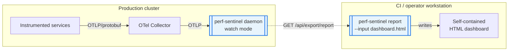
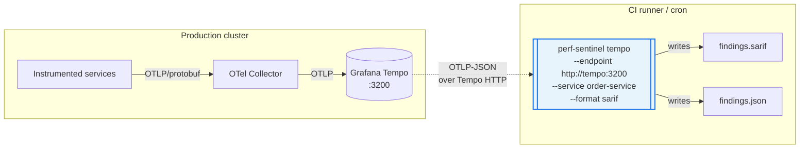
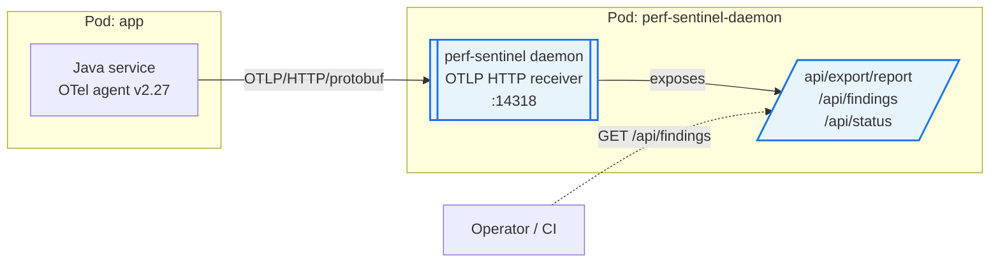
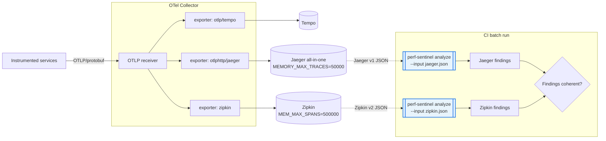
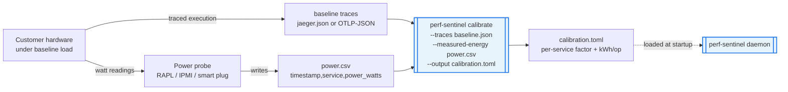
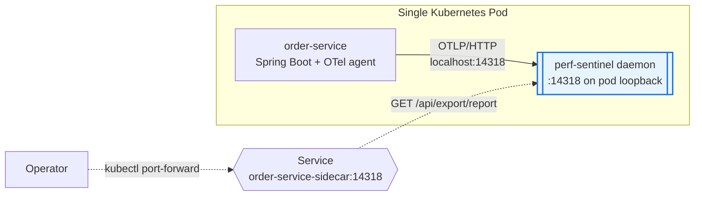
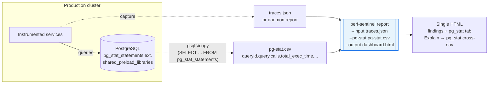

# B2 operational mode validation

This document is the adoption guide for perf-sentinel operational
modes. Each section describes one deployment shape that has been
validated end to end on the lab cluster, with an architecture diagram,
the input/output capture types, the configuration knobs that matter,
and the gotchas that bit us during validation.

The 8 scenarios live under `scenarios/b2-N-<name>/` and each one ships a
runnable `verify.sh` plus a focused `README.md`. The scripts are
reproducible on a `make up-cni` + `make seed-services` +
`make seed-electricity-maps` cluster.

## Coverage

| Scenario | Mode tested | Cluster deps | Status |
| --- | --- | --- | --- |
| [B2-1](#b2-1-hybrid-daemon-to-batch-html) | hybrid daemon -> batch HTML | running daemon | PASS |
| [B2-2](#b2-2-batch-over-tempo) | batch over Tempo via `perf-sentinel tempo` | daemon + Tempo | PASS |
| [B2-3](#b2-3-daemon-otlp-direct-no-collector) | daemon OTLP direct (no Collector) | dedicated daemon + cloned service | PASS |
| [B2-4](#b2-4-multi-format-input-jaeger--zipkin) | multi-format input (Jaeger + Zipkin) | Jaeger + Zipkin + multi-export collector | PASS |
| [B2-5](#b2-5-calibrate-energy-coefficients) | calibrate energy coefficients | none (fixture + synthetic CSV) | PASS |
| [B2-6](#b2-6-sidecar-pattern) | sidecar pattern (1 daemon per pod) | sidecar pod | PASS |
| [B2-7](#b2-7-cross-trace-correlation-finding) | cross-trace correlation finding | running daemon + cross-service traffic | PASS |
| [B2-8](#b2-8-pg_stat-live-integration) | `report --pg-stat` live integration | running daemon + Postgres `pg_stat_statements` | PASS |

## Run

```bash
# Single scenario
make verify-b2-1-hybrid-daemon-batch
make verify-b2-2-batch-tempo-scrape
make verify-b2-3-daemon-otlp-direct
make verify-b2-4-multiformat-input
make verify-b2-5-calibrate-mode
make verify-b2-6-sidecar-pattern
make verify-b2-7-correlation-finding
make verify-b2-8-pg-stat

# All eight (sequential, ~20 min total)
make verify-b2-all
```

Each scenario writes a markdown report under
`/tmp/scenario-b2-N-<name>-report.md`.

## How to read the diagrams

Every scenario diagram uses a consistent vocabulary:

- **Solid arrow** = always-on flow (production traffic, OTLP, pull
  loops).
- **Dashed arrow** = on-demand fetch (CI snapshot, CLI batch, query API).
- **Box with double border** = perf-sentinel surface (CLI subcommand or
  daemon endpoint).
- **Annotation in italic** = capture format (`OTLP/protobuf`,
  `Tempo OTLP-JSON`, `Jaeger v1`, `Zipkin v2`, `Report JSON`, `pg_stat
  CSV`).

The diagrams are also available as standalone Mermaid sources under
[`diagrams/`](diagrams/) (`b2-N-<name>.mmd`), useful for rendering to
SVG/PNG or copying into other docs.

## Capture format cheat sheet

Adoption decisions usually start with "what trace format do I have?".
This table maps perf-sentinel's accepted inputs to the upstream sources
the lab has exercised live.

| Input format | perf-sentinel entry point | Lab source | Validated by |
| --- | --- | --- | --- |
| OTLP/protobuf (live) | daemon `:14317` (gRPC) / `:14318` (HTTP) | OTel Collector or direct from app | B2-3, B2-6, B2-7 |
| OTLP-JSON (Tempo) | `perf-sentinel tempo --endpoint <url>` | Tempo `:3200` | B2-2 |
| Jaeger v1 JSON | `perf-sentinel analyze --input` | Jaeger query API | B2-4 |
| Zipkin v2 JSON | `perf-sentinel analyze --input` | Zipkin query API | B2-4 |
| Daemon Report JSON | `perf-sentinel report --input` | `/api/export/report` | B2-1 |
| Postgres `pg_stat_statements` CSV | `perf-sentinel report --pg-stat` | `psql \copy` | B2-8 |
| Power CSV (`timestamp,service,power_watts`) | `perf-sentinel calibrate --measured-energy` | metered hardware | B2-5 |

---

## B2-1 hybrid daemon to batch HTML

A daemon runs in production and accumulates findings via its rolling
window correlator. A developer or CI job snapshots the daemon's
`/api/export/report` endpoint and renders a single-file HTML dashboard
for shareable post-mortem. No re-analysis is run on the snapshot.

### Architecture



### Adoption notes

- Inputs: a running daemon exposing `/api/export/report`. No traces are
  re-parsed on the CI side.
- Output: a self-contained HTML file that bundles the daemon's findings,
  correlations, energy scores, and dashboards in a single artifact (the
  validated run produced ~1 MiB).
- Where it fits: post-mortem workflows, sprint review dashboards, weekly
  ops review. The HTML is shareable without giving access to the daemon.

### Configuration

No special daemon config. The CLI runs offline once it has the JSON.
The `--input` accepts the raw `Report` JSON returned by
`/api/export/report`.

### Watch out

- `analyze` does not accept Report JSON, only raw trace events. If you
  want SARIF output from a batch job, use B2-2 (Tempo) or feed Jaeger /
  Zipkin exports as in B2-4.
- The HTML reflects the daemon's correlator state at the moment of the
  snapshot. There is no time-window flag to slice the snapshot
  retroactively.

---

## B2-2 batch over Tempo

A user has Tempo deployed but no perf-sentinel daemon running 24/7.
A periodic batch CI job fetches recent traces from Tempo and runs
detection on them, emitting findings as JSON or SARIF.

### Architecture



### Adoption notes

- Inputs: Tempo's HTTP API (`:3200`) returning OTLP-JSON.
- Output: JSON findings list or SARIF (suitable for GitHub code
  scanning, GitLab security dashboard).
- Where it fits: low-cost adoption when Tempo is already deployed.
  No daemon footprint, just a CI cron that pulls the last N minutes
  of traces.

### Configuration

```bash
perf-sentinel tempo \
  --endpoint http://tempo.observability.svc.cluster.local:3200 \
  --service order-service \
  --since 1h \
  --format sarif
```

`host.docker.internal:3200` is used in the lab verify because the CLI
runs in a Docker container on the developer host while Tempo is
port-forwarded.

### Watch out

- Tempo serves OTLP-JSON only (no Jaeger v1 dialect). Earlier
  perf-sentinel versions required a Jaeger conversion pre-step. From
  0.5.16 onward the `tempo` subcommand consumes OTLP-JSON natively.
  See `project_perf_sentinel_followup.md` item 5 (RESOLVED in 0.5.16).
- Set `--since` aggressively in CI to bound scan duration and avoid
  re-detecting findings that the previous run already surfaced.

---

## B2-3 daemon OTLP direct (no Collector)

Minimal setup: an instrumented service exports OTLP straight to the
perf-sentinel daemon's HTTP endpoint. No Tempo, no OTel Collector.
Useful for on-prem or edge environments where adding an extra hop is
undesirable.

### Architecture



### Adoption notes

- Inputs: OTLP/HTTP/protobuf direct from the app's OTel exporter
  (`OTEL_EXPORTER_OTLP_ENDPOINT=http://perf-sentinel-daemon:14318`).
- Output: the daemon's HTTP API surface (`/api/findings`,
  `/api/correlations`, `/api/export/report`).
- Where it fits: smallest footprint that still gets you live findings
  and correlations. Good fit for a single team owning a single service
  cluster, or for staging environments without observability tooling.

### Configuration

The lab daemon binds custom ports `14317` (gRPC) and `14318` (HTTP)
rather than the OTLP defaults `4317`/`4318` to avoid clashing with
other agents on the same node. Application config:

```yaml
env:
  - name: OTEL_EXPORTER_OTLP_ENDPOINT
    value: http://perf-sentinel-daemon-direct.b2-3-direct-otlp.svc.cluster.local:14318
  - name: OTEL_EXPORTER_OTLP_PROTOCOL
    value: http/protobuf
```

### Watch out

- No Tempo means no historical trace storage. Findings live only as
  long as the daemon's correlator window keeps them.
- If you want both this mode AND a centralized lab daemon, give them
  distinct namespaces and make sure NetworkPolicies allow ingress to
  the dedicated daemon (the lab adds an additive
  `postgres-allow-b2-3-direct-otlp` policy in the `db` namespace for
  the cloned service).

---

## B2-4 multi-format input (Jaeger + Zipkin)

The OTel Collector pipeline emits the same traces in parallel to
several backends (Tempo, Jaeger, Zipkin). Batch perf-sentinel runs are
fed traces from each backend and the findings should be coherent.
Useful when migrating between trace stores or running a per-format
audit on top of an existing observability stack.

### Architecture



### Adoption notes

- Inputs: Jaeger query API (`/api/traces`), Zipkin query API
  (`/api/v2/traces`).
- Output: per-format findings comparable across backends (the lab run
  matched 3 categories common: `n_plus_one_sql`, `pool_saturation`,
  `redundant_sql`).
- Where it fits: organisations standardising on one trace backend that
  want to audit an alternative format before committing, or
  multi-tenant setups where different teams use different stores.

### Configuration

Collector overlay (`collector-overlay.yaml`):

```yaml
exporters:
  otlphttp/jaeger:
    endpoint: http://jaeger.observability.svc.cluster.local:4318
    tls: { insecure: true }
  zipkin:
    endpoint: http://zipkin.observability.svc.cluster.local:9411/api/v2/spans
service:
  pipelines:
    traces:
      exporters: [otlp/tempo, otlphttp/jaeger, zipkin]
```

### Watch out

- In-memory Jaeger and Zipkin FIFO-evict old traces when full. Default
  caps (10k traces / 100k spans) are too low under sustained k6
  traffic, raise them to 50k / 500k as in `manifests.yaml`.
- Use a focused traffic burst (B2-4 sends 20 targeted requests rather
  than running `make validate-findings` which floods the indexer with
  1500 requests).
- Filter out single-span health probes (>5 spans) before feeding the
  CLI, otherwise the analyze surface is dominated by trivial traces.
- Cilium NetworkPolicies must explicitly allow the Collector to reach
  Jaeger and Zipkin (the lab adds `jaeger-allow-internal`,
  `zipkin-allow-internal`, `otel-collector-egress-to-jaeger-zipkin`).
- Boundary fixtures: only Jaeger v1 is exercised. Zipkin v2 tags are
  `Map<String,String>`, so a depth-31 fixture would reject on type
  before the depth check fires. The depth guard itself is
  format-agnostic.

---

## B2-5 calibrate energy coefficients

Customer measures power consumption (in watts) on their own hardware
during a baseline trace window, feeds both the trace JSON and the power
CSV to `perf-sentinel calibrate`, and gets a TOML file with
hardware-tuned energy coefficients for accurate green-ops scoring.

### Architecture



### Adoption notes

- Inputs: baseline traces + a power CSV with one row per
  `(timestamp,service,power_watts)` sample.
- Output: a TOML file with `[calibration]`, `[calibration.services]`
  blocks and per-service `factor` + `measured_energy_per_op_kwh`.
- Where it fits: green-ops adoption on hardware that does not match the
  default coefficients (older CPUs, custom servers, on-prem deployments
  far from cloud reference profiles).

### Configuration

```bash
perf-sentinel calibrate \
  --traces fixtures/baseline.json \
  --measured-energy power.csv \
  --output calibration.toml
```

CSV format:

```
timestamp,service,power_watts
2026-04-30T11:08:00Z,order-service,18.0
2026-04-30T11:08:01Z,order-service,17.5
```

Timestamps must overlap the trace window or `calibrate` reports
"no overlap, factor unchanged".

### Watch out

- `calibrate` is for energy coefficients only, not anti-pattern
  thresholds. The CLI subcommand name historically led to confusion.
- If the measured wattage is well above the default model (or the CSV
  timestamps are off), `calibrate` prints
  `factor > 10x default, possible measurement error`. Treat it as a
  signal to recheck the CSV format and clock skew.
- Re-run after any major deployment change (new service, new region,
  hardware refresh).

---

## B2-6 sidecar pattern

A single application service is monitored by a perf-sentinel daemon
deployed as a sidecar in the same pod. The service pushes OTLP traces
to `localhost:14318`. Findings are scoped to that one service.

### Architecture



### Adoption notes

- Inputs: localhost OTLP from the colocated application container only.
- Output: per-pod daemon HTTP API. The cardinality is "one daemon per
  pod" so findings are naturally scoped.
- Where it fits: strict pod-level isolation, single-service monitoring
  without a centralized daemon, edge or air-gapped environments.

### Configuration

Pod-level OTel exporter env (the daemon and app share the network
namespace):

```yaml
- name: OTEL_EXPORTER_OTLP_ENDPOINT
  value: http://localhost:14318
- name: OTEL_EXPORTER_OTLP_PROTOCOL
  value: http/protobuf
```

Daemon `config.toml`:

```toml
[daemon]
listen_address = "0.0.0.0"     # see trade-off below
listen_port_http = 14318
trace_ttl_ms = 30000
```

### Watch out

- **Bind address trade-off**: a strict-isolation deployment binds
  `127.0.0.1:14318` so cross-pod traffic is impossible. The lab binds
  `0.0.0.0` because the verify probe goes through a Service. If you
  follow the lab pattern, enforce isolation by NOT exposing a Service
  for the daemon port (the lab does expose it, this is documented
  inline as a verify compromise).
- `trace_ttl_ms` defaults to 5000 ms which is too short for OTel agent
  BatchSpanProcessor flushes (5s window). Bump to 30000 for stable
  N+1 detection on bursty traffic.
- Per-pod overhead: ~60-150 MiB RAM. Multiply by pod count if rolling
  out fleet-wide.
- No correlator across pods. Cross-service findings are not visible
  with this pattern.

---

## B2-7 cross-trace correlation finding

A system has many services calling each other. The daemon's rolling
window correlator tracks span templates that systematically co-occur
across traces. When `service-A.span-X` consistently leads to
`service-B.span-Y` within the configured lag window, the correlator
exposes the pair via `/api/correlations` with a confidence score.

### Architecture

```mermaid
flowchart LR
    subgraph cluster["Production cluster"]
        ORDER[order-service]
        PAY[payment-service]
        NOTIF[notification-service]
        ORDER -- charge() --> PAY
        PAY -- notify() --> NOTIF
    end
    COL[OTel Collector] --> DAEMON
    ORDER --> COL
    PAY --> COL
    NOTIF --> COL
    subgraph daemon_box["perf-sentinel daemon"]
        DAEMON[[Rolling window correlator<br/>window_minutes=5<br/>min_co_occurrences=2<br/>min_confidence=0.5]]
        API[/api/correlations]
        DAEMON --> API
    end
    OPS[Operator / dashboard] -. "GET /api/correlations" .-> API
    classDef sentinel fill:#e8f4fc,stroke:#1a73e8,stroke-width:2px
    class DAEMON,API sentinel
```

### Adoption notes

- Inputs: live traces flowing through the daemon (any of the modes
  above provides the input).
- Output: a list of `(source, target, confidence, co_occurrence_count,
  median_lag_ms)` records exposed by `/api/correlations`. Each
  source/target is a `(service, finding_type, template)` triplet.
- Where it fits: spotting tight cross-service coupling, surfacing
  cascade-prone request chains, building a dependency graph that
  reflects reality rather than design intent.

### Configuration

```toml
[daemon.correlation]
enabled = true
window_minutes = 5
lag_threshold_ms = 60000
min_co_occurrences = 2
min_confidence = 0.5
```

### Watch out

- The window is 5 minutes by default. If your CI smoke run is shorter
  than that, you will see no correlations. The lab verify waits 90s
  for fresh entries and runs `make validate-findings` (chatty +
  fanout + serialized scenarios) to seed the correlator.
- `confidence > 0.5` is a sane production threshold. Lower it to surface
  noisy candidates during exploration; do not lower it in production
  alerts.
- The `source` and `target` fields are dicts, not strings. Consumers
  must extract `service` + `template` (the lab verify includes a small
  `fmt(d)` Python helper).

---

## B2-8 pg_stat live integration

Pair the trace-derived anti-pattern findings with database hotspot
data from `pg_stat_statements` in a single HTML dashboard. The
`pg_stat` tab surfaces the top SQL templates by total exec time,
calls, mean exec time, rows returned, and shared block hit/read
counters. The Explain -> pg_stat cross-navigation maps each detected
anti-pattern (notably `n_plus_one_sql`, `redundant_sql`, `slow_sql`)
to its matching template row.

### Architecture



### Adoption notes

- Inputs: any trace JSON accepted by `perf-sentinel report` (a daemon
  Report or raw trace events) plus a `pg_stat_statements` CSV.
- Output: an HTML dashboard with a `pg_stat` tab and Explain -> pg_stat
  cross-navigation links from anti-pattern findings to matching
  templates.
- Where it fits: closing the loop between application-level findings
  ("this code path is N+1") and database-level evidence ("this SQL
  template ran 12000 times in the window"). Most useful in
  post-mortems and capacity reviews.

### Configuration

Postgres needs the extension enabled at the cluster level. In the lab
this is done via the StatefulSet args (a startup-only setting):

```yaml
args:
  - -c
  - shared_preload_libraries=pg_stat_statements
  - -c
  - pg_stat_statements.track=all
  - -c
  - pg_stat_statements.max=10000
```

Plus `CREATE EXTENSION IF NOT EXISTS pg_stat_statements;` in the
init script (only runs on first init when PGDATA is empty).

CLI invocation:

```bash
perf-sentinel report \
  --input traces.json \
  --pg-stat pg-stat.csv \
  --output dashboard.html
```

CSV export:

```bash
psql -U lab -d lab -c "\copy (
  SELECT queryid, query, calls, total_exec_time, mean_exec_time,
         rows, shared_blks_hit, shared_blks_read
  FROM pg_stat_statements
  ORDER BY total_exec_time DESC LIMIT 100
) TO STDOUT WITH CSV HEADER" > pg-stat.csv
```

### Watch out

- `shared_preload_libraries` is a startup-only config: enabling it
  requires a Postgres restart.
- On a pre-existing data dir (PGDATA non-empty) the init script does
  not re-run, so `CREATE EXTENSION pg_stat_statements;` must be issued
  manually:
  ```bash
  kubectl -n db exec sts/postgres -- psql -U lab -d lab \
    -c "CREATE EXTENSION pg_stat_statements;"
  ```
- Reset the counters before the workload window
  (`SELECT pg_stat_statements_reset();`), otherwise the CSV mixes prior
  noise with the run-of-interest.
- Alternative input: `--pg-stat-prometheus <URL>` consumes the same data
  exposed by `postgres_exporter`. The lab does not deploy
  `postgres_exporter` today, hence the direct CSV path here.

---

## Where to publish this guide

The lab repo (this file) is the canonical reference because every
diagram is anchored to a runnable verify script. When promoting parts
of this guide into the upstream perf-sentinel docs (under
`/Users/robintrassard/RustroverProjects/perf-sentinel`), favour:

- The capture format cheat sheet.
- The per-mode configuration blocks.
- The "Watch out" lists.

Keep the architecture diagrams here, since they show how the modes
plug into a real cluster with the lab's specific naming. The upstream
docs can link back instead of duplicating.
