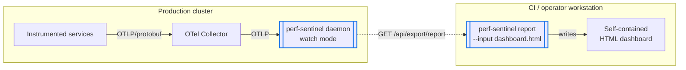
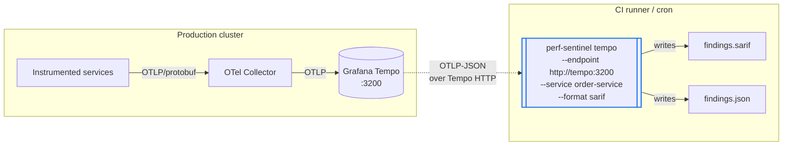
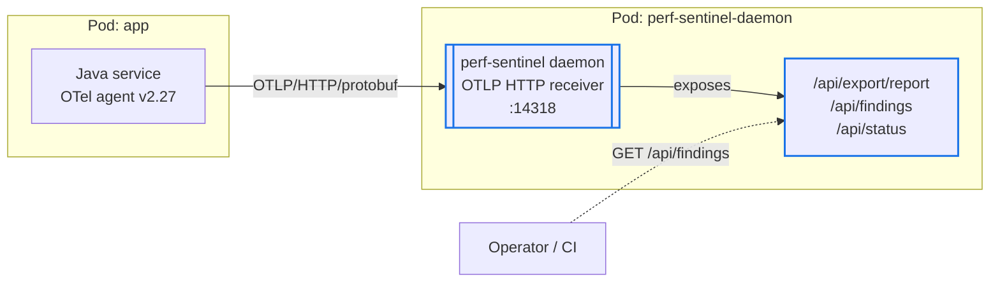
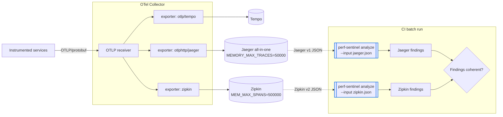
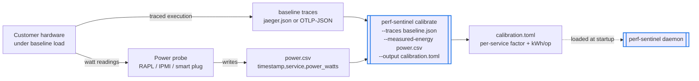
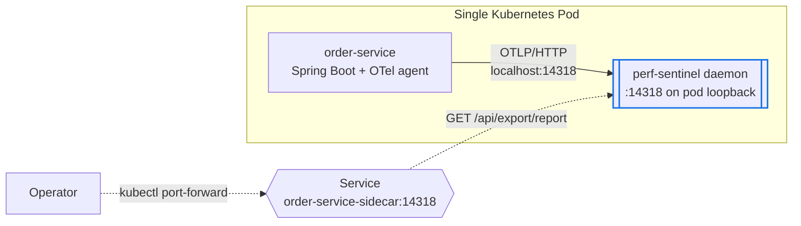
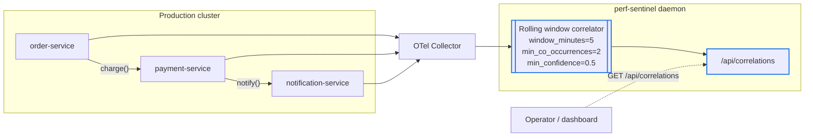
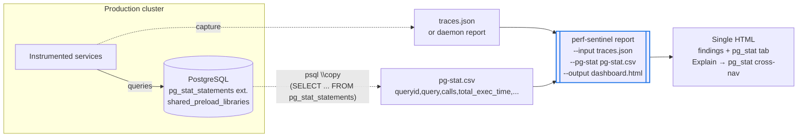

# Deployment-mode adoption guide

This document is the adoption guide for perf-sentinel operational
modes. Each section describes one deployment shape that has been
validated end to end on the lab cluster, with an architecture diagram,
the input/output capture types, the configuration knobs that matter,
and the gotchas that bit us during validation.

The 8 scenarios live under `scenarios/<name>/` and each one ships a
runnable `verify.sh` plus a focused `README.md`. The scripts are
reproducible on a `make up-cni` + `make seed-services` +
`make seed-electricity-maps` cluster.

## Big picture: perf-sentinel across a typical infra

perf-sentinel is not "one tool you install in one place". It plugs in
at every layer of the SDLC, with a different mode per environment.
This section is the 10000-foot view; the per-scenario sections below
detail each mode in depth.


Source: [`global-integration.mmd`](https://raw.githubusercontent.com/robintra/perf-sentinel-simulation-lab/main/docs/diagrams/mmd/global-integration.mmd).
Single SVG rendered from the `.mmd` source, committed alongside so the
guide displays inline on GitHub. Colors and contrast are baked into
the `.mmd` so the diagram stays readable in both light and dark mode.

### Numbered flow: a code change's journey

Each numbered arrow on the diagram is one step in the path of a
performance-relevant code change from the developer's laptop to the
production daemon's findings.

| # | What happens | Mode used |
| --- | --- | --- |
| (1) | Dev runs a local perf test against the service running on their workstation. | local batch |
| (2) | The captured `traces.json` is fed to `perf-sentinel analyze --input` (or `report --input`, or `inspect` for the TUI). | local batch |
| (3) | Findings printed to terminal (or HTML / TUI), the dev iterates until clean. | local batch |
| (4) | `git push` of the candidate change. | source control |
| (5) | CI is triggered on the PR. | CI/CD |
| (6) | CI runs perf integration tests, captures traces, then `analyze --ci`. **Without perf ITs, no findings will fire and the gate is meaningless.** | CI batch |
| (7) | Quality gate: exit 1 blocks the merge, exit 0 lets it through. | CI batch |
| (8) | Once merged, the code flows through the deploy pipeline. | CI/CD |
| (9) | Staging deployment: the focus-service pod ships with a perf-sentinel daemon as sidecar. | sidecar |
| (10) | The sidecar ingests OTLP over `localhost:14318` (no network hop). | sidecar |
| (11) | QA / SRE polls `/api/findings` on the staging sidecar to validate the release candidate. | sidecar |
| (12) | After QA approval, the same artifact is promoted to production. | CI/CD |
| (13) | Selected heavy services in prod send OTLP directly to the centralized daemon to skip the Collector hop. | centralized |
| (14) | All other services flow through the OTel Collector, which forwards OTLP to both the centralized daemon and the trace store (Tempo / VictoriaTraces / Jaeger). | centralized |
| (15) | On-call polls the daemon's HTTP API (`/api/status`, `/api/findings`, `/api/correlations`, `/api/explain/<trace-id>`, `/api/export/report`) and snapshots the Report to a self-contained HTML for post-mortem. | centralized |
| (16) | Optional nightly CI cron pulls recent traces from the trace store via `perf-sentinel tempo` (Tempo OTLP-JSON) or `perf-sentinel jaeger-query` (Jaeger / VictoriaTraces) to run regression detection on prod traffic. | CI batch |
| (extra) | **Always-on metrics path**: Prometheus scrapes the daemon's `/metrics` endpoint (works for any daemon, sidecar or centralized — same port as OTLP HTTP) and Grafana renders it via the upstream dashboard at [`examples/grafana-dashboard.json`](https://github.com/robintra/perf-sentinel/blob/main/examples/grafana-dashboard.json) using `perf_sentinel_findings_total`, `perf_sentinel_io_waste_ratio`, `perf_sentinel_service_io_ops_total`. | centralized + sidecar |
| (extra) | **Always-on log path**: every daemon also streams findings as NDJSON to stdout, picked up by the log aggregator (Loki / Elasticsearch / Splunk) via `kubectl logs` or fluent-bit. Useful for alerting and grep-style triage when the HTTP API is overkill. | centralized + sidecar |
| (A) | **pg_stat ingestion via CSV file**: a scheduled or on-demand `psql \copy (SELECT ... FROM pg_stat_statements) TO STDOUT WITH CSV HEADER` exports a snapshot of SQL hotspot counters to `pg-stat.csv`. The file is fed to `analyze`, `report` or the standalone `pg-stat` subcommand via `--pg-stat <csv>`. Works in both CI and local dev. | CI batch + local batch |
| (B) | **pg_stat ingestion via Prometheus**: `postgres_exporter` exposes `pg_stat_statements` on `:9187/metrics`, scraped by the cluster Prometheus. perf-sentinel reaches it via `--pg-stat-prometheus <url>` (one-shot HTTP GET against either `postgres_exporter` directly or the Prometheus aggregating it). Mutually exclusive with `--pg-stat <csv>`. Auth via `--pg-stat-auth-header` (`PERF_SENTINEL_PGSTAT_AUTH_HEADER` env var preferred in production). | CI batch + local batch |
| (D) | **Live prod triage by dev/architect**: an authorized dev can `curl` the prod daemon's HTTP API directly. Three formats: JSON via `/api/findings`, `/api/correlations`, `/api/explain/<trace-id>` (the explain endpoint only works while the trace is still inside the `trace_ttl_ms=30s` window) ; HTML via `curl /api/export/report \| perf-sentinel report --input - --output report.html` ; NDJSON streaming via `kubectl logs deploy/perf-sentinel-daemon -f` for live tailing. Useful when reproducing a customer issue without waiting for the next CI cycle. | centralized |
| (E) | **Daemon Report → local batch (best of both worlds)**: pull a Report snapshot from `/api/export/report`, render it with the local CLI. The daemon's `correlations` field is preserved as-is by `report --input` (the local CLI does not recompute correlations in batch — they are only available because the daemon already did the work over its rolling window). pg_stat is **not** part of the Report and must be added at render time: `curl /api/export/report \| perf-sentinel report --input - --pg-stat /tmp/pg-stat.csv --output dashboard.html`. The dev keeps the JSON locally for re-renders. | centralized → local batch |

### Trade-offs by entity and context

The same code-path detection logic powers every entity, but the
operational characteristics differ. This matrix is what to reach for
when you need to choose where a finding should come from.

| Entity | Mode | Pros | Cons / limits |
| --- | --- | --- | --- |
| **Local CLI** (`analyze --input` / `report --input` / `inspect` / `pg-stat`) | batch on captured trace | Fast iteration, no infra. Multi-format input (auto-detects native OTLP-JSON / Jaeger v1 / Zipkin v2). Re-runs deterministically on the same file. HTML / JSON / TUI / SARIF outputs. **Best-of-both-worlds path** (E): a daemon Report from `/api/export/report` carries `correlations` and is consumed as-is by `report --input -`, so a dev can render a local HTML with prod correlations + cross-reference pg_stat (`--pg-stat <csv>`) in one shot. Window depends on the source: trace dump from Tempo/Jaeger ≈ backend retention (often days/weeks) ; daemon Report = rolling window snapshot at curl time. | **Batch never recomputes correlations** (the correlator is daemon-only by design). When the input is a raw trace file, `correlations: []` always. They only appear when the input IS a daemon-produced Report. Limited to what was captured: forget to enable an exporter and you analyze a partial picture. No live signal, only post-hoc. |
| **Local daemon** (`perf-sentinel watch` on dev workstation, `127.0.0.1:4317` gRPC / `4318` HTTP) | live, dev session | Same `/api/findings` + `/api/correlations` + `/api/export/report` + `/metrics` surface as the prod daemon, but scoped to whatever the dev runs locally. **Correlations available without leaving the laptop**, no need to round-trip through prod. Snapshot via `curl /api/export/report \| report --input - --output report.html` for a sharable HTML at any moment. Useful when iterating on a feature where cross-trace co-occurrence matters (cascade between two local services, async fanout patterns). | Same windows as prod daemon: `trace_ttl_ms=30s` and `[daemon.correlation] window_minutes=10`. Correlator needs sustained traffic (`min_co_occurrences=3` default) → a single curl to a single endpoint won't fire correlations. The daemon binds `127.0.0.1` by default, so containerised local services need `host.docker.internal:4317` (or `listen_address = "0.0.0.0"` in `~/.perf-sentinel.toml`). RAM cost ~60–150 MiB while the dev session runs. |
| **CI CLI** (`analyze --ci` / `tempo` / `jaeger-query` / `pg-stat`) | batch on IT capture or trace store | Deterministic PR gate: exit code 1 fails the build, SARIF feeds GitHub / GitLab code scanning. Composable with `--pg-stat[-prometheus]` for SQL hotspot regression. Can pull from prod's trace store nightly via `tempo` / `jaeger-query` for drift detection. | **Useless without perf integration tests** (k6, JMeter, Gatling). A unit-test trace has no N+1 to detect. No correlations from a single CI run (correlator needs `[daemon.correlation] window_minutes=10` of sustained traffic). |
| **Sidecar daemon** (`watch`, per-pod) | live, scoped to one pod | Smallest live footprint that still gives `/api/findings` + Prometheus `/metrics` + NDJSON stdout. No cross-pod network hop (OTLP over loopback). Findings scoped to one service: zero noise from neighbors. Failure-isolated: sidecar OOM only affects that pod. | **Pod-only scope**: no cross-service correlations possible. **Rolling window only**: `trace_ttl_ms=30s` after last span (so `/api/explain/<trace-id>` evaporates fast); `[daemon.correlation] window_minutes=10` for cross-trace co-occurrences. **Per-pod cost**: ~60–150 MiB RAM per replica, multiplies with replica count. |
| **Centralized daemon** (`watch`, fleet) | live, fleet-wide | **Cross-service correlations** become available (`/api/correlations` only fires when multi-service co-occurrences are observed). Single API surface for SRE dashboards. Snapshot via `/api/export/report` → HTML for post-mortem. Can ingest both via OTel Collector and direct OTLP from heavy services. Memory metrics + log path + HTTP API in one place. | **Rolling window, not historical**: same `trace_ttl_ms=30s` and `window_minutes=10` defaults. For analysis older than the window, use the trace store (`perf-sentinel tempo` / `jaeger-query`). **Capacity ceiling**: `max_active_traces=10000` (default), LRU eviction past that. **Single point of contention**: one daemon for the fleet means RAM scales with active trace volume. |
| **HTML report** (`report --input`) | static post-mortem | Self-contained file (~1 MiB), shareable offline, opens in any browser. Embeds findings + pg_stat tab + Explain → pg_stat cross-nav + correlations (when source is a daemon Report). Canonical artifact for sprint reviews and incident reports. | **Frozen snapshot**: no live update. Correlations only present if the input is a daemon Report (batch JSON has no correlator state). Re-rendering requires re-running `report --input`. |

### Detection knob: N+1 SQL vs redundant SQL classification

The OpenTelemetry Java agent (and most other auto-instrumentation
agents) ships with the SQL statement sanitizer **on by default**, so
literals are replaced by `?` before the span hits perf-sentinel. With
no extractable parameters, the standard distinct-params rule rejects
the group and what is morally an N+1 ends up classified as
`redundant_sql` by the redundant detector. The
`[detection].sanitizer_aware_classification` setting (in `config.toml`
for daemons, in `.perf-sentinel.toml` for CI/local batch) tunes the
recovery heuristic. Same key, same effect, both modes — just different
file location.

| Value | Behavior | When to use |
| --- | --- | --- |
| `"auto"` (default) | Reclassify to `n_plus_one_sql` when **either** the ORM scope signal (Spring Data, Hibernate, EF Core, SQLAlchemy, ActiveRecord, GORM, Prisma, Diesel, ...) **or** the per-span timing variance fires. | Best recall on production Spring Data / EF Core stacks. |
| `"strict"` | Reclassify only when **both** signals fire conjointly (ORM scope + timing variance). | When `redundant_sql` itself is actionable signal you don't want absorbed into `n_plus_one_sql` (legacy polling loops, unmemoized config lookups served from row cache). The lab's daemon manifests use this value. |
| `"always"` | Reclassify any sanitized group reaching `n_plus_one_min_occurrences` spans as `n_plus_one_sql`. | Aggressive; may flip a real single-param redundancy. Use when you don't care about `redundant_sql` precision. |
| `"never"` | Disable the heuristic, pre-0.5.7 behavior. | Compatibility / debugging only. |

Findings reclassified by the heuristic carry
`classification_method = "sanitizer_heuristic"` in their JSON so
operators can spot where it fired vs the standard distinct-params path.
Findings produced by the standard rule omit the field.

### What goes where, and why

| Environment | Mode | Why this mode | See scenario |
| --- | --- | --- | --- |
| Local dev workstation | **Either** `analyze --input` (batch on a captured trace, fastest iteration) **or** `perf-sentinel watch` (local daemon on `127.0.0.1:4317/4318`, when the dev wants live correlations as they code). Plus `report --input` for HTML, `inspect` for TUI, `pg-stat` for SQL hotspot triage. | Pick batch when the goal is a deterministic post-mortem on a captured `traces.json` (file exporter or saved daemon snapshot). Pick the local daemon when iterating on cross-service flows where rolling correlations matter, or when the dev wants the same `/api/*` surface as prod for parity. The two coexist: a dev can run the daemon while debugging then capture its `/api/export/report` snapshot for offline triage. | [`hybrid-daemon-batch`](#hybrid-daemon-to-batch-html), [`multiformat-input`](#multi-format-input-jaeger--zipkin), [`daemon-otlp-direct`](#daemon-otlp-direct-no-collector) |
| CI/CD pipeline (PR gate) | `perf-sentinel analyze --ci --input traces.json` (or `tempo` to fetch live) | Fail the build when a regression introduces a new finding. **Requires perf integration tests in the pipeline** (k6, JMeter, Gatling). Without realistic load, the trace contains no anti-patterns to detect, so the gate is silently green and meaningless. | [`hybrid-daemon-batch`](#hybrid-daemon-to-batch-html), [`batch-tempo-scrape`](#batch-over-tempo) |
| Staging / pre-prod (focused service) | Sidecar daemon in the same pod, OTLP via `localhost:14318` | One service is in the spotlight for a release candidate or load test. Findings scoped to that pod, no cross-service noise. Cheaper than running a full centralized daemon if only one service matters. | [`sidecar-pattern`](#sidecar-pattern) |
| Production | Centralized daemon ingesting either via OTel Collector OR direct OTLP from selected services | Catch correlations across the whole fleet, expose `/api/correlations` for SRE dashboards, snapshot HTML reports for post-mortems. Heavy services can bypass the Collector and push OTLP straight to the daemon to skip the extra hop. | [`correlation-finding`](#cross-trace-correlation-finding), [`hybrid-daemon-batch`](#hybrid-daemon-to-batch-html), [`pg_stat`](#pg_stat-live-integration) |

### Watch out

- **CI gate without perf tests is theatre.** perf-sentinel detects
  N+1, redundant calls, slow SQL, fanout, etc. from real trace shapes.
  A unit-test trace with 3 spans will never trip a finding. If you
  wire the gate but skip the load step, you ship the regression and
  the gate stays green. Make perf integration tests a hard prerequisite
  to running `analyze --ci`.
- **Local dev: pick batch or daemon by need.** "Run a perf test, look
  at the findings, fix, repeat" → batch (`analyze --input`) is faster.
  "I'm chasing a cross-service interaction and I want correlations
  surfaced live as I code" → local daemon (`perf-sentinel watch` on
  `127.0.0.1:4317`). The two are not mutually exclusive: run the
  daemon, snapshot `/api/export/report` whenever needed, feed it to
  `report --input -` for an HTML you can keep. Just remember the
  daemon binds loopback by default, so Docker-ised local services need
  `host.docker.internal:4317` or `listen_address = "0.0.0.0"` in
  `~/.perf-sentinel.toml`.
- **Sidecar in staging means one daemon per monitored pod.** Multiply
  the daemon footprint (~60-150 MiB RAM) by replica count before
  rolling out fleet-wide. For multi-service staging, prefer the
  centralized mode used in production.
- **Production direct-OTLP path** skips Collector-side processing
  (sampling, tail-based filtering, multi-export). Use it sparingly,
  only for services where the extra hop hurts and where you don't need
  the Collector's pipeline.

## Coverage

| Scenario (slug) | Mode tested | Cluster deps | Status |
| --- | --- | --- | --- |
| [`hybrid-daemon-batch`](#hybrid-daemon-to-batch-html) | hybrid daemon -> batch HTML | running daemon | PASS |
| [`batch-tempo-scrape`](#batch-over-tempo) | batch over Tempo via `perf-sentinel tempo` | daemon + Tempo | PASS |
| [`daemon-otlp-direct`](#daemon-otlp-direct-no-collector) | daemon OTLP direct (no Collector) | dedicated daemon + cloned service | PASS |
| [`multiformat-input`](#multi-format-input-jaeger--zipkin) | multi-format input (Jaeger + Zipkin) | Jaeger + Zipkin + multi-export collector | PASS |
| [`calibrate-mode`](#calibrate-energy-coefficients) | calibrate energy coefficients | none (fixture + synthetic CSV) | PASS |
| [`sidecar-pattern`](#sidecar-pattern) | sidecar pattern (1 daemon per pod) | sidecar pod | PASS |
| [`correlation-finding`](#cross-trace-correlation-finding) | cross-trace correlation finding | running daemon + cross-service traffic | PASS |
| [`pg-stat`](#pg_stat-live-integration) | `report --pg-stat` live integration | running daemon + Postgres `pg_stat_statements` | PASS |
| [`grafana-dashboard`](#grafana-dashboard-validation) | upstream dashboard import + audit + alerts + postgres-exporter | running daemon + Prometheus + Grafana + Postgres | PASS |

## Run

```bash
# Single scenario
make verify-hybrid-daemon-batch
make verify-batch-tempo-scrape
make verify-daemon-otlp-direct
make verify-multiformat-input
make verify-calibrate-mode
make verify-sidecar-pattern
make verify-correlation-finding
make verify-pg-stat
make verify-grafana-dashboard

# All nine (sequential, ~30 min total)
make verify-all-scenarios
```

Each scenario writes a markdown report under
`/tmp/scenario-<name>-report.md`.

## How to read the diagrams

Every scenario diagram uses a consistent vocabulary:

- **Solid arrow** = always-on flow (production traffic, OTLP, pull
  loops).
- **Dashed arrow** = on-demand fetch (CI snapshot, CLI batch, query API).
- **Box with double border + blue stroke** = perf-sentinel surface (CLI
  subcommand or daemon endpoint). Colors are baked into the `.mmd`
  source so contrast stays correct in both light and dark mode.
- **Annotation in italic** = capture format (`OTLP/protobuf`,
  `Tempo OTLP-JSON`, `Jaeger v1`, `Zipkin v2`, `Report JSON`, `pg_stat
  CSV`).

The diagrams are also available as standalone Mermaid sources under
[`docs/diagrams/mmd/`](https://github.com/robintra/perf-sentinel-simulation-lab/tree/main/docs/diagrams/mmd)
(`<name>.mmd`), useful for rendering to SVG/PNG or copying into other
docs.

## Capture format cheat sheet

Adoption decisions usually start with "what trace format do I have?".
This table maps perf-sentinel's accepted inputs to the upstream sources
the lab has exercised live.

| Input format | perf-sentinel entry point | Lab source | Validated by |
| --- | --- | --- | --- |
| OTLP/protobuf (live) | daemon `:14317` (gRPC) / `:14318` (HTTP) | OTel Collector or direct from app | daemon-otlp-direct, sidecar-pattern, correlation-finding |
| OTLP-JSON (Tempo) | `perf-sentinel tempo --endpoint <url>` | Tempo `:3200` | batch-tempo-scrape |
| Jaeger v1 JSON | `perf-sentinel analyze --input` | Jaeger query API | multiformat-input |
| Zipkin v2 JSON | `perf-sentinel analyze --input` | Zipkin query API | multiformat-input |
| Daemon Report JSON | `perf-sentinel report --input` | `/api/export/report` | hybrid-daemon-batch |
| Postgres `pg_stat_statements` CSV | `perf-sentinel report --pg-stat` | `psql \copy` | pg-stat |
| Power CSV (`timestamp,service,power_watts`) | `perf-sentinel calibrate --measured-energy` | metered hardware | calibrate-mode |

---

## Hybrid daemon to batch HTML

A daemon runs in production and accumulates findings via its rolling
window correlator. A developer or CI job snapshots the daemon's
`/api/export/report` endpoint and renders a single-file HTML dashboard
for shareable post-mortem. No re-analysis is run on the snapshot.

### Architecture



### Adoption notes

- Inputs: a running daemon exposing `/api/export/report`. No traces are
  re-parsed on the CI side.
- Output: a self-contained HTML file that bundles the daemon's findings,
  correlations, energy scores, and dashboards in a single artifact (the
  validated run produced ~1 MiB).
- Where it fits: post-mortem workflows, sprint review dashboards, weekly
  ops review. The HTML is shareable without giving access to the daemon.

### Configuration

No special daemon config. The CLI runs offline once it has the JSON.
The `--input` accepts the raw `Report` JSON returned by
`/api/export/report`.

### Watch out

- `analyze` does not accept Report JSON, only raw trace events. If you
  want SARIF output from a batch job, use batch-tempo-scrape (Tempo) or feed Jaeger /
  Zipkin exports as in multiformat-input.
- The HTML reflects the daemon's correlator state at the moment of the
  snapshot. There is no time-window flag to slice the snapshot
  retroactively.

---

## Batch over Tempo

A user has Tempo deployed but no perf-sentinel daemon running 24/7.
A periodic batch CI job fetches recent traces from Tempo and runs
detection on them, emitting findings as JSON or SARIF.

### Architecture



### Adoption notes

- Inputs: Tempo's HTTP API (`:3200`) returning OTLP-JSON.
- Output: JSON findings list or SARIF (suitable for GitHub code
  scanning, GitLab security dashboard).
- Where it fits: low-cost adoption when Tempo is already deployed.
  No daemon footprint, just a CI cron that pulls the last N minutes
  of traces.

### Configuration

```bash
perf-sentinel tempo \
  --endpoint http://tempo.observability.svc.cluster.local:3200 \
  --service order-service \
  --since 1h \
  --format sarif
```

`host.docker.internal:3200` is used in the lab verify because the CLI
runs in a Docker container on the developer host while Tempo is
port-forwarded.

### Watch out

- Tempo serves OTLP-JSON only (no Jaeger v1 dialect). Earlier
  perf-sentinel versions required a Jaeger conversion pre-step. From
  0.5.16 onward the `tempo` subcommand consumes OTLP-JSON natively.
  See `project_perf_sentinel_followup.md` item 5 (RESOLVED in 0.5.16).
- Set `--since` aggressively in CI to bound scan duration and avoid
  re-detecting findings that the previous run already surfaced.

---

## Daemon OTLP direct (no Collector)

Minimal setup: an instrumented service exports OTLP straight to the
perf-sentinel daemon's HTTP endpoint. No Tempo, no OTel Collector.
Useful for on-prem or edge environments where adding an extra hop is
undesirable.

### Architecture



### Adoption notes

- Inputs: OTLP/HTTP/protobuf direct from the app's OTel exporter
  (`OTEL_EXPORTER_OTLP_ENDPOINT=http://perf-sentinel-daemon:14318`).
- Output: the daemon's HTTP API surface (`/api/findings`,
  `/api/correlations`, `/api/export/report`).
- Where it fits: smallest footprint that still gets you live findings
  and correlations. Good fit for a single team owning a single service
  cluster, or for staging environments without observability tooling.

### Configuration

The lab daemon binds custom ports `14317` (gRPC) and `14318` (HTTP)
rather than the OTLP defaults `4317`/`4318` to avoid clashing with
other agents on the same node. Application config:

```yaml
env:
  - name: OTEL_EXPORTER_OTLP_ENDPOINT
    value: http://perf-sentinel-daemon-direct.b2-3-direct-otlp.svc.cluster.local:14318
  - name: OTEL_EXPORTER_OTLP_PROTOCOL
    value: http/protobuf
```

### Watch out

- No Tempo means no historical trace storage. Findings live only as
  long as the daemon's correlator window keeps them.
- If you want both this mode AND a centralized lab daemon, give them
  distinct namespaces and make sure NetworkPolicies allow ingress to
  the dedicated daemon (the lab adds an additive
  `postgres-allow-b2-3-direct-otlp` policy in the `db` namespace for
  the cloned service).

---

## Multi-format input (Jaeger + Zipkin)

The OTel Collector pipeline emits the same traces in parallel to
several backends (Tempo, Jaeger, Zipkin). Batch perf-sentinel runs are
fed traces from each backend and the findings should be coherent.
Useful when migrating between trace stores or running a per-format
audit on top of an existing observability stack.

### Architecture



### Adoption notes

- Inputs: Jaeger query API (`/api/traces`), Zipkin query API
  (`/api/v2/traces`).
- Output: per-format findings comparable across backends (the lab run
  matched 3 categories common: `n_plus_one_sql`, `pool_saturation`,
  `redundant_sql`).
- Where it fits: organisations standardising on one trace backend that
  want to audit an alternative format before committing, or
  multi-tenant setups where different teams use different stores.

### Configuration

Collector overlay (`collector-overlay.yaml`):

```yaml
exporters:
  otlphttp/jaeger:
    endpoint: http://jaeger.observability.svc.cluster.local:4318
    tls: { insecure: true }
  zipkin:
    endpoint: http://zipkin.observability.svc.cluster.local:9411/api/v2/spans
service:
  pipelines:
    traces:
      exporters: [otlp/tempo, otlphttp/jaeger, zipkin]
```

### Watch out

- In-memory Jaeger and Zipkin FIFO-evict old traces when full. Default
  caps (10k traces / 100k spans) are too low under sustained k6
  traffic, raise them to 50k / 500k as in `manifests.yaml`.
- Use a focused traffic burst (multiformat-input sends 20 targeted requests rather
  than running `make validate-findings` which floods the indexer with
  1500 requests).
- Filter out single-span health probes (>5 spans) before feeding the
  CLI, otherwise the analyze surface is dominated by trivial traces.
- Cilium NetworkPolicies must explicitly allow the Collector to reach
  Jaeger and Zipkin (the lab adds `jaeger-allow-internal`,
  `zipkin-allow-internal`, `otel-collector-egress-to-jaeger-zipkin`).
- Boundary fixtures: only Jaeger v1 is exercised. Zipkin v2 tags are
  `Map<String,String>`, so a depth-31 fixture would reject on type
  before the depth check fires. The depth guard itself is
  format-agnostic.

---

## Calibrate energy coefficients

Customer measures power consumption (in watts) on their own hardware
during a baseline trace window, feeds both the trace JSON and the power
CSV to `perf-sentinel calibrate`, and gets a TOML file with
hardware-tuned energy coefficients for accurate green-ops scoring.

### Architecture



### Adoption notes

- Inputs: baseline traces + a power CSV with one row per
  `(timestamp,service,power_watts)` sample.
- Output: a TOML file with `[calibration]`, `[calibration.services]`
  blocks and per-service `factor` + `measured_energy_per_op_kwh`.
- Where it fits: green-ops adoption on hardware that does not match the
  default coefficients (older CPUs, custom servers, on-prem deployments
  far from cloud reference profiles).

### Configuration

```bash
perf-sentinel calibrate \
  --traces fixtures/baseline.json \
  --measured-energy power.csv \
  --output calibration.toml
```

CSV format:

```
timestamp,service,power_watts
2026-04-30T11:08:00Z,order-service,18.0
2026-04-30T11:08:01Z,order-service,17.5
```

Timestamps must overlap the trace window or `calibrate` reports
"no overlap, factor unchanged".

### Watch out

- `calibrate` is for energy coefficients only, not anti-pattern
  thresholds. The CLI subcommand name historically led to confusion.
- If the measured wattage is well above the default model (or the CSV
  timestamps are off), `calibrate` prints
  `factor > 10x default, possible measurement error`. Treat it as a
  signal to recheck the CSV format and clock skew.
- Re-run after any major deployment change (new service, new region,
  hardware refresh).

---

## Sidecar pattern

A single application service is monitored by a perf-sentinel daemon
deployed as a sidecar in the same pod. The service pushes OTLP traces
to `localhost:14318`. Findings are scoped to that one service.

### Architecture



### Adoption notes

- Inputs: localhost OTLP from the colocated application container only.
- Output: per-pod daemon HTTP API. The cardinality is "one daemon per
  pod" so findings are naturally scoped.
- Where it fits: strict pod-level isolation, single-service monitoring
  without a centralized daemon, edge or air-gapped environments.

### Configuration

Pod-level OTel exporter env (the daemon and app share the network
namespace):

```yaml
- name: OTEL_EXPORTER_OTLP_ENDPOINT
  value: http://localhost:14318
- name: OTEL_EXPORTER_OTLP_PROTOCOL
  value: http/protobuf
```

Daemon `config.toml`:

```toml
[daemon]
listen_address = "0.0.0.0"     # see trade-off below
listen_port_http = 14318
trace_ttl_ms = 30000
```

### Watch out

- **Bind address trade-off**: a strict-isolation deployment binds
  `127.0.0.1:14318` so cross-pod traffic is impossible. The lab binds
  `0.0.0.0` because the verify probe goes through a Service. If you
  follow the lab pattern, enforce isolation by NOT exposing a Service
  for the daemon port (the lab does expose it, this is documented
  inline as a verify compromise).
- `trace_ttl_ms` defaults to 5000 ms which is too short for OTel agent
  BatchSpanProcessor flushes (5s window). Bump to 30000 for stable
  N+1 detection on bursty traffic.
- Per-pod overhead: ~60-150 MiB RAM. Multiply by pod count if rolling
  out fleet-wide.
- No correlator across pods. Cross-service findings are not visible
  with this pattern.

---

## Cross-trace correlation finding

A system has many services calling each other. The daemon's rolling
window correlator tracks span templates that systematically co-occur
across traces. When `service-A.span-X` consistently leads to
`service-B.span-Y` within the configured lag window, the correlator
exposes the pair via `/api/correlations` with a confidence score.

### Architecture



### Adoption notes

- Inputs: live traces flowing through the daemon (any of the modes
  above provides the input).
- Output: a list of `(source, target, confidence, co_occurrence_count,
  median_lag_ms)` records exposed by `/api/correlations`. Each
  source/target is a `(service, finding_type, template)` triplet.
- Where it fits: spotting tight cross-service coupling, surfacing
  cascade-prone request chains, building a dependency graph that
  reflects reality rather than design intent.

### Configuration

```toml
[daemon.correlation]
enabled = true
window_minutes = 5
lag_threshold_ms = 60000
min_co_occurrences = 2
min_confidence = 0.5
```

### Watch out

- The window is 5 minutes by default. If your CI smoke run is shorter
  than that, you will see no correlations. The lab verify waits 90s
  for fresh entries and runs `make validate-findings` (chatty +
  fanout + serialized scenarios) to seed the correlator.
- `confidence > 0.5` is a sane production threshold. Lower it to surface
  noisy candidates during exploration; do not lower it in production
  alerts.
- The `source` and `target` fields are dicts, not strings. Consumers
  must extract `service` + `template` (the lab verify includes a small
  `fmt(d)` Python helper).

---

## pg_stat live integration

Pair the trace-derived anti-pattern findings with database hotspot
data from `pg_stat_statements` in a single HTML dashboard. The
`pg_stat` tab surfaces the top SQL templates by total exec time,
calls, mean exec time, rows returned, and shared block hit/read
counters. The Explain -> pg_stat cross-navigation maps each detected
anti-pattern (notably `n_plus_one_sql`, `redundant_sql`, `slow_sql`)
to its matching template row.

### Architecture



### Adoption notes

- Inputs: any trace JSON accepted by `perf-sentinel report` (a daemon
  Report or raw trace events) plus a `pg_stat_statements` CSV.
- Output: an HTML dashboard with a `pg_stat` tab and Explain -> pg_stat
  cross-navigation links from anti-pattern findings to matching
  templates.
- Where it fits: closing the loop between application-level findings
  ("this code path is N+1") and database-level evidence ("this SQL
  template ran 12000 times in the window"). Most useful in
  post-mortems and capacity reviews.

### Configuration

Postgres needs the extension enabled at the cluster level. In the lab
this is done via the StatefulSet args (a startup-only setting):

```yaml
args:
  - -c
  - shared_preload_libraries=pg_stat_statements
  - -c
  - pg_stat_statements.track=all
  - -c
  - pg_stat_statements.max=10000
```

Plus `CREATE EXTENSION IF NOT EXISTS pg_stat_statements;` in the
init script (only runs on first init when PGDATA is empty).

CLI invocation:

```bash
perf-sentinel report \
  --input traces.json \
  --pg-stat pg-stat.csv \
  --output dashboard.html
```

CSV export:

```bash
psql -U lab -d lab -c "\copy (
  SELECT queryid, query, calls, total_exec_time, mean_exec_time,
         rows, shared_blks_hit, shared_blks_read
  FROM pg_stat_statements
  ORDER BY total_exec_time DESC LIMIT 100
) TO STDOUT WITH CSV HEADER" > pg-stat.csv
```

### Watch out

- `shared_preload_libraries` is a startup-only config: enabling it
  requires a Postgres restart.
- On a pre-existing data dir (PGDATA non-empty) the init script does
  not re-run, so `CREATE EXTENSION pg_stat_statements;` must be issued
  manually:
  ```bash
  kubectl -n db exec sts/postgres -- psql -U lab -d lab \
    -c "CREATE EXTENSION pg_stat_statements;"
  ```
- Reset the counters before the workload window
  (`SELECT pg_stat_statements_reset();`), otherwise the CSV mixes prior
  noise with the run-of-interest.
- Alternative input: `--pg-stat-prometheus <URL>` consumes the same data
  exposed by `postgres-exporter` (queries
  `topk(N, pg_stat_statements_seconds_total)` per
  `crates/sentinel-core/src/ingest/pg_stat.rs:475`). The lab now
  deploys postgres-exporter via the
  [grafana-dashboard scenario](#grafana-dashboard-validation), and
  `verify-pg-stat` exercises both Path 1 (CSV) and Path 2 (Prometheus)
  when postgres-exporter is present. Path 2 is skipped (not failed)
  when the exporter is absent, so the CSV path stays runnable
  standalone.

---

## Grafana dashboard validation

The upstream perf-sentinel repo ships
`examples/grafana-dashboard.json` (17 panels, GreenOps-tagged) but the
lab has never validated it end-to-end. This scenario does, audits
which daemon metrics it does and does not cover, ships a
postgres-exporter-specific overlay (the daemon metric panels live
upstream now), loads 5 PrometheusRules, and deploys `postgres-exporter`
so the `--pg-stat-prometheus` path becomes available.

### Use case

A user clones perf-sentinel and imports the upstream dashboard. They
want signal on what is covered, what is missing, what is alertable.
This scenario answers all three in one run, plus stands up the
postgres-exporter that the
[`pg-stat`](#pg_stat-live-integration) scenario uses for its
Prometheus path.

### Coverage audit

Daemon 0.5.16 registers 11 perf_sentinel_* metric families
(`crates/sentinel-core/src/report/metrics.rs`, the histogram
`perf_sentinel_slow_duration_seconds` accounts for one family with
`_bucket`, `_count`, `_sum` suffixes). The upstream dashboard now
covers 11/11 (was 6/11 before
`feat(examples): expand grafana-dashboard.json from 8 to 17 panels`),
so there is no need for an extended overlay on the daemon side. The
lab overlay only carries the 2 postgres-exporter panels.

| Metric | Used by upstream | Used by lab overlay |
| --- | --- | --- |
| `perf_sentinel_findings_total` | 4 panels | no |
| `perf_sentinel_io_waste_ratio` | 1 panel | no |
| `perf_sentinel_active_traces` | 1 panel | no |
| `perf_sentinel_events_processed_total` | 1 panel | no |
| `perf_sentinel_service_io_ops_total` | 1 panel | no |
| `perf_sentinel_slow_duration_seconds` | 2 panels (p95 + heatmap) | no |
| `perf_sentinel_traces_analyzed_total` | 1 panel | no |
| `perf_sentinel_total_io_ops` | 1 panel | no |
| `perf_sentinel_avoidable_io_ops` | 1 panel | no |
| `perf_sentinel_scaphandre_last_scrape_age_seconds` | shared panel | no |
| `perf_sentinel_cloud_energy_last_scrape_age_seconds` | shared panel | no |
| `perf_sentinel_export_report_requests_total` | 1 panel | no |
| `up{job="perf-sentinel-daemon"}` | 1 panel (Daemon health) | no |
| `pg_stat_statements_seconds_total` | no | yes (Top 10 slow queries) |
| `pg_stat_statements_calls_total` | no | yes (DB query rate) |

### Upstream backlog

The original brief referenced 4 metric families that 0.5.16 does not
expose : `co2_grams_total`, `co2_per_request`,
`regional_carbon_intensity` (GreenOps Phase 9),
`correlations_total`, `pool_saturation_*`, `chatty_service_*`. They
are tracked as item 6 in the project memory's perf-sentinel followup
and would unlock an additional ~6 panels on the next upstream release.

### Alert rules

5 alerts ship in `scenarios/grafana-dashboard/alertrules.yaml`,
applied as a `PrometheusRule` in namespace `observability`. Routing
to Slack/PagerDuty/email is intentionally NOT configured, that stays
a user concern via Alertmanager `route` and `receivers`.

| Alert | Severity | Trigger | End-to-end test |
| --- | --- | --- | --- |
| `PerfSentinelDaemonDown` | critical | `up == 0 or absent(up) == 1` for 2m | yes (verify scales daemon to 0) |
| `PerfSentinelHighIOWasteRatio` | warning | `io_waste_ratio > 0.30` for 10m | rule loaded only |
| `PerfSentinelCriticalFindingsSurge` | critical | `> 50 critical/h` for 5m | rule loaded only |
| `PerfSentinelActiveTracesNearCapacity` | warning | `active_traces > 8000` for 5m | rule loaded only |
| `PerfSentinelEventProcessingStalled` | warning | `rate(events_processed) == 0` for 5m | rule loaded only |

The 4 non-trigger-tested rules require crafted load (waste ratio,
trace count, critical findings) or stopping the OTLP pipeline. The
`PerfSentinelDaemonDown` test scales the daemon Deployment to 0,
polls `/api/v1/rules` every 15s up to 240s for the alert state to
flip from `inactive` to `firing`, then restores the daemon. A trap
on `EXIT INT TERM` restores the daemon to replicas=1 even if the
script is interrupted between scale-down and restore. The alert
expression uses `absent(up{...}) == 1` in addition to `up == 0` so
it fires both when the daemon is broken (scrape returns failure)
and when the daemon Deployment has 0 replicas (no scrape target).

### postgres-exporter integration

Deployed in namespace `db` next to Postgres, exposes `:9187`, scraped
every 15s by the kube-prometheus-stack Prometheus operator via a
`ServiceMonitor`. NetworkPolicies updated in
`manifests/network-policies.yaml` (rules 4.J and 4.J.bis appended)
so postgres-exporter can dial Postgres on 5432. DNS egress and
Prometheus-scrape ingress were already covered by the lab's
namespace-wide policies.

After this scenario lands, the `pg-stat` scenario's Path 2 becomes
runnable and the panel `Top 10 slow queries (pg_stat)` in the
extended dashboard is non-conditional.

### Run

```bash
make verify-grafana-dashboard

# skip the 3 min daemon-down trigger test:
SKIP_TRIGGER_TEST=1 make verify-grafana-dashboard

# skip the 5 min validate-findings traffic step:
SKIP_TRAFFIC=1 make verify-grafana-dashboard
```

Report at `/tmp/scenario-grafana-dashboard-report.md` with the audit
table, panel-by-panel verdict, alert-rule load state, and trigger-test
verdict.

### Lab dashboard mirrors upstream

The lab's `manifests/grafana-dashboards/perf-sentinel-overview.json`
is a verbatim copy of upstream `examples/grafana-dashboard.json`. The
parity check in `verify.sh` diffs both with `jq --sort-keys` and FAILs
on drift, so the lab tracks upstream automatically. Two dashboards
visible in Grafana :

- `perf-sentinel-overview` (loaded by `bootstrap.sh`, identical to
  upstream, 17 panels)
- `perf-sentinel-extended` (lab overlay, 2 postgres-exporter panels :
  Top 10 slow queries, DB query rate)

### Watch out

- The 4 non-trigger-tested alerts are validated as "rule parses and
  loads", not as "fires under load". Document this when cherry-picking
  the rules into a production stack.
- postgres-exporter reuses the `lab` Postgres user. In production,
  prefer a dedicated read-only role.
- The parity check needs the upstream perf-sentinel repo at
  `${HOME}/RustroverProjects/perf-sentinel`. Override the path via
  `UPSTREAM_DASHBOARD_PATH=...`. When absent, the parity step is
  SKIPPED (not failed).
- If you tweak the lab copy of the dashboard without the corresponding
  upstream change, parity drifts and the scenario FAILs. The intended
  workflow is : edit upstream, then re-`cp` to the lab path, then run
  `make verify-grafana-dashboard`.

---

## CI/CD integration scenarios (sprint B1)

5 scenarios that validate the perf-sentinel 0.5.17 integration in CI/CD
pipelines: the canonical ack workflow (regression to ack via PR to
green pipeline), the 3 upstream templates (GitLab CI, Jenkinsfile,
GitHub Actions), and the output formats / diff / cap loader coverage.

### ci-shift-left (primary)

Canonical 3-phase use case:

1. **Clean baseline**: `scenarios/clean-load.js` (new k6 script,
   OrderController only, no `/api/fault/*`) drives traffic, daemon
   exports, `analyze --ci` should pass.
2. **Regression**: `make validate-findings` (the 10 fault scripts)
   drives anti-patterns, daemon exports, `analyze --ci` fails the
   gate, JSON + SARIF emitted, signature field asserted on every
   finding (0.5.17 feature).
3. **Acked**: signatures from phase 2 written into
   `.perf-sentinel-acknowledgments.toml`, re-analyze with
   `--acknowledgments`. Gate passes (0.5.17 acks excluded), 0 active
   findings, `--show-acknowledged` surfaces the suppressed entries.

```bash
make verify-ci-shift-left
# Skip the 5 min validate-findings re-run:
SKIP_REGRESSION_PHASE=1 make verify-ci-shift-left
```

Report at `/tmp/scenario-ci-shift-left-report.md`. The artefacts under
`/tmp/ci-shift-left/` are reused by `output-formats-coverage`.

### output-formats-coverage

4 sub-tests that exercise the CLI surface:

- **6.A** Coverage of 4 formats (json, sarif, text via `analyze`, html
  via `report` subcommand). Asserts non-empty outputs, JSON/SARIF
  count agreement, signature on every JSON finding. SARIF signature
  presence and markdown format presence are logged as informational
  gaps (memory items 10 and 11).
- **6.B** `perf-sentinel diff --before --after --format json` schema
  check (`new_findings`, `resolved_findings`, `severity_changes`,
  `endpoint_metric_deltas` all present, new_findings > 0).
- **6.C** Cap loader: 17 MiB ack file rejected with clear error
  (16 MiB cap from `crates/sentinel-core/src/acknowledgments.rs`).
- **6.D** Sanity gate on clean baseline (smoke check).

```bash
make verify-output-formats-coverage  # depends on ci-shift-left having run
```

### template-gitlab-ci

Validates the upstream `docs/ci-templates/gitlab-ci.yml` at v0.5.17:

1. Curl upstream template (fallback to local clone).
2. Lint via GitLab CE CI Lint API (`POST /api/v4/ci/lint`).
3. Parity vs lab fixture
   `artifacts/fixtures/gitlab-ci-from-upstream.yml` on structural
   invariants (perf-sentinel job, --ci flag, SARIF artifact, version
   pin).
4. Delegate to `scripts/verify-gitlab-perf-sentinel.sh` for the full
   end-to-end pipeline check (gate `allow_failure: true` on main,
   `allow_failure: false` on MR, SARIF + Code Quality artefacts).

```bash
make verify-template-gitlab-ci
SKIP_E2E=1 make verify-template-gitlab-ci  # lint + parity only
```

### template-jenkinsfile

Note: upstream filename is `jenkinsfile.groovy` (lowercase, .groovy
extension), NOT `Jenkinsfile`. Multibranch Pipeline accepts both.

1. Curl upstream `jenkinsfile.groovy` at v0.5.17.
2. Structural lint (declarative pipeline skeleton, `analyze`, `--ci`,
   SARIF, version pin).
3. Best-effort runtime via `jenkins/jenkinsfile-runner` containerised.
   SKIP gracefully on environment failures (Java init, plugin
   downloads, binary release URL not reachable).

```bash
make verify-template-jenkinsfile
SKIP_RUNTIME=1 make verify-template-jenkinsfile
```

### template-github-actions

1. Curl upstream `github-actions.yml` at v0.5.17.
2. Structural lint (YAML parse, top-level keys, install + analyze +
   `--ci` + SARIF upload, action SHAs pinned to 40-char commits).
3. `nektos/act --list` parse-only check (no execution).

```bash
make verify-template-github-actions
SKIP_RUNTIME=1 make verify-template-github-actions
```

### Coverage table (B1 sprint additions)

| Slug | Scope | Local | GHA |
| --- | --- | --- | --- |
| ci-shift-left | clean / regression / acked workflow | yes (primary) | yes |
| output-formats-coverage | json/sarif/text/html, diff, cap loader | yes (primary) | yes |
| template-gitlab-ci | gitlab-ci.yml lint + E2E | yes | LOCAL ONLY (GitLab CE RAM) |
| template-jenkinsfile | jenkinsfile.groovy lint + runtime | yes | LOCAL ONLY (jenkinsfile-runner flaky) |
| template-github-actions | github-actions.yml lint + act --list | yes | LOCAL ONLY (act-in-act convolu) |

`make verify-all-scenarios` includes all 14 scenarios, in an order
that preserves the inter-scenario artefact dependencies.

### Ack workflow walkthrough

The canonical use case `ci-shift-left` validates end-to-end:

1. Developer pushes a feature branch; integration tests run, daemon
   ingests traces, `analyze --ci` fails the gate (regression in
   anti-patterns).
2. Developer opens the PR; CI surfaces the findings via SARIF (Code
   Scanning) and a sticky comment.
3. Team reviews; some findings are intentional (caching, optimisation),
   the developer adds a `[[acknowledged]]` block per signature in
   `.perf-sentinel-acknowledgments.toml` with a justification.
4. Next pipeline: `analyze --acknowledgments` re-runs, the
   acknowledged findings are excluded from the gate, the pipeline
   passes. `--show-acknowledged` keeps the audit trail visible in the
   output.

The ack file is capped at 16 MiB by the upstream
`AcknowledgmentLoadError::TooLarge` to prevent malicious or accidental
denial-of-service via oversized files (`crates/sentinel-core/src/acknowledgments.rs:30`).

---

## Where to publish this guide

The lab repo (this file) is the canonical reference because every
diagram is anchored to a runnable verify script. When promoting parts
of this guide into the upstream perf-sentinel docs (under
`https://github.com/robintra/perf-sentinel`), favour:

- The capture format cheat sheet.
- The per-mode configuration blocks.
- The "Watch out" lists.

Keep the architecture diagrams here, since they show how the modes
plug into a real cluster with the lab's specific naming. The upstream
docs can link back instead of duplicating.
