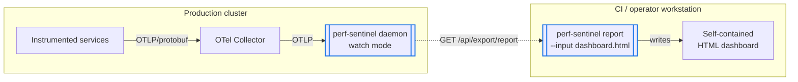
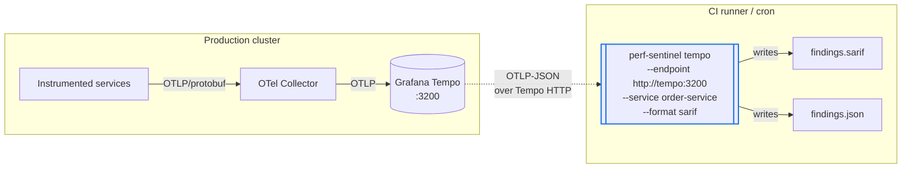
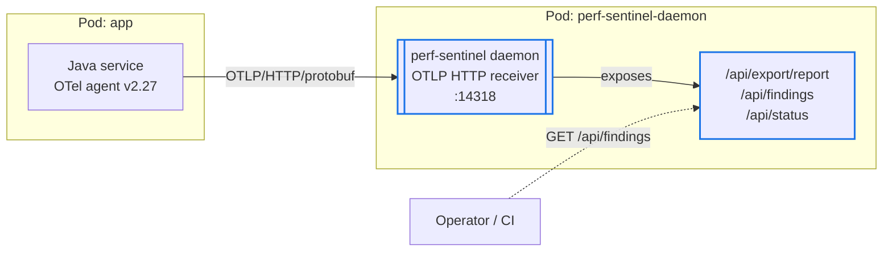
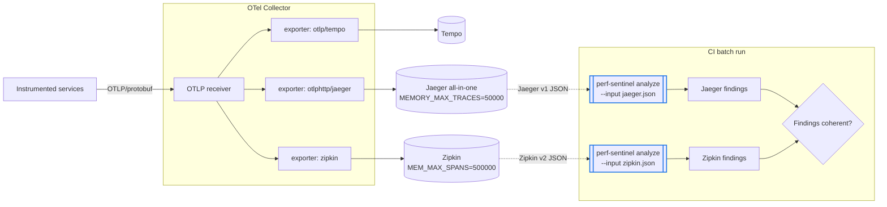
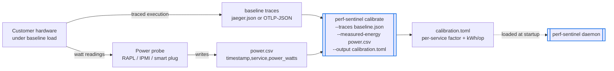
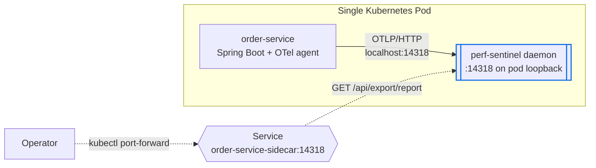
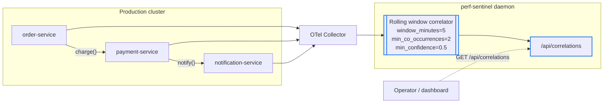
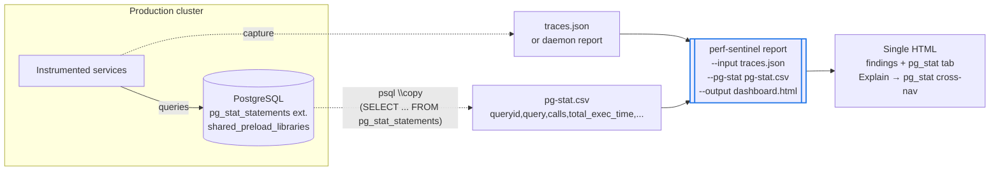

# Deployment-mode adoption guide

This document is the adoption guide for perf-sentinel operational
modes. Each section describes one deployment shape that has been
validated end to end on the lab cluster, with an architecture diagram,
the input/output capture types, the configuration knobs that matter,
and the gotchas that bit us during validation.

The 79 scenarios live under `scenarios/<name>/` and each one ships a
runnable `verify.sh` plus a focused `README.md`. The scripts are
reproducible on a `make up-cni` + `make seed-services` +
`make seed-electricity-maps` cluster.

## Big picture: perf-sentinel across a typical infra

perf-sentinel is not "one tool you install in one place". It plugs in
at every layer of the SDLC, with a different mode per environment.
This section is the 10000-foot view. The per-scenario sections below
detail each mode in depth.

### Per-environment views

Start here. Each environment has its own focused diagram covering only
the surface that mode exposes. Four different deployment topologies: local
dev, CI, staging and production.

**Local dev**


**CI/CD**


**Staging**


**Production**


### GreenOps view

A cross-cutting view of the data sources that feed perf-sentinel for
energy and carbon estimation. Two external real-time sources
(Scaphandre for kWh, Electricity Maps for gCO2/kWh) and three internal
cold tables (Cloud SPECpower across AWS / GCP / Azure for kWh, embodied
carbon per request via Boavizta + HotCarbon 2024 for gCO2e, network
transport via Mytton 2024 for kWh/GB). Works in both batch and daemon
mode, with linear, hourly, and monthly + hourly resolution.


### End-to-end view: how the four environments fit together

Once each mode is clear on its own, this is the integration view that
puts all four side by side and traces a code change from the developer's
laptop all the way to the production daemon's findings.


Source: [`global-integration.mmd`](https://raw.githubusercontent.com/robintra/perf-sentinel-simulation-lab/main/docs/diagrams/mmd/global-integration.mmd).
Single SVG rendered from the `.mmd` source, committed alongside so the
guide displays inline on GitHub. Colors and contrast are baked into
the `.mmd` so the diagram stays readable in both light and dark mode.

### Numbered flow: a code change's journey

Each numbered arrow on the diagram is one step in the path of a
performance-relevant code change from the developer's laptop to the
production daemon's findings.

| #       | What happens                                                                                                                                                                                                                                                                                                                                                                                                                                                                                                                                                                                               | Mode used                 |
|---------|------------------------------------------------------------------------------------------------------------------------------------------------------------------------------------------------------------------------------------------------------------------------------------------------------------------------------------------------------------------------------------------------------------------------------------------------------------------------------------------------------------------------------------------------------------------------------------------------------------|---------------------------|
| (1)     | Dev runs a local perf test against the service running on their workstation.                                                                                                                                                                                                                                                                                                                                                                                                                                                                                                                               | local batch               |
| (2)     | The captured `traces.json` is fed to `perf-sentinel analyze --input` (or `report --input`, or `inspect` for the TUI).                                                                                                                                                                                                                                                                                                                                                                                                                                                                                      | local batch               |
| (3)     | Findings printed to terminal (or HTML / TUI), the dev iterates until clean.                                                                                                                                                                                                                                                                                                                                                                                                                                                                                                                                | local batch               |
| (4)     | `git push` of the candidate change.                                                                                                                                                                                                                                                                                                                                                                                                                                                                                                                                                                        | source control            |
| (5)     | CI is triggered on the PR.                                                                                                                                                                                                                                                                                                                                                                                                                                                                                                                                                                                 | CI/CD                     |
| (6)     | CI runs perf integration tests, captures traces, then `analyze --ci`. **Without perf ITs, no findings will fire and the gate is meaningless.**                                                                                                                                                                                                                                                                                                                                                                                                                                                             | CI batch                  |
| (7)     | Quality gate: exit 1 blocks the merge, exit 0 lets it through.                                                                                                                                                                                                                                                                                                                                                                                                                                                                                                                                             | CI batch                  |
| (8)     | Once merged, the code flows through the deploy pipeline.                                                                                                                                                                                                                                                                                                                                                                                                                                                                                                                                                   | CI/CD                     |
| (9)     | Staging deployment: the focus-service pod ships with a perf-sentinel daemon as sidecar.                                                                                                                                                                                                                                                                                                                                                                                                                                                                                                                    | sidecar                   |
| (10)    | The sidecar ingests OTLP over `localhost:14318` (no network hop).                                                                                                                                                                                                                                                                                                                                                                                                                                                                                                                                          | sidecar                   |
| (11)    | QA / SRE polls `/api/findings` on the staging sidecar to validate the release candidate.                                                                                                                                                                                                                                                                                                                                                                                                                                                                                                                   | sidecar                   |
| (12)    | After QA approval, the same artifact is promoted to production.                                                                                                                                                                                                                                                                                                                                                                                                                                                                                                                                            | CI/CD                     |
| (13)    | Selected heavy services in prod send OTLP directly to the centralized daemon to skip the Collector hop.                                                                                                                                                                                                                                                                                                                                                                                                                                                                                                    | centralized               |
| (14)    | All other services flow through the OTel Collector, which forwards OTLP to both the centralized daemon and the trace store (Tempo / VictoriaTraces / Jaeger).                                                                                                                                                                                                                                                                                                                                                                                                                                              | centralized               |
| (15)    | On-call polls the daemon's HTTP API (`/api/status`, `/api/findings`, `/api/correlations`, `/api/explain/<trace-id>`, `/api/export/report`) and snapshots the Report to a self-contained HTML for post-mortem.                                                                                                                                                                                                                                                                                                                                                                                              | centralized               |
| (16)    | Optional nightly CI cron pulls recent traces from the trace store via `perf-sentinel tempo` (Tempo OTLP-JSON) or `perf-sentinel jaeger-query` (Jaeger / VictoriaTraces) to run regression detection on prod traffic.                                                                                                                                                                                                                                                                                                                                                                                       | CI batch                  |
| (extra) | **Always-on metrics path**: Prometheus scrapes the daemon's `/metrics` endpoint (works for any daemon, sidecar or centralized, on the same port as OTLP HTTP) and Grafana renders it via the upstream dashboard at [`examples/grafana-dashboard.json`](https://github.com/robintra/perf-sentinel/blob/main/examples/grafana-dashboard.json) using `perf_sentinel_findings_total`, `perf_sentinel_io_waste_ratio`, `perf_sentinel_service_io_ops_total`.                                                                                                                                                          | centralized + sidecar     |
| (extra) | **Always-on log path**: every daemon also streams findings as NDJSON to stdout, picked up by the log aggregator (Loki / Elasticsearch / Splunk) via `kubectl logs` or fluent-bit. Useful for alerting and grep-style triage when the HTTP API is overkill.                                                                                                                                                                                                                                                                                                                                                 | centralized + sidecar     |
| (A)     | **pg_stat ingestion via CSV file**: a scheduled or on-demand `psql \copy (SELECT ... FROM pg_stat_statements) TO STDOUT WITH CSV HEADER` exports a snapshot of SQL hotspot counters to `pg-stat.csv`. The file is fed to `analyze`, `report` or the standalone `pg-stat` subcommand via `--pg-stat <csv>`. Works in both CI and local dev.                                                                                                                                                                                                                                                                 | CI batch + local batch    |
| (B)     | **pg_stat ingestion via Prometheus**: `postgres_exporter` exposes `pg_stat_statements` on `:9187/metrics`, scraped by the cluster Prometheus. perf-sentinel reaches it via `--pg-stat-prometheus <url>` (one-shot HTTP GET against either `postgres_exporter` directly or the Prometheus aggregating it). Mutually exclusive with `--pg-stat <csv>`. Auth via `--pg-stat-auth-header` (`PERF_SENTINEL_PGSTAT_AUTH_HEADER` env var preferred in production).                                                                                                                                                | CI batch + local batch    |
| (D)     | **Live prod triage by dev/architect**: an authorized dev can `curl` the prod daemon's HTTP API directly. Three formats: JSON via `/api/findings`, `/api/correlations`, `/api/explain/<trace-id>` (the explain endpoint only works while the trace is still inside the `trace_ttl_ms=30s` window) ; HTML via `curl /api/export/report \| perf-sentinel report --input - --output report.html` ; NDJSON streaming via `kubectl logs deploy/perf-sentinel-daemon -f` for live tailing. Useful when reproducing a customer issue without waiting for the next CI cycle.                                        | centralized               |
| (E)     | **Daemon Report → local batch (best of both worlds)**: pull a Report snapshot from `/api/export/report`, render it with the local CLI. The daemon's `correlations` field is preserved as-is by `report --input` (the local CLI does not recompute correlations in batch, and they are only available because the daemon already did the work over its rolling window). pg_stat is **not** part of the Report and must be added at render time: `curl /api/export/report \| perf-sentinel report --input - --pg-stat /tmp/pg-stat.csv --output dashboard.html`. The dev keeps the JSON locally for re-renders. | centralized → local batch |

### Trade-offs by entity and context

The same code-path detection logic powers every entity, but the
operational characteristics differ. This matrix is what to reach for
when you need to choose where a finding should come from.

| Entity                                                                                           | Mode                               | Pros                                                                                                                                                                                                                                                                                                                                                                                                                                                                                                                                                                                                              | Cons / limits                                                                                                                                                                                                                                                                                                                                                                                                                                            |
|--------------------------------------------------------------------------------------------------|------------------------------------|-------------------------------------------------------------------------------------------------------------------------------------------------------------------------------------------------------------------------------------------------------------------------------------------------------------------------------------------------------------------------------------------------------------------------------------------------------------------------------------------------------------------------------------------------------------------------------------------------------------------|----------------------------------------------------------------------------------------------------------------------------------------------------------------------------------------------------------------------------------------------------------------------------------------------------------------------------------------------------------------------------------------------------------------------------------------------------------|
| **Local CLI** (`analyze --input` / `report --input` / `inspect` / `pg-stat`)                     | batch on captured trace            | Fast iteration, no infra. Multi-format input (auto-detects native OTLP-JSON / Jaeger v1 / Zipkin v2). Re-runs deterministically on the same file. HTML / JSON / TUI / SARIF outputs. **Best-of-both-worlds path** (E): a daemon Report from `/api/export/report` carries `correlations` and is consumed as-is by `report --input -`, so a dev can render a local HTML with prod correlations + cross-reference pg_stat (`--pg-stat <csv>`) in one shot. Window depends on the source: trace dump from Tempo/Jaeger ≈ backend retention (often days/weeks) ; daemon Report = rolling window snapshot at curl time. | **Batch never recomputes correlations** (the correlator is daemon-only by design). When the input is a raw trace file, `correlations: []` always. They only appear when the input IS a daemon-produced Report. Limited to what was captured: forget to enable an exporter and you analyze a partial picture. No live signal, only post-hoc.                                                                                                              |
| **Local daemon** (`perf-sentinel watch` on dev workstation, `127.0.0.1:4317` gRPC / `4318` HTTP) | live, dev session                  | Same `/api/findings` + `/api/correlations` + `/api/export/report` + `/metrics` surface as the prod daemon, but scoped to whatever the dev runs locally. **Correlations available without leaving the laptop**, no need to round-trip through prod. Snapshot via `curl /api/export/report \| report --input - --output report.html` for a sharable HTML at any moment. Useful when iterating on a feature where cross-trace co-occurrence matters (cascade between two local services, async fanout patterns).                                                                                                     | Same windows as prod daemon: `trace_ttl_ms=30s` and `[daemon.correlation] window_minutes=10`. Correlator needs sustained traffic (`min_co_occurrences=3` default) → a single curl to a single endpoint won't fire correlations. The daemon binds `127.0.0.1` by default, so containerised local services need `host.docker.internal:4317` (or `listen_address = "0.0.0.0"` in `~/.perf-sentinel.toml`). RAM cost ~60–150 MiB while the dev session runs. |
| **CI CLI** (`analyze --ci` / `tempo` / `jaeger-query` / `pg-stat`)                               | batch on IT capture or trace store | Deterministic PR gate: exit code 1 fails the build, SARIF feeds GitHub / GitLab code scanning. Composable with `--pg-stat[-prometheus]` for SQL hotspot regression. Can pull from prod's trace store nightly via `tempo` / `jaeger-query` for drift detection.                                                                                                                                                                                                                                                                                                                                                    | **Useless without perf integration tests** (k6, JMeter, Gatling). A unit-test trace has no N+1 to detect. No correlations from a single CI run (correlator needs `[daemon.correlation] window_minutes=10` of sustained traffic).                                                                                                                                                                                                                         |
| **Sidecar daemon** (`watch`, per-pod)                                                            | live, scoped to one pod            | Smallest live footprint that still gives `/api/findings` + Prometheus `/metrics` + NDJSON stdout. No cross-pod network hop (OTLP over loopback). Findings scoped to one service: zero noise from neighbors. Failure-isolated: sidecar OOM only affects that pod.                                                                                                                                                                                                                                                                                                                                                  | **Pod-only scope**: no cross-service correlations possible. **Rolling window only**: `trace_ttl_ms=30s` after last span (so `/api/explain/<trace-id>` evaporates fast); `[daemon.correlation] window_minutes=10` for cross-trace co-occurrences. **Per-pod cost**: ~60–150 MiB RAM per replica, multiplies with replica count.                                                                                                                           |
| **Centralized daemon** (`watch`, fleet)                                                          | live, fleet-wide                   | **Cross-service correlations** become available (`/api/correlations` only fires when multi-service co-occurrences are observed). Single API surface for SRE dashboards. Snapshot via `/api/export/report` → HTML for post-mortem. Can ingest both via OTel Collector and direct OTLP from heavy services. Memory metrics + log path + HTTP API in one place.                                                                                                                                                                                                                                                      | **Rolling window, not historical**: same `trace_ttl_ms=30s` and `window_minutes=10` defaults. For analysis older than the window, use the trace store (`perf-sentinel tempo` / `jaeger-query`). **Capacity ceiling**: `max_active_traces=10000` (default), LRU eviction past that. **Single point of contention**: one daemon for the fleet means RAM scales with active trace volume.                                                                   |
| **HTML report** (`report --input`)                                                               | static post-mortem                 | Self-contained file (~1 MiB), shareable offline, opens in any browser. Embeds findings + pg_stat tab + Explain → pg_stat cross-nav + correlations (when source is a daemon Report). Canonical artifact for sprint reviews and incident reports.                                                                                                                                                                                                                                                                                                                                                                   | **Frozen snapshot**: no live update. Correlations only present if the input is a daemon Report (batch JSON has no correlator state). Re-rendering requires re-running `report --input`.                                                                                                                                                                                                                                                                  |

### Detection knob: N+1 SQL vs redundant SQL classification

The OpenTelemetry Java agent (and most other auto-instrumentation
agents) ships with the SQL statement sanitizer **on by default**, so
literals are replaced by `?` before the span hits perf-sentinel. With
no extractable parameters, the standard distinct-params rule rejects
the group and what is morally an N+1 ends up classified as
`redundant_sql` by the redundant detector. The
`[detection].sanitizer_aware_classification` setting (in `config.toml`
for daemons, in `.perf-sentinel.toml` for CI/local batch) tunes the
recovery heuristic. Same key, same effect, both modes, just different
file location.

| Value              | Behavior                                                                                                                                                                                              | When to use                                                                                                                                                                                                        |
|--------------------|-------------------------------------------------------------------------------------------------------------------------------------------------------------------------------------------------------|--------------------------------------------------------------------------------------------------------------------------------------------------------------------------------------------------------------------|
| `"auto"` (default) | Reclassify to `n_plus_one_sql` when **either** the ORM scope signal (Spring Data, Hibernate, EF Core, SQLAlchemy, ActiveRecord, GORM, Prisma, Diesel, ...) **or** the per-span timing variance fires. | Best recall on production Spring Data / EF Core stacks.                                                                                                                                                            |
| `"strict"`         | Reclassify only when **both** signals fire conjointly (ORM scope + timing variance).                                                                                                                  | When `redundant_sql` itself is actionable signal you don't want absorbed into `n_plus_one_sql` (legacy polling loops, unmemoized config lookups served from row cache). The lab's daemon manifests use this value. |
| `"always"`         | Reclassify any sanitized group reaching `n_plus_one_min_occurrences` spans as `n_plus_one_sql`.                                                                                                       | Aggressive; may flip a real single-param redundancy. Use when you don't care about `redundant_sql` precision.                                                                                                      |
| `"never"`          | Disable the heuristic, pre-0.5.7 behavior.                                                                                                                                                            | Compatibility / debugging only.                                                                                                                                                                                    |

Findings reclassified by the heuristic carry
`classification_method = "sanitizer_heuristic"` in their JSON so
operators can spot where it fired vs the standard distinct-params path.
Findings produced by the standard rule omit the field.

### What goes where, and why

| Environment                          | Mode                                                                                                                                                                                                                                                                                      | Why this mode                                                                                                                                                                                                                                                                                                                                                                                                                 | See scenario                                                                                                                                                               |
|--------------------------------------|-------------------------------------------------------------------------------------------------------------------------------------------------------------------------------------------------------------------------------------------------------------------------------------------|-------------------------------------------------------------------------------------------------------------------------------------------------------------------------------------------------------------------------------------------------------------------------------------------------------------------------------------------------------------------------------------------------------------------------------|----------------------------------------------------------------------------------------------------------------------------------------------------------------------------|
| Local dev workstation                | **Either** `analyze --input` (batch on a captured trace, fastest iteration) **or** `perf-sentinel watch` (local daemon on `127.0.0.1:4317/4318`, when the dev wants live correlations as they code). Plus `report --input` for HTML, `inspect` for TUI, `pg-stat` for SQL hotspot triage. | Pick batch when the goal is a deterministic post-mortem on a captured `traces.json` (file exporter or saved daemon snapshot). Pick the local daemon when iterating on cross-service flows where rolling correlations matter, or when the dev wants the same `/api/*` surface as prod for parity. The two coexist: a dev can run the daemon while debugging then capture its `/api/export/report` snapshot for offline triage. | [`hybrid-daemon-batch`](#hybrid-daemon-to-batch-html), [`multiformat-input`](#multi-format-input-jaeger--zipkin), [`daemon-otlp-direct`](#daemon-otlp-direct-no-collector) |
| CI/CD pipeline (PR gate)             | `perf-sentinel analyze --ci --input traces.json` (or `tempo` to fetch live)                                                                                                                                                                                                               | Fail the build when a regression introduces a new finding. **Requires perf integration tests in the pipeline** (k6, JMeter, Gatling). Without realistic load, the trace contains no anti-patterns to detect, so the gate is silently green and meaningless.                                                                                                                                                                   | [`hybrid-daemon-batch`](#hybrid-daemon-to-batch-html), [`batch-tempo-scrape`](#batch-over-tempo)                                                                           |
| Staging / pre-prod (focused service) | Sidecar daemon in the same pod, OTLP via `localhost:14318`                                                                                                                                                                                                                                | One service is in the spotlight for a release candidate or load test. Findings scoped to that pod, no cross-service noise. Cheaper than running a full centralized daemon if only one service matters.                                                                                                                                                                                                                        | [`sidecar-pattern`](#sidecar-pattern)                                                                                                                                      |
| Production                           | Centralized daemon ingesting either via OTel Collector OR direct OTLP from selected services                                                                                                                                                                                              | Catch correlations across the whole fleet, expose `/api/correlations` for SRE dashboards, snapshot HTML reports for post-mortems. Heavy services can bypass the Collector and push OTLP straight to the daemon to skip the extra hop.                                                                                                                                                                                         | [`correlation-finding`](#cross-trace-correlation-finding), [`hybrid-daemon-batch`](#hybrid-daemon-to-batch-html), [`pg_stat`](#pg_stat-live-integration)                   |

### Watch out

- **CI gate without perf tests is theatre.** perf-sentinel detects
  N+1, redundant calls, slow SQL, fanout, etc. from real trace shapes.
  A unit-test trace with 3 spans will never trip a finding. If you
  wire the gate but skip the load step, you ship the regression and
  the gate stays green. Make perf integration tests a hard prerequisite
  to running `analyze --ci`.
- **Local dev: pick batch or daemon by need.** "Run a perf test, look
  at the findings, fix, repeat" → batch (`analyze --input`) is faster.
  "I'm chasing a cross-service interaction and I want correlations
  surfaced live as I code" → local daemon (`perf-sentinel watch` on
  `127.0.0.1:4317`). The two are not mutually exclusive: run the
  daemon, snapshot `/api/export/report` whenever needed, feed it to
  `report --input -` for an HTML you can keep. Just remember the
  daemon binds loopback by default, so Docker-ised local services need
  `host.docker.internal:4317` or `listen_address = "0.0.0.0"` in
  `~/.perf-sentinel.toml`.
- **Sidecar in staging means one daemon per monitored pod.** Multiply
  the daemon footprint (~60-150 MiB RAM) by replica count before
  rolling out fleet-wide. For multi-service staging, prefer the
  centralized mode used in production.
- **Production direct-OTLP path** skips Collector-side processing
  (sampling, tail-based filtering, multi-export). Use it sparingly,
  only for services where the extra hop hurts and where you don't need
  the Collector's pipeline.

## Coverage

| Scenario (slug)                                           | Mode tested                                                    | Cluster deps                                     | Status |
|-----------------------------------------------------------|----------------------------------------------------------------|--------------------------------------------------|--------|
| [`hybrid-daemon-batch`](#hybrid-daemon-to-batch-html)     | hybrid daemon -> batch HTML                                    | running daemon                                   | PASS   |
| [`batch-tempo-scrape`](#batch-over-tempo)                 | batch over Tempo via `perf-sentinel tempo`                     | daemon + Tempo                                   | PASS   |
| [`daemon-otlp-direct`](#daemon-otlp-direct-no-collector)  | daemon OTLP direct (no Collector)                              | dedicated daemon + cloned service                | PASS   |
| [`multiformat-input`](#multi-format-input-jaeger--zipkin) | multi-format input (Jaeger + Zipkin)                           | Jaeger + Zipkin + multi-export collector         | PASS   |
| [`calibrate-mode`](#calibrate-energy-coefficients)        | calibrate energy coefficients                                  | none (fixture + synthetic CSV)                   | PASS   |
| [`sidecar-pattern`](#sidecar-pattern)                     | sidecar pattern (1 daemon per pod)                             | sidecar pod                                      | PASS   |
| [`correlation-finding`](#cross-trace-correlation-finding) | cross-trace correlation finding                                | running daemon + cross-service traffic           | PASS   |
| [`pg-stat`](#pg_stat-live-integration)                    | `report --pg-stat` live integration                            | running daemon + Postgres `pg_stat_statements`   | PASS   |
| [`grafana-dashboard`](#grafana-dashboard-validation)      | upstream dashboard import + audit + alerts + postgres-exporter | running daemon + Prometheus + Grafana + Postgres | PASS   |
| [`astronomy-shop`](#astronomy-shop-capture-and-replay)    | foreign OTel auto-instrumentation + FP budget on captured demo slices | none (committed fixtures + local binary)         | PASS   |
| [`grouping-identity`](#grouping-identity)                  | 0.11 grouping identity across ingest, detection and outputs    | local binary + Docker + Chrome                    | PASS   |

The first nine rows are the core deployment-mode scenarios.
`astronomy-shop` is the foreign-instrumentation replay gate.
`grouping-identity` is the 0.11 contract gate. The lab now ships 79
scenarios in total, all wired into `make verify-all-scenarios` (run
`make help` for the full per-target list). The others cover the CI
quality gate (`ci-shift-left`, `output-formats-coverage`), the three
CI templates (GitLab, Jenkins, GitHub Actions), and the resilience and
failure-mode scenarios. Those last include `daemon-sigterm-drain`, the
0.8.5 graceful-drain-on-SIGTERM proof, and `daemon-analysis-shedding`,
the 0.8.6 metered analysis load-shedding proof.

They cover the measured-energy backends: Scaphandre, Kepler, Redfish,
`alumet-conformance` (the 0.9.12 Alumet gate against the real upstream
agent) and `alumet-db-waste` (the 0.9.13 database-waste gate covering
the Alumet DB-cgroup energy attributed to the SQL-only avoidable
share, with sticky/staleness and carry-over-under-shedding legs). They
cover the ack workflow, and the query monitor data plane through
`query-monitor-api`, the 0.8.8 read-only endpoints behind
`query monitor`: `/api/config` with its secret-leak gate,
`/api/energy`, the extended `/api/status`, and the six
energy/carbon/capacity gauges.

They cover the disclose (two-tier waste v1.1), disclose-temporal
(continuity v1.2), and verify-hash CLI, plus the five 0.8.13
disclosure/chart gates: `sci-functional-unit` G1 SCI-per-trace
intensity, `rgesn-crosswalk` G2 RGESN crosswalk, `esrs-e1-crosswalk`
R1 schema v1.3 + ESRS E1 crosswalk, `verify-hash-fail-closed` R2
signed-without-identity fail-closed, and `chart-prometheusrule-pdb`
Phase A PrometheusRule + PodDisruptionBudget.

`chart-disclose-persistence` is a real `helm install` in
`StatefulSet`+persistence mode: the disclosure archive survives a pod
reschedule and round-trips through `disclose`, the live counterpart to
the render-only chart gates above. It is the first scenario to consume
the chart as an OCI artifact rather than a local path. It resolves the
newest published version from the GHCR tag list by default, and
switches to the working-tree chart only when that one is newer, i.e. a
pre-publication release candidate, so in OCI mode it needs no
perf-sentinel checkout at all.

Then come the six limit-testing scenarios (`limit-*`, below), the four
0.9.2 ingestion/normalize/suggestion gates (`sql-backtick-redaction`,
`non-sql-datastore-drop`, `non-sql-datastore-metering`,
`ruby-activerecord-suggestion`), the 0.9.3 Datadog/dd-trace bridge
gate (`datadog-bridge`), and the two 0.9.5 gates: `batch-otlp-file`
for OTLP/JSON batch input from the Collector file exporter, and
`mysql-stat` on a real MySQL LTS performance_schema. See the sections
near the end of this guide for those two.

The `astronomy-shop` capture-and-replay gate covers foreign OTel demo
auto-instrumentation and a false-positive budget on committed slices.
Two astronomy-replay robustness gates build on it:
`sampling-degradation`, deterministic trace-sampled and span-loss
variants of the astronomy slices, and `semconv-drift`,
old-only/new-only/dup attribute-key rewrites. See the sections after
astronomy-shop for both.

The `prod-topology-replay` gate replays a committed slice of real
Alibaba v2022 production call graphs for the topological detector
surface, and the `rpc-carrier-parity` gate rewrites that same slice
onto the OTel RPC semconv keys the ingest admits since product 0.9.8.
The `chaos-replay` gate replays a committed slice of the OTel demo
captured under live chaos, namely failure flags, a mid-tier SIGKILL
and a paused dependency, asserting clean degradation and a
deterministic finding census.

The `endpoint-resolution` gate locks the 0.9.22 `source.endpoint`
ancestor walk. It covers the inbound route resolved through ancestors
rather than the direct parent, the CLIENT skip that stops an outbound
URL naming a finding, the outermost-not-nearest code frame, and the
per-language spelling parity that keeps one origin on one
acknowledgment signature. The `appsec-hardening` gate locks the 0.9.15
AppSec remediation: source_endpoint redaction, ack API-key enforcement
on reads with the `PERF_SENTINEL_ACK_API_KEY` override, the real
quality gate on `/api/export/report`, the verify-hash attestation
PARTIAL cap, and the non-loopback bind advisory.

The `broker-messaging-waste` gate covers OTel messaging ingestion and
the broker energy attribution. At its centre is the two-source
arbitration between a measured cgroup and a declared cluster. It is
driven against a real scraper that is cut, restored with a retroactive
catch-up, answers without the expected label, and is unreachable from
boot. It also covers disclosure v1.5, the configuration refusals, the
destination spellings across broker families, and the producer link on
the real astronomy capture.

The `java-ci-capture` gate runs the upstream Java CI recipe verbatim
from the published POM: Maven Failsafe with the OTel agent attached to
the fork, `perf-sentinel capture` receiving OTLP over the network, and
`analyze --ci` on the result. It holds the capture exit-code contract
too: size cap, unusable versus backpressure rejections, refusal to
start on an unwritable output, whole-process-group stop on SIGTERM,
and cross-container listening.

The `otlp-compression-matrix` gate locks the 0.9.28 OTLP transport ×
encoding matrix. Gzipped gRPC is ingested, and refused on the pre-fix
image. The HTTP and uncompressed paths stay green, deflate works over
both transports, and zstd/snappy are still refused. A cluster leg
temporarily switches the real collector onto the daemon's gRPC port.
The `ack-lifecycle-warning` gate locks the 0.9.28 acknowledgment life
cycle: the unmatched warning, the fixed-versus-not-run split driven by
per-endpoint I/O counts, and the guard that keeps a pre-computed
report from advising the removal of a still-useful entry.

The `export-snapshot-scope` gate locks the 0.13.1 export slice. It
covers the configurable `max_export_findings` cap where it is
published, acts and discloses, and the `snapshot_scope` entries
together with their absence on a cold start. It also covers an
oversized snapshot named rather than flattened into an unreachable
daemon, and the startup advisory that fires on the two knobs together
but never on retained traces alone.

The six `hub-*` gates are the 0.15.0 ecosystem tier, the first
scenarios in this lab to involve anything other than perf-sentinel
itself. `hub-ingestion` is their dependency root: the daemon's push
export reaching PerfSentinelHub, and the envelope coming back out in a
shape the IDE plugins parse. `hub-source-reachability` isolates a
daemon-and-Hub pair to prove that only a successful poll clears the
unreachable marker and a push never does. `hub-derived-status` forges
envelopes to reach `likely_resolved`, which no organic traffic in this
lab produces, and pins the two negative cases (a source that never
witnessed the finding, and one the Hub cannot reach) that must stay
`not_observed`. `hub-lineage-mutation` drives a real SQL template
mutation through `order-service` and checks both halves of the answer,
the Hub's lineage origin and the CLI's `mutated_findings` pairing.
`hub-retention-purge` proves the boot purge drops a stale predecessor
while its successor keeps the original birth date, and that `backup`
yields a database a second Hub can serve from. `hub-plugin-contract`
captures the payload the JetBrains plugin actually parses, straight
from a running Hub, into a fixture the plugin replays in its own
`HubContractTest`.

Two limits are worth stating. The Hub has no published image, so every
run needs `make seed-hub-local` to build one from a local checkout, and
the committed manifest stays in `ImagePullBackOff` until it does. And
no finding in this lab carries a `code_location`: the OpenTelemetry
Java agent attaches no `code.*` attributes to JDBC spans, so the
plugin's navigation contract is not covered by a captured fixture and
stays owned by the plugin's own anchor resolver tests.

The release gate runs all 79. Each validated version is recorded in
the upstream `release-gate/lab-validations.txt` ledger.

## Run

```bash
# Single scenario (full list via `make help`)
make verify-hybrid-daemon-batch
make verify-batch-tempo-scrape
make verify-daemon-otlp-direct
make verify-multiformat-input
make verify-calibrate-mode
make verify-sidecar-pattern
make verify-correlation-finding
make verify-grouping-identity
make verify-pg-stat
make verify-grafana-dashboard
make verify-query-monitor-api
make verify-ci-shift-left
make verify-output-formats-coverage
make verify-verify-hash-roundtrip
make verify-intent-validator
make verify-template-gitlab-ci
make verify-template-jenkinsfile
make verify-template-github-actions
make verify-multi-agent-load
make verify-long-running-drift
make verify-failure-mode-daemon-restart
make verify-daemon-sigterm-drain
make verify-failure-mode-backend-down
make verify-failure-mode-network-partition
make verify-cold-start-edge-cases
make verify-daemon-ack-workflow
make verify-scaphandre-mock-validation
make verify-measured-energy-chain

# 0.8.13 feature gates (run with PERF_SENTINEL_VERSION=0.8.13-rc until the image is published)
make verify-sci-functional-unit
make verify-rgesn-crosswalk
make verify-esrs-e1-crosswalk
make verify-verify-hash-fail-closed
make verify-chart-prometheusrule-pdb

# 0.9.5 feature gates (local release binary + Docker)
make verify-batch-otlp-file
make verify-mysql-stat

# Astronomy Shop capture-and-replay (committed fixtures + local release binary only)
make verify-astronomy-shop

# Sampling robustness on the astronomy fixtures (local release binary only)
make verify-sampling-degradation

# Semconv-migration robustness on the astronomy fixtures (local release binary only)
make verify-semconv-drift

# Real production topology from the Alibaba v2022 call graphs (local release binary only)
make verify-prod-topology-replay

# OTel RPC semconv ingest vs the synthetic carrier on that same slice (local release binary only)
make verify-rpc-carrier-parity

# Live-chaos telemetry from the OTel demo (local release binary only)
make verify-chaos-replay

# All 70 (sequential, long-running-drift is the long pole)
make verify-all-scenarios
```

Each scenario writes a markdown report under
`/tmp/scenario-<name>-report.md`.

## How to read the diagrams

Every scenario diagram uses a consistent vocabulary:

- **Solid arrow** = always-on flow (production traffic, OTLP, pull
  loops).
- **Dashed arrow** = on-demand fetch (CI snapshot, CLI batch, query API).
- **Box with double border + blue stroke** = perf-sentinel surface (CLI
  subcommand or daemon endpoint). Colors are baked into the `.mmd`
  source so contrast stays correct in both light and dark mode.
- **Annotation in italic** = capture format (`OTLP/protobuf`,
  `Tempo OTLP-JSON`, `Jaeger v1`, `Zipkin v2`, `Report JSON`, `pg_stat
  CSV`).

The diagrams are also available as standalone Mermaid sources under
[`docs/diagrams/mmd/`](https://github.com/robintra/perf-sentinel-simulation-lab/tree/main/docs/diagrams/mmd)
(`<name>.mmd`), useful for rendering to SVG/PNG or copying into other
docs.

## Capture format cheat sheet

Adoption decisions usually start with "what trace format do I have?".
This table maps perf-sentinel's accepted inputs to the upstream sources
the lab has exercised live.

| Input format                                | perf-sentinel entry point                   | Lab source                        | Validated by                                             |
|---------------------------------------------|---------------------------------------------|-----------------------------------|----------------------------------------------------------|
| OTLP/protobuf (live)                        | daemon `:14317` (gRPC) / `:14318` (HTTP)    | OTel Collector or direct from app | daemon-otlp-direct, sidecar-pattern, correlation-finding |
| OTLP-JSON (Tempo)                           | `perf-sentinel tempo --endpoint <url>`      | Tempo `:3200`                     | batch-tempo-scrape                                       |
| Jaeger v1 JSON                              | `perf-sentinel analyze --input`             | Jaeger query API                  | multiformat-input                                        |
| Zipkin v2 JSON                              | `perf-sentinel analyze --input`             | Zipkin query API                  | multiformat-input                                        |
| Daemon Report JSON                          | `perf-sentinel report --input`              | `/api/export/report`              | hybrid-daemon-batch                                      |
| Postgres `pg_stat_statements` CSV           | `perf-sentinel report --pg-stat`            | `psql \copy`                      | pg-stat                                                  |
| Power CSV (`timestamp,service,power_watts`) | `perf-sentinel calibrate --measured-energy` | metered hardware                  | calibrate-mode                                           |

---

## Hybrid daemon to batch HTML

A daemon runs in production and accumulates findings via its rolling
window correlator. A developer or CI job snapshots the daemon's
`/api/export/report` endpoint and renders a single-file HTML dashboard
for shareable post-mortem. No re-analysis is run on the snapshot.

### Architecture



### Adoption notes

- Inputs: a running daemon exposing `/api/export/report`. No traces are
  re-parsed on the CI side.
- Output: a self-contained HTML file that bundles the daemon's findings,
  correlations, energy scores, and dashboards in a single artifact (the
  validated run produced ~1 MiB).
- Where it fits: post-mortem workflows, sprint review dashboards, weekly
  ops review. The HTML is shareable without giving access to the daemon.

### Configuration

No special daemon config. The CLI runs offline once it has the JSON.
The `--input` accepts the raw `Report` JSON returned by
`/api/export/report`.

### Watch out

- `analyze` does not accept Report JSON, only raw trace events. If you
  want SARIF output from a batch job, use batch-tempo-scrape (Tempo) or feed Jaeger /
  Zipkin exports as in multiformat-input.
- The HTML reflects the daemon's correlator state at the moment of the
  snapshot. There is no time-window flag to slice the snapshot
  retroactively.

---

## Batch over Tempo

A user has Tempo deployed but no perf-sentinel daemon running 24/7.
A periodic batch CI job fetches recent traces from Tempo and runs
detection on them, emitting findings as JSON or SARIF.

### Architecture



### Adoption notes

- Inputs: Tempo's HTTP API (`:3200`) returning OTLP-JSON.
- Output: JSON findings list or SARIF (suitable for GitHub code
  scanning, GitLab security dashboard).
- Where it fits: low-cost adoption when Tempo is already deployed.
  No daemon footprint, just a CI cron that pulls the last N minutes
  of traces.

### Configuration

```bash
perf-sentinel tempo \
  --endpoint http://tempo.observability.svc.cluster.local:3200 \
  --service order-service \
  --since 1h \
  --format sarif
```

`host.docker.internal:3200` is used in the lab verify because the CLI
runs in a Docker container on the developer host while Tempo is
port-forwarded.

### Watch out

- Tempo serves OTLP-JSON only (no Jaeger v1 dialect). Earlier
  perf-sentinel versions required a Jaeger conversion pre-step. From
  0.5.16 onward the `tempo` subcommand consumes OTLP-JSON natively.
  See `project_perf_sentinel_followup.md` item 5 (RESOLVED in 0.5.16).
- Set `--since` aggressively in CI to bound scan duration and avoid
  re-detecting findings that the previous run already surfaced.

---

## Daemon OTLP direct (no Collector)

Minimal setup: an instrumented service exports OTLP straight to the
perf-sentinel daemon's HTTP endpoint. No Tempo, no OTel Collector.
Useful for on-prem or edge environments where adding an extra hop is
undesirable.

### Architecture



### Adoption notes

- Inputs: OTLP/HTTP/protobuf direct from the app's OTel exporter
  (`OTEL_EXPORTER_OTLP_ENDPOINT=http://perf-sentinel-daemon:14318`).
- Output: the daemon's HTTP API surface (`/api/findings`,
  `/api/correlations`, `/api/export/report`).
- Where it fits: smallest footprint that still gets you live findings
  and correlations. Good fit for a single team owning a single service
  cluster, or for staging environments without observability tooling.

### Configuration

The lab daemon binds custom ports `14317` (gRPC) and `14318` (HTTP)
rather than the OTLP defaults `4317`/`4318` to avoid clashing with
other agents on the same node. Application config:

```yaml
env:
  - name: OTEL_EXPORTER_OTLP_ENDPOINT
    value: http://perf-sentinel-daemon-direct.b2-3-direct-otlp.svc.cluster.local:14318
  - name: OTEL_EXPORTER_OTLP_PROTOCOL
    value: http/protobuf
```

### Watch out

- No Tempo means no historical trace storage. Findings live only as
  long as the daemon's correlator window keeps them.
- If you want both this mode AND a centralized lab daemon, give them
  distinct namespaces and make sure NetworkPolicies allow ingress to
  the dedicated daemon (the lab adds an additive
  `postgres-allow-b2-3-direct-otlp` policy in the `db` namespace for
  the cloned service).

---

## Multi-format input (Jaeger + Zipkin)

The OTel Collector pipeline emits the same traces in parallel to
several backends (Tempo, Jaeger, Zipkin). Batch perf-sentinel runs are
fed traces from each backend and the findings should be coherent.
Useful when migrating between trace stores or running a per-format
audit on top of an existing observability stack.

### Architecture



### Adoption notes

- Inputs: Jaeger query API (`/api/traces`), Zipkin query API
  (`/api/v2/traces`).
- Output: per-format findings comparable across backends (the lab run
  matched 3 categories common: `n_plus_one_sql`, `pool_saturation`,
  `redundant_sql`).
- Where it fits: organisations standardising on one trace backend that
  want to audit an alternative format before committing, or
  multi-tenant setups where different teams use different stores.

### Configuration

Collector overlay (`collector-overlay.yaml`):

```yaml
exporters:
  otlphttp/jaeger:
    endpoint: http://jaeger.observability.svc.cluster.local:4318
    tls: { insecure: true }
  zipkin:
    endpoint: http://zipkin.observability.svc.cluster.local:9411/api/v2/spans
service:
  pipelines:
    traces:
      exporters: [otlp/tempo, otlphttp/jaeger, zipkin]
```

### Watch out

- In-memory Jaeger and Zipkin FIFO-evict old traces when full. Default
  caps (10k traces / 100k spans) are too low under sustained k6
  traffic, raise them to 50k / 500k as in `manifests.yaml`.
- Use a focused traffic burst (multiformat-input sends 20 targeted requests rather
  than running `make validate-findings` which floods the indexer with
  1500 requests).
- Filter out single-span health probes (>5 spans) before feeding the
  CLI, otherwise the analyze surface is dominated by trivial traces.
- Cilium NetworkPolicies must explicitly allow the Collector to reach
  Jaeger and Zipkin (the lab adds `jaeger-allow-internal`,
  `zipkin-allow-internal`, `otel-collector-egress-to-jaeger-zipkin`).
- Boundary fixtures: only Jaeger v1 is exercised. Zipkin v2 tags are
  `Map<String,String>`, so a depth-31 fixture would reject on type
  before the depth check fires. The depth guard itself is
  format-agnostic.

---

## Grouping identity

`grouping-identity` is the 0.11 fail-closed contract for deployment identity.
It drives OTLP HTTP, OTLP gRPC and the daemon JSON socket, then checks resource
priority, span fallback, custom `tenant.id`, the eight-key cap, 256-byte
truncation, control-character rejection and per-trace detector partitioning.
It also verifies the JSON/API contract, legacy-baseline diff fallback and the
real Chrome findings/correlations CSV exports.

```bash
make verify-grouping-identity
```

Prerequisites: the local 0.11.0 release binary, Docker and Chrome/Chromium. The
scenario writes `/tmp/scenario-grouping-identity-report.md` and never records a
release ledger PASS itself.

---

## Calibrate energy coefficients

Customer measures power consumption (in watts) on their own hardware
during a baseline trace window, feeds both the trace JSON and the power
CSV to `perf-sentinel calibrate`, and gets a TOML file with
hardware-tuned energy coefficients for accurate green-ops scoring.

### Architecture



### Adoption notes

- Inputs: baseline traces + a power CSV with one row per
  `(timestamp,service,power_watts)` sample.
- Output: a TOML file with `[calibration]`, `[calibration.services]`
  blocks and per-service `factor` + `measured_energy_per_op_kwh`.
- Where it fits: green-ops adoption on hardware that does not match the
  default coefficients (older CPUs, custom servers, on-prem deployments
  far from cloud reference profiles).

### Configuration

```bash
perf-sentinel calibrate \
  --traces fixtures/baseline.json \
  --measured-energy power.csv \
  --output calibration.toml
```

CSV format:

```
timestamp,service,power_watts
2026-04-30T11:08:00Z,order-service,18.0
2026-04-30T11:08:01Z,order-service,17.5
```

Timestamps must overlap the trace window or `calibrate` reports
"no overlap, factor unchanged".

### Watch out

- `calibrate` is for energy coefficients only, not anti-pattern
  thresholds. The CLI subcommand name historically led to confusion.
- If the measured wattage is well above the default model (or the CSV
  timestamps are off), `calibrate` prints
  `factor > 10x default, possible measurement error`. Treat it as a
  signal to recheck the CSV format and clock skew.
- Re-run after any major deployment change (new service, new region,
  hardware refresh).

---

## Sidecar pattern

A single application service is monitored by a perf-sentinel daemon
deployed as a sidecar in the same pod. The service pushes OTLP traces
to `localhost:14318`. Findings are scoped to that one service.

### Architecture



### Adoption notes

- Inputs: localhost OTLP from the colocated application container only.
- Output: per-pod daemon HTTP API. The cardinality is "one daemon per
  pod" so findings are naturally scoped.
- Where it fits: strict pod-level isolation, single-service monitoring
  without a centralized daemon, edge or air-gapped environments.

### Configuration

Pod-level OTel exporter env (the daemon and app share the network
namespace):

```yaml
- name: OTEL_EXPORTER_OTLP_ENDPOINT
  value: http://localhost:14318
- name: OTEL_EXPORTER_OTLP_PROTOCOL
  value: http/protobuf
```

Daemon `config.toml`:

```toml
[daemon]
listen_address = "0.0.0.0"     # see trade-off below
listen_port_http = 14318
trace_ttl_ms = 30000
```

### Watch out

- **Bind address trade-off**: a strict-isolation deployment binds
  `127.0.0.1:14318` so cross-pod traffic is impossible. The lab binds
  `0.0.0.0` because the verify probe goes through a Service. If you
  follow the lab pattern, enforce isolation by NOT exposing a Service
  for the daemon port (the lab does expose it, this is documented
  inline as a verify compromise).
- `trace_ttl_ms` defaults to 5000 ms which is too short for OTel agent
  BatchSpanProcessor flushes (5s window). Bump to 30000 for stable
  N+1 detection on bursty traffic.
- Per-pod overhead: ~60-150 MiB RAM. Multiply by pod count if rolling
  out fleet-wide.
- No correlator across pods. Cross-service findings are not visible
  with this pattern.

---

## Cross-trace correlation finding

A system has many services calling each other. The daemon's rolling
window correlator tracks span templates that systematically co-occur
across traces. When `service-A.span-X` consistently leads to
`service-B.span-Y` within the configured lag window, the correlator
exposes the pair via `/api/correlations` with a confidence score.

### Architecture



### Adoption notes

- Inputs: live traces flowing through the daemon (any of the modes
  above provides the input).
- Output: a list of `(source, target, confidence, co_occurrence_count,
  median_lag_ms)` records exposed by `/api/correlations`. Each
  source/target is a `(service, finding_type, template)` triplet.
- Where it fits: spotting tight cross-service coupling, surfacing
  cascade-prone request chains, building a dependency graph that
  reflects reality rather than design intent.

### Configuration

```toml
[daemon.correlation]
enabled = true
window_minutes = 5
lag_threshold_ms = 60000
min_co_occurrences = 2
min_confidence = 0.5
```

### Watch out

- The window is 5 minutes by default. If your CI smoke run is shorter
  than that, you will see no correlations. The lab verify waits 90s
  for fresh entries and runs `make validate-findings` (chatty +
  fanout + serialized scenarios) to seed the correlator.
- `confidence > 0.5` is a sane production threshold. Lower it to
  surface noisy candidates during exploration. Do not lower it in
  production alerts.
- The `source` and `target` fields are dicts, not strings. Consumers
  must extract `service` + `template` (the lab verify includes a small
  `fmt(d)` Python helper).

---

## pg_stat live integration

Pair the trace-derived anti-pattern findings with database hotspot
data from `pg_stat_statements` in a single HTML dashboard. The
`pg_stat` tab surfaces the top SQL templates by total exec time,
calls, mean exec time, rows returned, and shared block hit/read
counters. The Explain -> pg_stat cross-navigation maps each detected
anti-pattern (notably `n_plus_one_sql`, `redundant_sql`, `slow_sql`)
to its matching template row.

### Architecture



### Adoption notes

- Inputs: any trace JSON accepted by `perf-sentinel report` (a daemon
  Report or raw trace events) plus a `pg_stat_statements` CSV.
- Output: an HTML dashboard with a `pg_stat` tab and Explain -> pg_stat
  cross-navigation links from anti-pattern findings to matching
  templates.
- Where it fits: closing the loop between application-level findings
  ("this code path is N+1") and database-level evidence ("this SQL
  template ran 12000 times in the window"). Most useful in
  post-mortems and capacity reviews.

### Configuration

Postgres needs the extension enabled at the cluster level. In the lab
this is done via the StatefulSet args (a startup-only setting):

```yaml
args:
  - -c
  - shared_preload_libraries=pg_stat_statements
  - -c
  - pg_stat_statements.track=all
  - -c
  - pg_stat_statements.max=10000
```

Plus `CREATE EXTENSION IF NOT EXISTS pg_stat_statements;` in the
init script (only runs on first init when PGDATA is empty).

CLI invocation:

```bash
perf-sentinel report \
  --input traces.json \
  --pg-stat pg-stat.csv \
  --output dashboard.html
```

CSV export:

```bash
psql -U lab -d lab -c "\copy (
  SELECT queryid, query, calls, total_exec_time, mean_exec_time,
         rows, shared_blks_hit, shared_blks_read
  FROM pg_stat_statements
  ORDER BY total_exec_time DESC LIMIT 100
) TO STDOUT WITH CSV HEADER" > pg-stat.csv
```

### Watch out

- `shared_preload_libraries` is a startup-only config: enabling it
  requires a Postgres restart.
- On a pre-existing data dir (PGDATA non-empty) the init script does
  not re-run, so `CREATE EXTENSION pg_stat_statements;` must be issued
  manually:
  ```bash
  kubectl -n db exec sts/postgres -- psql -U lab -d lab \
    -c "CREATE EXTENSION pg_stat_statements;"
  ```
- Reset the counters before the workload window
  (`SELECT pg_stat_statements_reset();`), otherwise the CSV mixes prior
  noise with the run-of-interest.
- Alternative input: `--pg-stat-prometheus <URL>` consumes the same data
  exposed by `postgres-exporter` (queries
  `topk(N, pg_stat_statements_seconds_total)` per
  `crates/sentinel-core/src/ingest/pg_stat.rs:475`). The lab now
  deploys postgres-exporter via the
  [grafana-dashboard scenario](#grafana-dashboard-validation), and
  `verify-pg-stat` exercises both Path 1 (CSV) and Path 2 (Prometheus)
  when postgres-exporter is present. Path 2 is skipped (not failed)
  when the exporter is absent, so the CSV path stays runnable
  standalone.

---

## Grafana dashboard validation

The upstream perf-sentinel repo ships
`examples/grafana-dashboard.json` (17 panels, GreenOps-tagged) but the
lab has never validated it end-to-end. This scenario does, audits
which daemon metrics it does and does not cover, ships a
postgres-exporter-specific overlay (the daemon metric panels live
upstream now), loads 5 PrometheusRules, and deploys `postgres-exporter`
so the `--pg-stat-prometheus` path becomes available.

### Use case

A user clones perf-sentinel and imports the upstream dashboard. They
want signal on what is covered, what is missing, what is alertable.
This scenario answers all three in one run, plus stands up the
postgres-exporter that the
[`pg-stat`](#pg_stat-live-integration) scenario uses for its
Prometheus path.

### Coverage audit

Daemon 0.5.16 registers 11 perf_sentinel_* metric families
(`crates/sentinel-core/src/report/metrics.rs`, the histogram
`perf_sentinel_slow_duration_seconds` accounts for one family with
`_bucket`, `_count`, `_sum` suffixes). The upstream dashboard now
covers 11/11 (was 6/11 before
`feat(examples): expand grafana-dashboard.json from 8 to 17 panels`),
so there is no need for an extended overlay on the daemon side. The
lab overlay only carries the 2 postgres-exporter panels.

| Metric                                               | Used by upstream         | Used by lab overlay       |
|------------------------------------------------------|--------------------------|---------------------------|
| `perf_sentinel_findings_total`                       | 4 panels                 | no                        |
| `perf_sentinel_io_waste_ratio`                       | 1 panel                  | no                        |
| `perf_sentinel_active_traces`                        | 1 panel                  | no                        |
| `perf_sentinel_events_processed_total`               | 1 panel                  | no                        |
| `perf_sentinel_service_io_ops_total`                 | 1 panel                  | no                        |
| `perf_sentinel_slow_duration_seconds`                | 2 panels (p95 + heatmap) | no                        |
| `perf_sentinel_traces_analyzed_total`                | 1 panel                  | no                        |
| `perf_sentinel_total_io_ops`                         | 1 panel                  | no                        |
| `perf_sentinel_avoidable_io_ops`                     | 1 panel                  | no                        |
| `perf_sentinel_scaphandre_last_scrape_age_seconds`   | shared panel             | no                        |
| `perf_sentinel_cloud_energy_last_scrape_age_seconds` | shared panel             | no                        |
| `perf_sentinel_export_report_requests_total`         | 1 panel                  | no                        |
| `up{job="perf-sentinel-daemon"}`                     | 1 panel (Daemon health)  | no                        |
| `pg_stat_statements_seconds_total`                   | no                       | yes (Top 10 slow queries) |
| `pg_stat_statements_calls_total`                     | no                       | yes (DB query rate)       |

### Upstream backlog

The original brief referenced 4 metric families that 0.5.16 does not
expose : `co2_grams_total`, `co2_per_request`,
`regional_carbon_intensity` (GreenOps Phase 9),
`correlations_total`, `pool_saturation_*`, `chatty_service_*`. They
are tracked as item 6 in the project memory's perf-sentinel followup
and would unlock an additional ~6 panels on the next upstream release.

### Alert rules

5 alerts ship in `scenarios/grafana-dashboard/alertrules.yaml`,
applied as a `PrometheusRule` in namespace `observability`. Routing
to Slack/PagerDuty/email is intentionally NOT configured, that stays
a user concern via Alertmanager `route` and `receivers`.

| Alert                                  | Severity | Trigger                              | End-to-end test                 |
|----------------------------------------|----------|--------------------------------------|---------------------------------|
| `PerfSentinelDaemonDown`               | critical | `up == 0 or absent(up) == 1` for 2m  | yes (verify scales daemon to 0) |
| `PerfSentinelHighIOWasteRatio`         | warning  | `io_waste_ratio > 0.30` for 10m      | rule loaded only                |
| `PerfSentinelCriticalFindingsSurge`    | critical | `> 50 critical/h` for 5m             | rule loaded only                |
| `PerfSentinelActiveTracesNearCapacity` | warning  | `active_traces > 8000` for 5m        | rule loaded only                |
| `PerfSentinelEventProcessingStalled`   | warning  | `rate(events_processed) == 0` for 5m | rule loaded only                |

The 4 non-trigger-tested rules require crafted load (waste ratio,
trace count, critical findings) or stopping the OTLP pipeline. The
`PerfSentinelDaemonDown` test scales the daemon Deployment to 0,
polls `/api/v1/rules` every 15s up to 240s for the alert state to
flip from `inactive` to `firing`, then restores the daemon. A trap
on `EXIT INT TERM` restores the daemon to replicas=1 even if the
script is interrupted between scale-down and restore. The alert
expression uses `absent(up{...}) == 1` in addition to `up == 0` so
it fires both when the daemon is broken (scrape returns failure)
and when the daemon Deployment has 0 replicas (no scrape target).

### postgres-exporter integration

Deployed in namespace `db` next to Postgres, exposes `:9187`, scraped
every 15s by the kube-prometheus-stack Prometheus operator via a
`ServiceMonitor`. NetworkPolicies updated in
`manifests/network-policies.yaml` (rules 4.J and 4.J.bis appended)
so postgres-exporter can dial Postgres on 5432. DNS egress and
Prometheus-scrape ingress were already covered by the lab's
namespace-wide policies.

After this scenario lands, the `pg-stat` scenario's Path 2 becomes
runnable and the panel `Top 10 slow queries (pg_stat)` in the
extended dashboard is non-conditional.

### Run

```bash
make verify-grafana-dashboard

# skip the 3 min daemon-down trigger test:
SKIP_TRIGGER_TEST=1 make verify-grafana-dashboard

# skip the 5 min validate-findings traffic step:
SKIP_TRAFFIC=1 make verify-grafana-dashboard
```

Report at `/tmp/scenario-grafana-dashboard-report.md` with the audit
table, panel-by-panel verdict, alert-rule load state, and trigger-test
verdict.

### Lab dashboard mirrors upstream

The lab's `manifests/grafana-dashboards/perf-sentinel-overview.json`
is a verbatim copy of upstream `examples/grafana-dashboard.json`. The
parity check in `verify.sh` diffs both with `jq --sort-keys` and FAILs
on drift, so the lab tracks upstream automatically. Two dashboards
visible in Grafana :

- `perf-sentinel-overview` (loaded by `bootstrap.sh`, identical to
  upstream, 17 panels)
- `perf-sentinel-extended` (lab overlay, 2 postgres-exporter panels :
  Top 10 slow queries, DB query rate)

### Watch out

- The 4 non-trigger-tested alerts are validated as "rule parses and
  loads", not as "fires under load". Document this when cherry-picking
  the rules into a production stack.
- postgres-exporter reuses the `lab` Postgres user. In production,
  prefer a dedicated read-only role.
- The parity check needs the upstream perf-sentinel repo at
  `${HOME}/RustroverProjects/perf-sentinel`. Override the path via
  `UPSTREAM_DASHBOARD_PATH=...`. When absent, the parity step is
  SKIPPED (not failed).
- If you tweak the lab copy of the dashboard without the corresponding
  upstream change, parity drifts and the scenario FAILs. The intended
  workflow is : edit upstream, then re-`cp` to the lab path, then run
  `make verify-grafana-dashboard`.

---

## CI/CD integration scenarios

5 scenarios that validate the perf-sentinel integration in CI/CD
pipelines: the canonical ack workflow (regression to ack via PR to
green pipeline), the 3 upstream templates (GitLab CI, Jenkinsfile,
GitHub Actions), and the output formats / diff / cap loader coverage.
`ci-shift-left` and `output-formats-coverage` derive their CLI image
from `manifests/perf-sentinel-daemon.yaml`, so they track the version
under validation. Override with `PERF_SENTINEL_VERSION` (a GHCR tag).
The three template scenarios still fetch the upstream templates at a
pinned git tag (`UPSTREAM_VERSION`, default 0.5.17), because the fetch
is by tag and a newer one only exists once the release is published.

### ci-shift-left (primary)

Canonical 3-phase use case:

1. **Clean baseline**: `scenarios/clean-load.js` (new k6 script,
   OrderController only, no `/api/fault/*`) drives traffic, daemon
   exports, `analyze --ci` should pass.
2. **Regression**: `make validate-findings` (the 10 fault scripts)
   drives anti-patterns, daemon exports, `analyze --ci` fails the
   gate, JSON + SARIF emitted, signature field asserted on every
   finding (0.5.17 feature).
3. **Acked**: signatures from phase 2 written into
   `.perf-sentinel-acknowledgments.toml`, re-analyze with
   `--acknowledgments`. Gate passes (0.5.17 acks excluded), 0 active
   findings, `--show-acknowledged` surfaces the suppressed entries.

```bash
make verify-ci-shift-left
# Skip the 5 min validate-findings re-run:
SKIP_REGRESSION_PHASE=1 make verify-ci-shift-left
```

Report at `/tmp/scenario-ci-shift-left-report.md`. The artefacts under
`/tmp/ci-shift-left/` are reused by `output-formats-coverage`.

### output-formats-coverage

4 sub-tests that exercise the CLI surface:

- **6.A** Coverage of 4 formats (json, sarif, text via `analyze`, html
  via `report` subcommand). Asserts non-empty outputs, JSON/SARIF
  count agreement, signature on every JSON finding. SARIF signature
  presence and markdown format presence are logged as informational
  gaps (memory items 10 and 11).
- **6.B** `perf-sentinel diff --before --after --format json` schema
  check (`new_findings`, `resolved_findings`, `severity_changes`,
  `endpoint_metric_deltas` all present, new_findings > 0).
- **6.C** Cap loader: 17 MiB ack file rejected with clear error
  (16 MiB cap from `crates/sentinel-core/src/acknowledgments.rs`).
- **6.D** Sanity gate on clean baseline (smoke check).

```bash
make verify-output-formats-coverage  # depends on ci-shift-left having run
```

### template-gitlab-ci

Validates the upstream `docs/ci-templates/gitlab-ci.yml` at v0.5.17:

1. Curl upstream template (fallback to local clone).
2. Lint via GitLab CE CI Lint API (`POST /api/v4/ci/lint`).
3. Parity vs lab fixture
   `artifacts/fixtures/gitlab-ci-from-upstream.yml` on structural
   invariants (perf-sentinel job, --ci flag, SARIF artifact, version
   pin).
4. Delegate to `scripts/verify-gitlab-perf-sentinel.sh` for the full
   end-to-end pipeline check (gate `allow_failure: true` on main,
   `allow_failure: false` on MR, SARIF + Code Quality artefacts).

```bash
make verify-template-gitlab-ci
SKIP_E2E=1 make verify-template-gitlab-ci  # lint + parity only
```

### template-jenkinsfile

Note: upstream filename is `jenkinsfile.groovy` (lowercase, .groovy
extension), NOT `Jenkinsfile`. Multibranch Pipeline accepts both.

1. Curl upstream `jenkinsfile.groovy` at v0.5.17.
2. Structural lint (declarative pipeline skeleton, `analyze`, `--ci`,
   SARIF, version pin).
3. Best-effort runtime via `jenkins/jenkinsfile-runner` containerised.
   SKIP gracefully on environment failures (Java init, plugin
   downloads, binary release URL not reachable).

```bash
make verify-template-jenkinsfile
SKIP_RUNTIME=1 make verify-template-jenkinsfile
```

### template-github-actions

1. Curl upstream `github-actions.yml` at v0.5.17.
2. Structural lint (YAML parse, top-level keys, install + analyze +
   `--ci` + SARIF upload, action SHAs pinned to 40-char commits).
3. `nektos/act --list` parse-only check (no execution).

```bash
make verify-template-github-actions
SKIP_RUNTIME=1 make verify-template-github-actions
```

### Coverage table (B1 sprint additions)

| Slug                           | Scope                                                              | Local                                  | GHA                                       |
| --- | --- | --- | --- |
| ci-shift-left | clean / regression / acked workflow | yes (primary) | yes |
| output-formats-coverage | json/sarif/text/html, diff, cap loader | yes (primary) | yes |
| template-gitlab-ci | gitlab-ci.yml lint + E2E | yes | LOCAL ONLY (GitLab CE RAM) |
| template-jenkinsfile | jenkinsfile.groovy lint + runtime | yes | LOCAL ONLY (jenkinsfile-runner flaky) |
| template-github-actions | github-actions.yml lint + act --list | yes | LOCAL ONLY (act-in-act convolu) |

`make verify-all-scenarios` includes all 79 scenarios, in an order
that preserves the inter-scenario artefact dependencies.

`java-ci-capture` is the first lab scenario whose trace file is
produced by a language agent rather than by a Collector, committed
fixtures, or a backend query API. That is the gap that let two broken
Java CI recipes ship before anyone noticed. It runs the upstream
recipe verbatim from the published POM: Maven Failsafe +
`perf-sentinel capture` → `analyze --ci`. It also holds the exit-code
contract that command promises, namely the size cap, unusable versus
backpressure rejections, refusal to start on an unwritable output,
whole-process-group stop on SIGTERM, and cross-container listening.

`ci-e2e-jenkins` runs the documented Java CI recipe inside a real
Jenkins controller. It follows the artifact all the way to whether the
published dashboard **renders in a browser**. It is the first lab
scenario to serve a report over HTTP and assert on the rendered DOM
rather than on the file size. It reproduces, in situ, the
unstyled-report symptom caused by Jenkins' default
Content-Security-Policy, confirms the remedy documented in
`docs/CI.md` works, and measures that the "sibling files" fix promised
there would not help.

It was quarantined out of the gate from 2026-08-01 to 2026-08-02 on
one assertion, J0.
`capture --output target/traces.json -- mvn verify`, the documented
one-liner, could not run on a clean CI workspace, because `target/`
does not exist yet. `capture` refused to start, so the test suite
never ran. Product 0.9.25 creates the directory, J0 is green, and the
scenario is back in `make verify-all-scenarios`. It gained J8 at the
same time: 0.9.25 makes the report open with a notice naming both
causes of a blank page, which a script removes during parsing, so the
notice must be present exactly when the page failed to render. Its
shared browser helper lives in `scenarios/ci-e2e-common/`, which is
not a scenario and is not counted, like `scenarios/limit-common/`.

`ci-e2e-github` is the same chain through a real GitHub Actions
workflow, run locally by `act`, and it is part of the gate. It passes:
the display risk on GitHub is low by construction: artifacts are zip
downloads GitHub never renders, and Pages serves without a restrictive
CSP, so the same dashboard that comes out blank through Jenkins
renders here. That contrast is measured on both sides rather than
assumed.

`ci-e2e-gitlab` completes the family on the lab's only real CI engine:
GitLab CE with its Kubernetes-executor runner. It also closes a gap
the lab had documented against itself. `docs/GITLAB-CI.md:83-86` noted
that the Pages job produces `public/index.html` but that
`${CI_PAGES_URL}` is never fetched over HTTP. It is now fetched,
loaded in a browser, and asserted to have rendered. It needs
`make up-gitlab` and `make seed-gitlab-project`, and SKIPs cleanly
without them.

### Ack workflow walkthrough

The canonical use case `ci-shift-left` validates end-to-end:

1. Developer pushes a feature branch. Integration tests run, daemon
   ingests traces, `analyze --ci` fails the gate (regression in
   anti-patterns).
2. Developer opens the PR. CI surfaces the findings via SARIF (Code
   Scanning) and a sticky comment.
3. Team reviews. Some findings are intentional (caching,
   optimisation), the developer adds a `[[acknowledged]]` block per
   signature in `.perf-sentinel-acknowledgments.toml` with a
   justification.
4. Next pipeline: `analyze --acknowledgments` re-runs, the
   acknowledged findings are excluded from the gate, the pipeline
   passes. `--show-acknowledged` keeps the audit trail visible in the
   output.

The ack file is capped at 16 MiB by the upstream
`AcknowledgmentLoadError::TooLarge` to prevent malicious or accidental
denial-of-service via oversized files (`crates/sentinel-core/src/acknowledgments.rs:30`).

---

## Resilience and failure modes

8 scenarios that validate the daemon under adverse conditions: massive
concurrency, multi-hour drift, backend pannes, network partition,
cold-start edge cases, graceful-vs-ungraceful shutdown drain, and
metered analysis load-shedding. They are additive on top of the rest of
the suite, no existing scenario or manifest is modified.

All 8 share two design choices:

- **OTLP producers run as kubectl Jobs in-cluster**, not as `docker run
  --network host`. The cluster DNS path (`perf-sentinel-daemon.observability.svc:14318`)
  is portable across Linux and macOS and does not depend on Docker
  Desktop's host networking semantics.
- **Verdicts are semantic, not metric-name-coupled**. Where the brief
  drafts referenced metrics that did not exist in the daemon, the
  scripts substitute observations from `/api/export/report` and
  `/api/status`. The Prometheus path is used only for `process_*` runtime
  metrics (RSS, FDs) and the documented daemon counters (12 of them,
  see `manifests/grafana-dashboards/perf-sentinel-overview.json`).

### multi-agent-load

A kubectl Job with `parallelism=PRODUCERS` of `telemetrygen` Pods
emits OTLP HTTP traces at `RATE_PER_PRODUCER` sps for `DURATION`
seconds against the production daemon. RPC attributes make the generated
CLIENT spans analyzable instead of correctly filtered as `not_io`. The daemon
must keep `/api/status` answering, receive at least 90% of the expected raw
OTLP spans, ingest at least `MIN_EVENTS_DELTA` events, and stay under
`RSS_LIMIT_BYTES` (500 MiB by default). On 0.5.19+
the report also surfaces `perf_sentinel_otlp_rejected_total{reason="channel_full"}`
as a quantitative backpressure signal next to the events delta.

```bash
make verify-multi-agent-load                                      # smoke (10 producers)
PRODUCERS=50 make verify-multi-agent-load                         # local stress
PRODUCERS=200 RATE_PER_PRODUCER=50 make verify-multi-agent-load   # k3d ceiling
```

### long-running-drift

Continuous OTLP traffic (Job parallelism=2) over `DURATION_HOURS`
hours, sampled every `SAMPLE_INTERVAL` seconds. RSS, FDs, and
`perf_sentinel_active_traces` are written to a TSV. On 0.5.19+ RSS
comes from `process_resident_memory_bytes` and FDs from
`process_open_fds` directly via `/metrics`, with a `kubectl top pod`
fallback when the surfaces are absent (older daemons or cfg-gated
builds). Drift is the percent change of average RSS between the warm
window `[10-30 %]` of samples and the tail window `[70-100 %]`. PASS
requires analyzable RPC traffic (`events_processed` delta > 0), drift below
`DRIFT_PCT_LIMIT` (default 10 %), `active_traces` not monotonically growing,
and `fds_delta < 50` when the FDs column is populated (skipped in fallback
mode).

```bash
make verify-long-running-drift                  # default 2h, 10x base traffic
LONG_RUN=1 make verify-long-running-drift       # 24h leak hunting, 1x traffic
```

### failure-mode-daemon-restart

`kubectl rollout restart` of the daemon Deployment in the middle of a
180-second analyzable RPC telemetrygen burst. Asserts that traffic is active
before the rollout, `/api/status` answers post-restart, `events_processed`
resumes climbing, and no panic / FATAL line shows up in the daemon logs since
the rollout.

```bash
make verify-failure-mode-daemon-restart
```

### daemon-sigterm-drain

Proves the v0.8.5 graceful-drain-on-`SIGTERM` contract that
`failure-mode-daemon-restart` predates. Injects a real N+1 (six SQL
spans, one template, distinct ids) via an in-cluster OTLP/protobuf
Job, while a scoped ConfigMap holds `trace_ttl_ms = 30000` so the
trace stays in-flight. It then runs two controls reading the same
per-window NDJSON archive. The **positive** control is a graceful
`SIGTERM` via `scale --replicas=0`, where the in-flight finding is
flushed. The **negative** control is an ungraceful `SIGKILL` of the
daemon PID via `docker exec <node> kill -9`, where it is lost. Tests
the image under test (`SIGTERM_DRAIN_IMAGE`, default
`ghcr.io/robintra/perf-sentinel:0.8.5`). On a 0.8.4 daemon the
positive control FAILs by design, which is the counter-check.

```bash
make verify-daemon-sigterm-drain   # default: ghcr.io/robintra/perf-sentinel:0.8.5
```

### daemon-analysis-shedding

Proves the v0.8.6 **decoupled analysis worker** and its **metered
load-shedding**. 0.8.6 moves `detect + score` off the `select!` loop
onto a single worker behind a bounded channel
(`[daemon] analysis_queue_capacity`, default 1024). A scoped ConfigMap
reduces the queue to `2` and shrinks `max_active_traces` to `10`, then
a telemetrygen Job overloads the daemon. The scenario asserts the
three 0.8.6 surfaces climb/move
(`perf_sentinel_analysis_shed_batches_total`,
`perf_sentinel_analysis_shed_traces_total`,
`perf_sentinel_analysis_queue_depth`), that **ingestion is not blocked
while analysis sheds** (`events_processed` keeps climbing and
`/api/status` answers on every poll), and that the new tunable is
range-validated (`analysis_queue_capacity = 0` is rejected, via the
local 0.8.6 binary. Skipped in CI). Fail-loud on worker death
(`DaemonError::AnalysisWorkerStopped`) is covered by upstream unit
tests and asserted statically (no safe lab lever to panic a detector
mid-flight).

```bash
make verify-daemon-analysis-shedding
```

### failure-mode-backend-down

3 sub-tests that scale a backend to 0 replicas for `PANNE_DURATION`
seconds, then restore: the OTel collector Deployment, the Tempo
StatefulSet, and the Postgres StatefulSet (in `db` namespace). For
each sub-test, the daemon must keep `/api/status` answering during the
panne and after the restore, and emit no panic / FATAL log delta. SKIP
when a backend is not deployed in the current cluster.

```bash
make verify-failure-mode-backend-down
```

### failure-mode-network-partition

Apply a strict ingress NetworkPolicy that severs all cross-pod traffic
to the daemon. `kubectl port-forward` bypasses pod NetworkPolicies
(kubelet proxy path), so the harness can still curl the daemon during
the partition window. PASS requires `/api/status` answering during and
after the partition, and no panic / FATAL log delta.

```bash
make verify-failure-mode-network-partition
```

### cold-start-edge-cases

4 sub-tests of cold-start corner cases:

1. **6.A** Zero-traffic cold-start: rollout, wait 60 s, assert daemon
   is up and `/api/export/report` exposes a `cold_start` signal. On
   0.5.19+ the assertion looks for `warning_details[].kind == "cold_start"`,
   with a fallback regex on the legacy `warnings: [string]` array on
   older daemons.
2. **6.B** Cold-start + immediate burst: rollout, then a Job
   parallelism=5 of telemetrygen at 200 sps for 30 s. Assert
   `events_processed` delta > 1000 and daemon up.
3. **6.C** Malformed TOML config: `docker run --rm` of the daemon
   image with a deliberately broken config. Must exit non-zero within
   15 s with one of `invalid` / `parse` / `syntax` / `expected` /
   `TOML` in stderr.
4. **6.D** Cold-start without the Electricity Maps secret: backup,
   delete, rollout, wait 30 s, assert daemon up. Restore at end.

```bash
make verify-cold-start-edge-cases
```

### daemon-ack-workflow

End-to-end validation of the perf-sentinel daemon ack workflow added in
0.5.20, with the Prometheus counter surface added in 0.5.21. The lab
manifest at `manifests/perf-sentinel-daemon.yaml` mounts a
`perf-sentinel-acks` PVC at `/var/lib/perf-sentinel/` and enables the
`[daemon.ack]` section in the ConfigMap.

11 verification steps cover the full lifecycle (steps 1-3 are setup,
steps 4-11 each emit one PASS/FAIL verdict for a total of 8 verdicts):

1. Sanity: daemon reachable on `/api/status`.
2. Seed: harvest 3 distinct finding signatures from
   `/api/export/report` (`sig_a`, `sig_b`, `sig_c`). Fails fast if
   fewer than 3 findings are present, with an actionable message
   asking the operator to run `make seed-services` and
   `scripts/validate-findings.sh`.
3. Idempotent cleanup: best-effort `DELETE` on each harvested
   signature so a re-run on a daemon with a persisted ack store
   starts from a clean slate. Counter snapshot baseline (`ack`,
   `unack`, `fail_already_acked`) taken right after.
4. `POST /api/findings/<sig_a>/ack` with body `{by, reason,
   expires_at = now + TTL_LONG_SEC}`, expect 201 Created. The long
   TTL keeps `sig_a` active across the rollout restart in step 7.
5. Filter check: feature-detect `/api/findings`. If exposed, default
   GET hides `sig_a` and `?include_acked=true` exposes the
   `acknowledged_by.by` annotation. Soft assert when the build does
   not surface the annotation field.
6. Counter delta `ack_operations_total{action="ack"} += 1`. Falls
   back to a `GET /api/acks` lookup when the 0.5.21 counter surface
   is absent (verdict source `counter_absent_0520_fallback`).
7. `kubectl rollout restart` the daemon. After the rollout completes,
   verify `sig_a` still surfaces in `GET /api/acks`, validating the
   PVC-backed JSONL store survives the process recycle.
8. `POST /api/findings/<sig_b>/ack` with a long TTL, kept for steps
   9-10.
9. Conflict path: a duplicate POST on `sig_b` returns 409 and
   increments `ack_operations_failed_total{action="ack",reason="already_acked"}`.
10. `DELETE /api/findings/<sig_b>/ack` returns 204 No Content and
    increments the `unack` counter. The `unack` counter is
    re-snapshotted right before the DELETE because the rollout in
    step 7 recycled the daemon process.
11. TTL filter on a fresh signature: `POST /api/findings/<sig_c>/ack`
    with a short TTL, sleep past the deadline, poll `GET /api/acks`
    and confirm `sig_c` is no longer surfaced (query-time
    filtering).

Counter assertions tolerate a 0.5.20 daemon that has not yet adopted
the 0.5.21 pre-warmed series. When the surface is absent the verdict
falls back to API-list lookups. The report records the verdict source
so any regression in counter pre-warming is visible without breaking
the scenario.

```bash
make verify-daemon-ack-workflow

# Tunables:
TTL_SEC=30 TTL_LONG_SEC=300 EXPIRY_SLEEP_SEC=35 EXPIRY_POLL_SEC=15 \
  ./scenarios/daemon-ack-workflow/verify.sh
```

### scaphandre-mock-validation

End-to-end validation of the daemon Scaphandre scrape path against a
Python stdlib mock at `manifests/scaphandre-mock.yaml`. RAPL is not
accessible on Apple Silicon (registers are Intel-only) nor on most
cloud runners (no RAPL passthrough), so the lab cannot run a real
Scaphandre exporter. The mock exposes the single metric perf-sentinel
consumes, `scaph_process_power_consumption_microwatts`, with
deterministic per-process power values hashed from `(exe, pid)`.

The lab daemon ConfigMap at `manifests/perf-sentinel-daemon.yaml`
includes a permanent `[green.scaphandre]` block that points at
`http://scaphandre-mock:9100/metrics`. `scripts/bootstrap.sh` deploys
the mock right before the daemon (during `make up-cni`) so the
scraper hits a Ready endpoint at the very first tick. `make
seed-scaphandre-mock` stays available for re-seeding when the mock is
manually scaled to 0 (e.g. by the scenario itself testing graceful
degradation).

6 sub-tests, each emitting one PASS/FAIL verdict:

1. Sanity: daemon `/api/status` reachable and a `Running`
   `scaphandre-mock` pod is present. Fails fast with an actionable
   hint when the mock is not seeded.
2. Mock `/metrics` shape: 5
   `scaph_process_power_consumption_microwatts` gauge lines with the
   required `# HELP` and `# TYPE` directives.
3. Determinism: two consecutive scrapes return identical power
   values. Confirms the SHA-256 hash is stable.
4. Daemon log signal: `"Scaphandre scraper started"` (info-level)
   present in the recent daemon logs, proving the
   `[green.scaphandre]` config was loaded and the scraper task
   spawned. `"Scaphandre scrape failed"` lines tolerated as a soft
   warning when the mock came up after the daemon.
5. Daemon gauge signal: `perf_sentinel_scaphandre_last_scrape_age_seconds`
   sampled twice, `SCRAPE_INTERVAL_SEC + 1` seconds apart. At least
   one sample must be below `SCRAPE_INTERVAL_SEC + 2` (the gauge
   resets to 0 on each successful scrape and grows in real time
   between scrapes).
6. Mock degradation: scale the mock to 0 replicas, sleep
   `DEGRADE_WAIT_SEC`, assert daemon `/api/status` still answers and
   `"Scaphandre scrape failed"` appears in the recent log tail
   (proxy-model fallback active). The trap restores `--replicas=1`
   on exit.

```bash
make verify-scaphandre-mock-validation

# Tunables:
SCRAPE_INTERVAL_SEC=5 DEGRADE_WAIT_SEC=30 MOCK_LOCAL_PORT=19100 \
  ./scenarios/scaphandre-mock-validation/verify.sh
```

When validating on bare-metal Intel/AMD with a real Scaphandre
exporter, swap the `endpoint` in the daemon ConfigMap to point at the
real instance and skip `make seed-scaphandre-mock`. The scenario
still passes as a regression smoke for the lab manifest path.

### Failure modes responses

A reference of expected daemon behaviour per panne. Useful when
operating perf-sentinel in a production setup, not just for the lab.

| Panne                              | Expected daemon response                                                                                                                                 |
|------------------------------------|----------------------------------------------------------------------------------------------------------------------------------------------------------|
| OTel collector down (push gone)    | Daemon up. Direct OTLP producers keep working on 14318.                                                                                                  |
| Tempo down (read backend gone)     | Daemon up. Watch mode never reads from Tempo, only batch mode does.                                                                                      |
| Postgres down                      | Daemon up. The optional `--pg-stat-prometheus` scrape may log a warning, ingestion continues.                                                            |
| OTLP producer flood (bursts)       | Daemon up. Backpressure visible as `events_processed` deficit, no silent drops in critical path.                                                         |
| Daemon redeploy (rollout restart)  | In-flight spans dropped gracefully. New daemon instance accepts traffic within the rollout window.                                                       |
| Network partition (ingress denied) | Daemon up via kubelet liveness path. `events_processed` halts. Resumes once partition heals.                                                             |
| Malformed TOML config              | Fail-fast on startup with a clear parse error. No silent fallback.                                                                                       |
| Missing EM secret                  | Daemon up. GreenOps fallback to `annual` carbon intensity source. Warning surfaced in the report.                                                        |
| Ack store regression               | Acks survive daemon rollout via the PVC-backed JSONL store. Compaction at startup keeps the file size bounded. Expired entries filter out at query time. |

### Coverage table

| Slug                           | Scope                                                              | Local                                  | GHA                                       |
|--------------------------------|--------------------------------------------------------------------|----------------------------------------|-------------------------------------------|
| multi-agent-load               | concurrent OTLP producers via Job parallelism                      | yes (50-200 producers)                 | yes (10 producers, smoke)                 |
| long-running-drift             | RSS / FD / active_traces drift over hours                          | yes (2h default, 24h with LONG_RUN=1)  | yes (5 min smoke harness)                 |
| failure-mode-daemon-restart    | rollout during traffic                                             | yes                                    | yes                                       |
| daemon-sigterm-drain           | graceful SIGTERM drains in-flight window, SIGKILL loses it (0.8.5) | yes (needs 0.8.5+ image)               | yes (image under test)                    |
| daemon-analysis-shedding       | metered analysis load-shedding + configurable queue (0.8.6)        | yes (bounds check needs host 0.8.6 bin) | yes (bounds check skipped)               |
| failure-mode-backend-down      | 3 backends scale-to-0                                              | yes                                    | yes                                       |
| failure-mode-network-partition | NetworkPolicy ingress isolation                                    | yes                                    | yes                                       |
| cold-start-edge-cases          | 4 cold-start sub-tests                                             | yes (Docker required for 6.C)          | yes (Docker available on ubuntu-latest)   |
| daemon-ack-workflow            | ack API end-to-end with PVC persistence and 0.5.21 counter asserts | yes (needs >=2 findings seeded)        | yes (validate-findings step seeds before) |
| scaphandre-mock-validation     | Scaphandre scrape path end-to-end against the Python stdlib mock   | yes (Apple Silicon OK, no RAPL needed) | yes (Linux runner, no RAPL needed)        |

### CI smoke vs local full

Two scenarios accept stress profiles tuned for the developer machine:

- `multi-agent-load`: CI uses 10 producers (60k spans over 60 s), local
  stress uses 50 to 200. 1000 producers as drafted in the sprint brief
  exceeds Docker Desktop k3d single-node capacity in practice.
- `long-running-drift`: CI runs a 5-minute smoke (just verifies the
  loop and the percentile math do not throw). Real drift detection is
  local-only: 2 h default for an afternoon run, 24 h via `LONG_RUN=1`
  for production-pace leak hunting.

---

## Where to publish this guide

The lab repo (this file) is the canonical reference because every
diagram is anchored to a runnable verify script. When promoting parts
of this guide into the upstream perf-sentinel docs (under
`https://github.com/robintra/perf-sentinel`), favour:

- The capture format cheat sheet.
- The per-mode configuration blocks.
- The "Watch out" lists.

Keep the architecture diagrams here, since they show how the modes
plug into a real cluster with the lab's specific naming. The upstream
docs can link back instead of duplicating.

---

## Supply chain pinning

The lab follows the same pinning policy as upstream perf-sentinel
(see `docs/SUPPLY-CHAIN.md` upstream for the full rationale):

- **GitHub Actions** are pinned by SHA in `.github/workflows/`, with
  the human-readable tag in a trailing comment.
- **Container images** in `manifests/` and `helm/values/` are pinned
  by `image@sha256:<digest>`, again with the tag commented for
  readability. Scripts under `scripts/` and `scenarios/*/verify.sh`
  use tag pins (the maintenance overhead of re-resolving digests on
  every upstream bump outweighs the marginal supply-chain gain for
  short-lived CLI invocations).
- **Helm charts** carry an explicit `--version X.Y.Z` on every
  `helm install` and `helm upgrade`, including the secondary paths
  (calico fallback in `scripts/install-cni.sh`, hubble UI overlay in
  `scripts/hubble-ui.sh`).
- **Helm runtime** itself is pinned to a specific release in
  `azure/setup-helm` (`version: 'v3.18.4'`), which avoids the
  implicit `v3.18.4` fallback the action logs when its release
  fetcher fails.

Dependabot is configured in `.github/dependabot.yml` to open weekly
PRs that bump the SHAs of GitHub Actions and the digests of Docker
images referenced in workflows. PRs land with the `dependencies`
label so they are easy to filter.

**Known limitation**: Dependabot's `docker` ecosystem only scans
`Dockerfile` and `image:` references inside GitHub Actions workflows.
Digest pins under `manifests/`, `helm/values/` and
`scenarios/*/manifests.yaml` are **not** auto-bumped, they have to be
refreshed manually whenever the upstream image moves. A migration to
Renovate would close this gap (Renovate parses Kubernetes and Helm
values natively). Deferred to a dedicated effort.

To verify nothing has drifted back to floating refs, run:

```bash
# Floating GHA tags (must return nothing)
grep -nE 'uses:.*@(v[0-9]+|main|master)$' .github/workflows/*.yml

# `:latest` images in tracked paths (must return nothing)
grep -rn ':latest' scenarios/ scripts/ manifests/ helm/

# Helm calls without --version (must return nothing)
grep -nE 'helm (install|upgrade)' Makefile scripts/*.sh scenarios/*/verify.sh \
  | grep -v -- '--version'
```


## Limit-testing scenarios

Six scenarios stress perf-sentinel at the edges: many services, high trace
volume, adversarial shapes, multiple concurrent sources, and large batch
inputs. They are driven by `tools/tracegen/`, a parameterized load
generator whose spans carry real I/O semantics (`db.statement`,
`http.url`), so detection and scoring do real work (telemetrygen spans
are filtered as `not_io` and never load the analysis path). Every run
ends with a JSON line of exactly what was sent (traces, spans, planted
patterns), which the verify scripts reconcile against the daemon
counters.

Prerequisites: `make seed-tracegen` once, which builds and imports the
generator image, and a 0.8.7+ daemon. Before the release image exists,
run `make seed-daemon-local` to build one from a local checkout. That
pins the manifest with an uncommitted working-tree edit, which the
release flow replaces with the GHCR digest. For clean cardinality and
saturation numbers, tear the shop fleet down first
(`scripts/teardown-services.sh`).

| Scenario | What it proves | Fast mode |
|---|---|---|
| `limit-batch-volume` | analyze/bench/report/diff on 50k+ traces x 3 formats, planted-finding reconciliation | ~8 min, no cluster |
| `limit-trace-shapes` | 1500-span traces, 400-deep chains, 1200-wide fanout, duplicate ids across TTL, 70KB SQL | ~10 min |
| `limit-service-cardinality` | 1500 services vs the 1024 metering cap, overflow counter, /metrics envelope | ~8 min |
| `limit-saturation-curve` | tps ramp to shed, saturation table, max clean throughput at 256Mi/500m | ~12 min |
| `limit-multi-source` | OTLP gRPC + HTTP + NDJSON socket + tempo reader concurrently, no starvation | ~10 min |
| `limit-prod-window-soak` | production TTL (30 s) plateau, RSS drift, drain | ~12 min |

`LONG_RUN=1` deepens each scenario (5000 services, 1600 tps ramp, 30 min
soak, 250k-trace corpora). The saturation table lands in the scenario
report and in `/tmp/limit-saturation-curve/saturation.tsv`.

## 0.9.2 ingestion / normalize / suggestion scenarios

Four scenarios validate the `0.9.2` changes to span ingestion, the SQL
tokenizer, and framework-aware suggestions. They are
**self-contained**: each needs only the local release binary
(`cargo build --release -p perf-sentinel`), with no cluster. The
daemon-facing ones launch a throwaway loopback `perf-sentinel watch`
daemon (fresh per run), POST OTLP/protobuf to `/v1/traces`, and read
`/api/findings`, `/metrics`, `/api/export/report`. The changes are
pure ingestion/detection logic, identical in the local binary and the
GHCR image, so a loopback daemon validates them faithfully and the
scenarios stay CI-runnable without a cluster.

| Scenario | What it proves |
|---|---|
| `sql-backtick-redaction` | MySQL backtick identifiers are preserved (incl. the numeric `` `2024` `` the pre-0.9.2 tokenizer masked); PostgreSQL bracket/array string literals (`ARRAY['secret','pii']`, `data['ssn']`) are masked to `?` with no leak in the `analyze --format json` output |
| `non-sql-datastore-drop` | redis + elasticsearch (with `url.full`) spans dropped on `db.system` alone across batch Jaeger, batch Zipkin, and OTLP daemon. Only the PostgreSQL N+1 survives, ES is not reclassified as HTTP, `non_sql_datastore` counter rises by the dropped count |
| `non-sql-datastore-metering` | a Redis-only fleet raises the `non_sql_datastore` counter but **not** the `/api/export/report` zero-retention warning (0.9.2 excludes it from the gap); an internal `not_io` fleet still raises the warning (negative control) |
| `ruby-activerecord-suggestion` | an N+1 under the OTLP scope `OpenTelemetry::Instrumentation::ActiveRecord` is enriched with `suggested_fix.framework = ruby_active_record` (recommends `includes`/`preload`/`eager_load`); a `.rb` `code.filepath` with no ORM scope yields `ruby_generic` |

The `non-sql-datastore-metering` warning lives in the Report, which
short-circuits to a cold-start envelope until ≥1 trace is analyzed, so
each case first seeds one analyzable trace over the NDJSON socket (a
non-OTLP path that does not bump `otlp_spans_received_total`) before
flooding OTLP. See that scenario's `README.md`. Validated end to end
against a `0.9.2` (`feature/0.9.2`) binary.

## 0.9.3 Datadog / dd-trace bridge scenario

One scenario, `datadog-bridge`, validates the `0.9.3` Datadog /
dd-trace ingestion bridge and the db-system classification hardening
that shipped with it. **Self-contained**: local release binary + a
throwaway loopback daemon (OTLP `/v1/traces`) and batch
`analyze`/`explain` on committed Jaeger/Zipkin fixtures, no cluster.
Every bridged fixture mimics the **real** OTel Collector
`datadogreceiver` output (contrib v0.155.0): instrumentation scope
`Datadog`, SQL pre-obfuscated (`?`) in `dd.span.Resource`, the engine
under the stable OTel 1.27+ key `db.system.name`. An optional live leg
sends a synthetic dd-trace v0.4 payload through a real
`datadogreceiver` container into the daemon (`otlphttp` tee). It
**SKIPs** cleanly when Docker is unavailable, so the deterministic
assertions always gate.

| Assertion | What it proves |
|---|---|
| A | a dd-trace N+1 carrying only `db.system.name` is recognized as SQL and yields a non-zero SQL finding (the 0.9.3 stable-semconv fix; a regression here = zero findings) |
| B | non-SQL stores (`db.type=redis`, stable `db.system.name=aws.dynamodb`) are dropped, never tokenized, and no key/secret leaks into `/api/findings` or the HTML report |
| C | cross-format `operation` label canonicalization via `explain`: `db.system="postgres"` → `postgresql`, a db-system-less SQL span → `sql`, on Jaeger and Zipkin |
| D | the stable `db.system.name` is honored in every batch path: SQL engines yield findings, `aws.dynamodb` is dropped (events drop from 20 to 19) |
| E | a cloud SQL engine (`snowflake` via the dd-trace `db.type` meta key) yields a SQL finding |
| F | F3 limitation locked, not flagged: pre-obfuscated SQL under default `auto` + uniform timing surfaces as `redundant_sql`; `strict` recovers `n_plus_one_sql` at ≥ 3× the threshold (≥ 15 identical) |
| G | `perf_sentinel_otlp_spans_filtered_total{reason="non_sql_datastore"}` and `{reason="missing_db_statement"}` rise for dropped stores and a statement-less SQL gap |

Note: the `operation` label (assertion C) is exposed by
`explain --format json` on the batch (Jaeger/Zipkin) paths. OTLP does
not round-trip through `analyze`, so the OTLP path asserts the same
canonicalization via finding recognition (assertion A/D) rather than
the label string. Validated end to end against a `0.9.3`
(`feature/0.9.3`) binary, including the live `datadogreceiver` leg.

## 0.9.5 batch OTLP + mysql-stat scenarios

Two scenarios validate the `0.9.5` features. Both need the local
release binary and Docker. `batch-otlp-file` adds an optional cluster
leg.

`batch-otlp-file` proves the **OTLP/JSON batch input**: the whole
`--input` family auto-detects `ExportTraceServiceRequest` payloads
(structural top-level key sniff), both as a single pretty-printed
object and as the NDJSON stream written by the Collector `file`
exporter. The headline path is backend-less: dd-trace →
`datadogreceiver` → `file` exporter → `analyze`, no Tempo/Jaeger. A
throwaway contrib collector tees the converted OTLP to a loopback
daemon (strict sanitizer mode on both sides, dd-trace SQL is
pre-obfuscated) and to an NDJSON dump. Batch findings must cohere with
`/api/findings` on the same traffic. A truncated trailing line (file
rotation / in-flight write) is tolerated with the
`truncated trailing OTLP JSON document` warning. A half-line-only file
and mid-stream garbage hard-fail. A Jaeger UI export stays Jaeger even
when a tag value says `resourceSpans`, and an OTLP dump stays OTLP
even with an attribute named/valued `data`. The native-OTel leg layers
`collector-overlay.yaml` (a `file/dump` exporter + hostPath mount) on
the cluster collector, drives order-service N+1 faults, reads the dump
off the k3d nodes (the contrib image is scratch-based: no tar, no
`kubectl cp`), and reverts the overlay on exit. It SKIPs cleanly
without a cluster.

`mysql-stat` proves the **`pg-stat` twin for MySQL** on a real
`performance_schema.events_statements_summary_by_digest`. A
`mysql:9.7` container runs a workload mirroring the instrumented
services' patterns: N+1 point lookups, `IN (a, b, c)`, `UPDATE` and
full-scan aggregates. That workload is exported as JSON via
`JSON_ARRAYAGG`, never `INTO OUTFILE`, which emits unsupported TSV,
plus a properly quoted CSV twin. It asserts the four rankings in
stable order (`top by total_exec_time`, `calls`, `mean_exec_time`,
`rows_examined`) with plausible millisecond timers (picoseconds /
1e9), CSV/JSON equivalence, and the `--traces` cross-reference:
`[seen in traces]` lands on a genuine backticked MySQL digest matching
a dd-trace obfuscated template (backtick / spacing / case
canonicalization on real data on both sides). Robustness legs force
the real `DIGEST_TEXT = NULL` catch-all row with
`--performance-schema-digests-size=10` (ignored without failing the
export), reject an all-null export with an error naming `DIGEST_TEXT`,
render `NULL`/`\N` schemas as absent, and prove ANSI escape sequences
in a trapped export never reach the terminal (normal and parse-error
paths, where the check targets the attacker-controlled OSC/BEL bytes,
not the logger's own CSI color codes). The dashboard legs cover
`report --mysql-stat` (tab + 4 ranking chips + digest data,
`--mysql-stat-top` bounds and companion-flag validation) and the
populated `mysql_stat` tab in `demo --html`.

## astronomy-shop capture-and-replay

The `astronomy-shop` scenario validates perf-sentinel against the
**OpenTelemetry Astronomy Shop demo**
([open-telemetry/opentelemetry-demo](https://github.com/open-telemetry/opentelemetry-demo)) - the two things the lab cannot produce
with its own services: spans from canonical, community-maintained OTel
auto-instrumentation across languages (vendor-scope recognition against
instrumentation we did not author), and a **false-positive budget** on
continuous, concurrent, legitimate mixed traffic (until now the only negative
fixture was `scenarios/clean-load.js`, two endpoints on one controller).

The design is capture-once/replay-forever. The demo is ~15-20 services
and would blow the Docker budget on top of the lab stack, so it never
enters the k3d cluster. `make capture-astronomy-shop` (one-off) runs
the upstream docker compose at a pinned tag. It injects a Collector
`file` exporter through the demo's own `otelcol-config-extras.yml`
extension hook, restating the exporter list because the collector
config merge replaces arrays. It then cuts two phases by stop/mv/start
of the collector, so the live dump is never truncated (buffered
writer, fd not guaranteed O_APPEND). The clean phase (all flagd flags
off, normal load-generator profile) is the false-positive corpus. The
degraded phase (the manifest's `flags_enabled` on,
`recommendationCacheFailure` by default) is the recall corpus. Full
dumps stay in gitignored `artifacts/astronomy-shop/`. `curate.py`
selects a deterministic slice of complete traces from each (window
minus a 30s edge guard, ordered by start time) and only the slices
plus `fixtures/fixture-manifest.json` are committed.

The manifest is the contract: `flags_enabled` drives the capture, and
`demo_version` / `otel_demo_commit` / `fp_budget` are stamped back.
Ground truth is loose and documented - we do not control Astronomy
Shop internals - so R1 asserts at least one finding class from
`expected_finding_classes` appears on the degraded slice, not that a
specific service owns a specific pattern. F1 is the novel gate: total
findings on the clean slice must stay `<= fp_budget`, stamped as the
**exact observed count** at curation time (replay is deterministic, so
no slack factor). A later binary exceeding it fails by design and
forces a human triage, and the actual classes are emitted into the
report even on PASS so a class shift under budget stays visible. R1
and F1 run under the same default detection config. F2 renders the
batch dashboard from the clean slice. `make verify-astronomy-shop`
replays the committed slices with no cluster and no Docker.

Day-one catch: on first capture R1 FAILed because `analyze` rejected the
whole degraded slice with `JSON parse error: missing field values` - the
recommendation service emits `app.filtered_products.list` as `"arrayValue":{}`
(an empty list; canonical protojson omits empty repeated fields, so `values`
is legitimately absent) whenever `recommendationCacheFailure` is on, and
perf-sentinel's OTLP JSON model required `values`. One such attribute poisoned
the entire batch ingest (exit non-zero, zero findings) - 6 of the 660 slice
lines carry it. That was an upstream fix, not a lab fix: it landed as
`fix(ingest): accept OTLP/JSON arrayValue/kvlistValue with omitted values
(#81)`, and the committed degraded slice keeps those lines as its regression
fixture. R1 now passes: the slice analyzes to 231 traces with `n_plus_one_sql`
+ `redundant_sql` on product-catalog and `redundant_http` on the frontend
chain, no lab edits needed. F1 measures 253 findings on the 226-trace clean
corpus (redundant_http, redundant_sql, slow_http) - the false-positive profile
on realistic mixed traffic that motivated the scenario, recorded as the
ratchet budget.

## sampling-degradation replay robustness

Every corpus above shares a hidden assumption: traces arrive whole. Real
production violates it constantly - deployments sample (head or tail) and
collectors drop spans under pressure - and perf-sentinel has **no
upstream-sampling awareness by design**: its `sampling_rate` config is the
daemon's own ingest down-sampler (`daemon/sampling.rs`), not compensation
for sampling done before the telemetry arrives, and the detectors count the
spans physically present against fixed thresholds. The lab's services run
`always_on`, so this path had never been exercised. `sampling-degradation`
locks the next-best contract: the analyzer must **degrade properly** on
partial corpora rather than crash, flail, or false-positive.

The scenario is transform-based replay over the committed
astronomy-shop fixtures - nothing new is committed, no cluster, no
Docker. `degrade.py` streams the NDJSON slices, using curate.py's
re-emit pattern, into 8 run-time variants. The first is
trace-consistent sampling at 50/10/1% keep, where a span is kept iff
`fnv1a64(traceId)/2^64 < keep-rate`. That is a byte-for-byte port of
the product's own sampler hash, self-checked at import, which makes
keep-sets **nested across rates**. The second is a 30% span-loss
variant per slice that keeps every root and drops non-root spans on a
`traceId+spanId` salt, reproducing collector loss: partial call graphs
with broken parentage. An S0 die-guard aborts the run if a transform
ever no-ops, so the assertions cannot pass vacuously.

Assertions are all relational against in-run baselines, nothing
restamped: A1 every variant analyzes without crashing (down to the
~2-trace 1% corpus); A2 total findings on the degraded chain are
monotone non-increasing (sound because keep-sets are nested; first
run: 247 >= 117 >= 35 >= 3 at 100/50/10/1%). A3 no variant invents a
finding class beyond the degraded baseline, with the manifest
intersection recorded for recall visibility; A4 the clean corpus stays
under the astronomy manifest's `fp_budget` at every rate - sampling
must never create false positives. A5/A6 the span-loss variants still
analyze traces and invent no class (counts deliberately unconstrained:
broken parentage may legitimately reshape timing statistics).
`make verify-sampling-degradation` runs it with the local release
binary and python3 only.

## semconv-drift migration robustness

The second hidden assumption in every lab corpus is **one semantic
convention at a time**. OTel renamed the attribute keys the detectors read
(`db.statement` → `db.query.text`, `db.system` → `db.system.name`,
`http.method` → `http.request.method`, `http.url` → `url.full`), and during
the migration real fleets emit any mix of both generations
(`OTEL_SEMCONV_STABILITY_OPT_IN`), sometimes both keys on the same span.
The product ingest is dual-keyed across OTLP/Jaeger/Zipkin with a
documented preference per pair - `db.system.name` is new-preferred, the
other three pairs old-preferred - but the lab never isolated the
stable-only shape: the astronomy capture dual-emits per service (never per
span - measured zero dual-keyed spans), every lab generator uses the legacy
keys, and `datadog-bridge` isolates `db.system.name` but still pairs it
with `db.statement`. A span carrying `db.query.text` without `db.statement`
had zero scenario coverage.

`semconv-drift` closes that in both directions with the same transform-based
replay substrate as `sampling-degradation`: `drift.py` streams the degraded
astronomy slice and rewrites span-level attributes into three run-time
variants - `old-only` (pure legacy), `new-only` (pure stable, the headline
corpus shape), and `dup` (both keys on every carrying span, the opt-in
"dup" mode). Structure, ids and timings are untouched, and the resolved
value is always the preferred key's, so the rewrite is finding-preserving
by construction and recapture-proof even if a future capture ever
dual-emits on one span. A B0 die-guard establishes the in-run baseline,
and G1-G3 die-guards assert each variant's actual key population (plus the
absence of the third dd-trace alias `db.type` in the fixture), so the
equality can never pass vacuously on a no-op transform.

D1-D3 then assert **strict equality**: each variant must analyze to the
same `traces_analyzed` and the exact same per-class finding counts as the
untransformed baseline (first run: 231 traces, `n_plus_one_sql=1
redundant_http=237 redundant_sql=9`, 913 events, identical on all three
variants). Any drift here is precisely the ingest asymmetry the scenario
exists to catch, with `events_processed` recorded per variant to localize
a failure to ingest vs detection. `make verify-semconv-drift` runs it with
the local release binary and python3 only.

## prod-topology-replay real production topology

Every corpus so far, meaning the lab services, astronomy-shop and the
transform gates, is at most demo-scale topology.
`prod-topology-replay` replays the one thing none of them can provide:
**real production call graphs**, from the Alibaba
cluster-trace-microservices-v2022 dataset (17k+ hashed microservices,
20M+ call graphs over 13 days). The scenario follows the
astronomy-shop fetch-once/replay-forever design.
`make fetch-prod-topology` (one-off) downloads the first 3 minutes of
the dataset (~223 MB) into gitignored `artifacts/alibaba/`.
`convert.py` then turns it into a committed OTLP/JSON NDJSON slice. It
dedupes the dataset's double-recorded RPCs `(traceid, rpc_id)`
first-wins, and keeps only traces whose call tree is consistent:
exactly one root, every parent present, the cheap version of the
CASPER reconstruction filter for the dataset's documented topological
inconsistencies. It selects deterministically (earliest timestamp,
5–300 spans, first 300 traces) with md5-derived ids and a fixed epoch
anchor, so the output is byte-stable.

The scope is stated honestly in the README: the dataset carries
topology and timing, not attributes, so every call is emitted as an
HTTP client span with a synthetic carrier url
(`http://<dm>/<interface>`) that exists only so ingest keeps the span.
What the gate validates is the topological detector surface (fanout,
chatty, serialized) and ingest on real-world trace shapes, not
query-shape detection. Assertions mirror astronomy's contract
philosophy against a stamped manifest: T1 deterministic
`traces_analyzed`, T2 every stamped finding class still found, T3
exact stamped finding count (drift forces a human look; restamp
deliberately by rerunning fetch.sh), T4 one request line per curated
trace, T5 the dashboard renders. `make verify-prod-topology-replay`
needs only the local release binary and python3.

## rpc-carrier-parity OTel RPC semconv ingest

Since product 0.9.8 the ingest admits OTel RPC semconv spans natively
(`rpc.system` present, `span.kind == CLIENT`, target
`"{rpc.service}/{rpc.method}"` with the span name as fallback, modeled
as outbound `*_http` calls). The synthetic carrier above is no longer
the only way to feed RPC-shaped production topology.
`rpc-carrier-parity` proves it at scale without downloading anything:
`rpcify.py` rewrites the committed Alibaba slice into three shapes:
the carrier stripped and replaced by `rpc.service`/`rpc.method`
(client), by a `<dm>/<interface>` span name only (fallback), and the
client shape with every span flipped to SERVER kind, and analyzes them
against the in-run carrier baseline.

The gate asserts four things. P1 is client == fallback exactly,
because both target resolutions are one admission path. P2 is
identical `traces_analyzed`, `events_processed` and the four
topology-class counts vs the carrier. P3 is `redundant_http` floored
and recorded: the HTTP normalizer strips the URL host, so the carrier
merges same-interface calls to different dm hosts into false
redundancy groups, 10 findings on this slice, which the RPC target
correctly keeps apart. P4 is zero findings on the SERVER-kind corpus,
since rpc.* rides inbound handler spans too, and admitting them would
double-count every hop. `make verify-rpc-carrier-parity` needs only
the committed fixture, python3 and a local release binary at product
0.9.8 or later.

## chaos-replay live-chaos telemetry from the OTel demo

The last of the four "break the assumptions" axes (clean / complete /
mono-convention / **coherent** telemetry): where
`sampling-degradation` and `semconv-drift` transform healthy captures
offline, `chaos-replay` commits a slice of what real instrumentation
emits while the system actually breaks. `capture.sh` (one-off,
`make capture-chaos-replay`) drives the Astronomy Shop demo through a
manifest-driven chaos window, sharing the pinned clone and
file-exporter machinery with `astronomy-shop`. That window turns on
four failure flags: `paymentUnreachable`, `kafkaQueueProblems`,
`adHighCpu` and `loadGeneratorFloodHomepage`. It SIGKILLs `checkout`
mid-load, a mid-tier orchestrator, so its buffered spans die while its
callees' SERVER spans still export. That yields structural
broken-parent traces a leaf-service kill cannot produce. It finally
pauses `shipping` for 90 s with `docker compose pause`, producing
client timeouts and huge-duration spans on resume.

The gate (`make verify-chaos-replay`, local release binary only)
asserts X1 clean degradation (`analyze` exits 0, `traces_analyzed`
equals the stamp, no panic on stderr), X2 the per-class finding census
equals the stamped census (deterministic replay: any count drift or
invented class forces a human look. Restamping = rerun capture.sh), X3
the chaos guard (the slice still carries the stamped counts of ERROR
spans and broken-parent traces, so X1/X2 can never pass vacuously on a
tame corpus, and capture.sh refuses to stamp one), and X4
`report --input` renders. Curation reuses `astronomy-shop/curate.py`,
whose eligibility filter is purely temporal, so the half-traces
survive by design.

## alumet-conformance Alumet measured-energy backend vs the real agent

The 0.9.12 gate for the 6th measured-energy backend, and the first
scenario where a local daemon scrapes a Prometheus exporter that runs
in a throwaway docker container: the REAL upstream `alumet-agent`
(v0.9.5 `.deb`, sha256-pinned per arch, procfs + prometheus-exporter
plugins). It pre-validates the product CI job
`alumet-wire-conformance` by replaying its steps, including the
verbatim dynamic metric-name discovery. That discovery is mandatory
because upstream's unit-suffix branch is inverted: unit-carrying
metrics lose the unit, and unitless ones gain a trailing underscore.
It then locks the math the CI job cannot, against the committed frozen
capture (`fixtures/alumet-wire-capture.prom`).
`per_service_energy_kwh` must equal
`sum(positive process rows) x scrape_interval / (energy_interval_secs x 3.6e6)`
within 1%, with rows sharing a label value summed. A declared-interval
desync of 5.0 vs 1.0 must rescale by exactly x5. Alumet must outrank a
configured-and- matching Scaphandre (`alumet_rapl`), both warn latches
must fire exactly once, and `/api/energy` must return 6 rows with
alumet first, a breaking change vs 0.9.11. Docker is optional: the
live legs SKIP cleanly without it, the frozen legs always gate.
Container gotchas are locked in the scenario README (file capabilities
on the packaged binary, and the shipped conffile lacking the
prometheus-exporter section, which the agent backfills from defaults,
so we use a fresh ALUMET_CONFIG only for a clean capture).

## alumet-db-waste Alumet DB-cgroup energy x SQL waste ratio

The 0.9.13 gate for the database-waste feature, built directly on the
0.9.12 Alumet backend. It reuses the `alumet-conformance` harness, a
local daemon on loopback scraping a `python3 -m http.server`, but
augments the committed frozen capture with **one synthetic
database-cgroup series** (`resource_consumer_kind="pg-cgroup"`, a
known `72000 J/poll`, so every figure is checkable. The label is
deliberately distinct from any `service_mappings` value, since a
collision is a config error). `[green.alumet.database]` declares that
cgroup, and each scored window the daemon reports
`green_summary.database_waste = { energy_kwh, waste_kwh, waste_gco2, region, sql_waste_ratio }`,
where
`sql_waste_ratio = min(avoidable_sql_io_ops / total_sql_io_ops, 1.0)`
and `waste_kwh = energy_kwh x sql_waste_ratio`, a CPU-only lower
bound, **excluded** from the top-level `energy_kwh`, from `co2`, and
from the public `disclose` output. Five legs: **B** recomputes the
arithmetic and proves the exclusion (the DB label never enters the
per-service energy maps, the top-level `energy_kwh` equals the pure
service sum, and `disclose` strips `database_waste` even though the
per-window archive carries it), **C** locks the review-hardened sticky
live cell, with no flapping to `null` between scrapes, then ageing out
within the TTL (`2 x staleness = 6 x scrape interval`) once the
scraper dies under continued traffic, not pinned forever, **D** floods
a 1-deep analysis queue and a 20-trace window (the
`daemon-analysis-shedding` recipe) to shed whole batches and checks
that the DB energy summed across the archived NDJSON windows equals
the measured `scrape_total x per-scrape` (quantized to whole scrapes.
The carry-over signature is one window absorbing the energy that
accumulated while scoring around it was shed) with the daemon
**shedding instead of OOMing**, **E** validates the config surface
(collision, typo'd subsection, missing endpoint, and the
`deny_unknown_fields` compat-break are rejected at load. An
unknown-but-charset-valid region only warns and drops `waste_gco2`),
and **F** confirms the `/api/export/report` snapshot backing the
`query monitor` "Database waste:" line. Self-contained: local binary,
no cluster, Docker not required.

## 0.9.15 AppSec hardening scenario

`appsec-hardening` validates the 0.9.15 AppSec remediation end to end,
self-contained (local release binary + throwaway loopback daemon, no
cluster, no Docker). Five legs: **A** batch-analyzes a synthetic
native fixture whose N+1 parent URL carries `user:pass@`,
`?token=SECRET` and `#frag`. The finding's `source_endpoint` and
signature must come back stripped, while a path-`@`
(`/users/a@b.example/orders`) and a route template survive untouched.
0.9.14 leaks the full URL, which is why ack signatures recorded
against such endpoints change across the upgrade. **B** configures
`[daemon.ack] api_key` and proves `GET /api/acks` answers 401 bare and
200 with `X-API-Key`. It then restarts the daemon with
`PERF_SENTINEL_ACK_API_KEY` and proves the env key beats the TOML key,
both going through the same >=12-char validation. **C** reads
`/api/export/report` cold, with three evaluated rules and
`passed:true`, where 0.9.14 hardcoded `rules:[]`. It reads it again
after seeding a 12-occurrence critical N+1 SQL over the NDJSON socket
against `n_plus_one_sql_critical_max = 0`, where `passed:false` and
the rule trips. **D** builds a baked report (analyze → disclose →
hash-bake) and injects `integrity.binary_attestation` post-bake. That
is a post-sign field, so the content hash still validates. It asserts
the PARTIAL cap (exit 2) with the new `--verify-binary <path>` hint, a
flag that does not exist in 0.9.14. Note that the exit code alone is
not a discriminator, since an unsigned report is PARTIAL on both
versions. **E** binds `0.0.0.0` and asserts the non-loopback advisory
is logged while the daemon still serves. It then pins the 0.9.15
matcher widening with a second bind on `[::1]` that must stay silent,
where the 0.9.14 string-compare matcher warned on it. Ports
14406-14407 on loopback. Leg E binds 14408-14409 on all interfaces,
then on `[::1]`.

## endpoint-resolution (0.9.22 `source.endpoint`)

`make verify-endpoint-resolution`. Self-contained: a local release
binary, two committed OTLP/JSON fixtures, no cluster and no daemon.
Requires product **>= 0.9.22**.

Pins how `source.endpoint` is resolved at OTLP ingestion. 0.9.22
replaced the direct-parent lookup with one bounded walk up the parent
chain (`CODE_ATTRS_MAX_DEPTH = 8`) resolving, in order, the nearest
inbound HTTP route (`http.route` on any kind, `http.url`/`url.full` on
any kind **except** CLIENT, blank values skipped), then the
**outermost** usable `code.*` frame, then `"unknown"`. Since the
acknowledgment signature is
`type : service : endpoint : hash(template)`, each of those rules
decides which findings share an ack. Acknowledging one silently hides
every other finding resolving to the same endpoint. That makes this an
ack-correctness gate, not a display one.

Thirty assertions in four groups. **A** covers the walk: a route two
levels above the leaf, a route outranking the frames below it, the
depth bound honoured on both sides, and a blank `http.route` skipped
rather than adopted, where 0.9.17 turned a whitespace-only route into
a whitespace-only endpoint. **B** covers the CLIENT skip: an outbound
`url.full` no longer names the finding, while SERVER and
kind-unspecified spans stay eligible and `http.route` counts on any
kind. **C** covers outermost-not-nearest: two entry points over one
shared DAO keep distinct endpoints. Its documented cost is that a
framework layer carrying `code.*` of its own wins and collapses both
onto itself. That is frozen here because no agent in this lab emits
framework frames: under the OTel javaagent only 5 of 5216
`order-service` spans carry `code.*`, all of them the `@Scheduled`
method. **D** covers spelling parity: the legacy `code.namespace` +
`code.function` pair and the stable `code.function.name` must produce
one endpoint string per origin. It also covers the frames the resolver
must refuse rather than mangle (`?`, `@`, a bare unqualified name, a
blank namespace), and `#` rewritten to `.`.

The frames in `agent-frames.ndjson` are read out of real agent output, never
invented: the PHP ones from the committed astronomy `quote` service (Slim +
PHP-DI under the PHP OTel SDK), the Java ones from the astronomy `ad` service
and from this lab's `order-service` scheduled jobs captured off the Collector
file exporter. `fixtures/generate.py` regenerates both files.

Discrimination: 28/30 on `feature/0.9.22`, 18/30 on 0.9.17.

**Known red at `1160c183`: D1 and D2.** PHP qualifies namespaces with
`\` but methods with `::`, and `frame_separator()` picks `\` for any
namespace holding one, so `code.function.name = Slim\App::handle`
resolves to `Slim\App::handle` while the legacy pair `Slim\App` +
`handle` resolves to `Slim\App\handle`. Two spellings of one origin,
two ack signatures, the exact re-keying the separator rule was written
to prevent, on the exact language it was written for. Reported
upstream. The gate stays red until the fix lands.

## broker-messaging-waste (messaging ingestion + broker energy)

`make verify-broker-messaging-waste`. Self-contained: a local release
binary on loopback plus a `python3 -m http.server` energy mock. No
cluster, no Docker.

Gates the two coupled blocks added on top of 0.9.22. **Messaging
ingestion**: broker spans (Kafka, RabbitMQ, Pulsar, SQS, NATS, JMS)
stop being dropped as `not_io` and become `EventType::Messaging`, with
`n_plus_one_messaging` / `slow_messaging` and a producer → consumer
edge resolved through OTel span links. **Broker energy attribution**:
no joules-per-message coefficient is derivable, so the broker's own
energy is measured (`[green.alumet.broker]`) or declared
(`[green.broker_static]`, the only option on a managed broker) and
split by a messaging waste ratio, exactly like `database_waste`.
Measurement wins over declaration.

Deterministic batch fixtures assert both `n_plus_one_messaging` and
`slow_messaging` through executable code.

The arbitration between those two sources is what this scenario is
really for. It is already covered upstream by unit tests **against an
injected clock** (`take_broker_energy` / `patch_broker_energy` take
`now` as a parameter), and that is precisely the limit: no unit test
meets a scraper that delivers energy per interval *and retroactively*,
that answers *without carrying the expected label*, and that *dies
then comes back*. The logic was rewritten three times in review, each
correction revealing the next, so legs A1-A6 map 1:1 onto the four
rules the current code rests on.

Twelve legs. **D** eight configuration cases (half-declared
`[green.broker_static]`, `provider = "asw"`, the cgroup colliding with
`service_mappings` and with the database declaration, a broker without
an Alumet endpoint, an invalid broker `region` and a control char in
its `label_value`, all refused, each naming *that* section, plus
`provider = ""` accepted as `generic`). **A1/A2** the nominal regime:
`alumet_rapl` in every window once the measurement owns the timeline,
and the summed energy matching the closed form
`elapsed × J / (energy_interval × 3.6e6)` rather than the declared
cluster's, and a per-tick double billing, the arbitration's first
failure mode, lands near 2×. **A3/A4** Alumet cut past the staleness
window (3× the scrape interval) then restored while handing over the
whole outage in one catch-up reading, which must be dropped exactly
once. **A5** a healthy endpoint whose `label_value` is absent from the
exposition: `broker_specpower` continuously and `messaging_waste`
**present**, the review regression that silently emptied the figure on
a perfectly valid config. **A6** boot with Alumet unreachable. **B**
disclosure v1.5 (three-term provenance invariant, the
`measured_windows = 0` shape no unit test exercised, and the v1.4
disclosure written by 0.9.22 still verifying). **C** the display
surfaces with no flicker. **E** destination spellings across broker
families. **F** the producer link on the real astronomy capture.

Three design points worth keeping when editing it:

- **The wall clock is compressed, the ratio is not.** What triggers the double
  billing is `scrape_interval > analysis batch cadence`, not the 30 s of the
  product report: 3 s scrape against a 1 s trace TTL keeps the relation and
  turns an hour into minutes.
- **A static exposition cannot test the recovery rule.** A real Alumet
  agent accumulates while unreachable and hands the gap over on the
  first successful scrape. A constant file never catches up, so A4
  would pass vacuously. The served value is rewritten to one outage's
  worth of joules for **exactly one** successful scrape, tracked
  through the daemon's own
  `perf_sentinel_alumet_scrape_total{status="success"}` rather than a
  sleep.
- **Boot is not the nominal regime.** Before any scrape lands, the
  declaration bills legitimately, which is what A6 asserts, so A1
  counts declared windows only from the first measured one onwards.

**Leg F fails on the current branch and the failure is the finding.**
`resolve_producer_link` walks **ancestors** only, while the real
OpenTelemetry Java/.NET Kafka instrumentation emits the `receive`
CONSUMER span as a **sibling** of the work it triggered, under a
shared parent. On the committed astronomy capture: 28 linked consumer
traces, 0 links surfaced. The two crafted shapes in
`fixtures/broker_cases.py` isolate the cause to that one variable:
same trace, same link, only the parent of the analyzable span differs,
and only the ancestor form renders `triggered by trace`. Reported
upstream. The gate stays red until the fix lands.

One validator subtlety pinned by legs d7/d8 rather than assumed:
`label_value` is deliberately permissive, since a value with spaces or
`!` is accepted, because cgroup names carry odd characters and
`validate_workload_fields` bounds only length and control characters
there. The charset rule (`ASCII letters, digits, '-' and '_'`) applies
to **`region`**. Those two rejections are the ones that flow through
the validator broker and database share, so they are where a section
mix-up would surface, and both name `[green.alumet.broker]` alone.

Noted rather than failed: on a RabbitMQ **default exchange**
`messaging.destination.name` is blank and
`messaging.rabbitmq.destination.routing_key` is never read, so
publishes to distinct routing keys collapse into one template, the
same class as the host-strip merges documented in
`rpc-carrier-parity`.

## archive-integrity-chain (0.9.25 hash chain over the window archive)

`make verify-archive-integrity-chain`. Self-contained: a local release
binary and python3. No cluster, no Docker. Around 90 seconds.

Until 0.9.25, integrity stopped at the published document. `content_hash` and
the cosign signature proved a report had not moved since generation, while the
NDJSON windows it was aggregated from carried nothing: editing one before
running `disclose` produced a coherent report with a valid hash, and no scenario
here could tell. Each archive line now records `{ts, report, prev, seq, hash}`
and `disclose` publishes the verdict under `integrity.trace_integrity_chain`.

Six legs: an intact archive (`breaks = 0`, `windows_verified` equal to
the window count), one window edited in place (`breaks = 1`, and the
report is still produced, since a break is published rather than
fatal), a pre-chaining archive (`windows_unchained = N`, `breaks = 0`,
no accusation of tampering on an old file), the `hash` field
**removed** after the chain has started (a break, which closes the
obvious workaround for the edit case), a `SIGKILL` mid-write followed
by a restart (`breaks = 0`, because a restarted daemon reads the last
hash back before appending), and a deterministically torn tail (the
torn line counts as a **lost window**, never as a break).

The last two are the same guarantee from two angles. The `SIGKILL` is
the operational shape and cannot promise it will tear a line. Cutting
the last line in half by hand measures the case the product fixed at
the very end of the branch, which had only ever run under unit tests.

The archive is generated by a **real daemon** on every run rather than
committed as a fixture, so the chain always matches the binary under
test. Two constraints on the plumbing: `TMP_DIR` must stay short,
because the daemon's JSON socket lives there and a Unix socket path is
capped near 104 bytes, and the window cadence is `trace_ttl_ms`, not a
timer, since the daemon archives one window per eviction cycle that
carried traffic.

Two limits are upstream trade-offs rather than defects, and the
scenario says so instead of testing them: a clean truncation of the
file's *tail* is invisible to the chain alone (what remains is a
shorter self-consistent chain, so detecting it needs an anchor outside
the file, which `integrity.cross_period_log` stays reserved for), and
a **version rollback** appends unchained windows after chained ones,
which the anti-strip rule counts as a break. Rotate the archive before
a downgrade.

## archive-window-drops (0.15.0 dropped archive windows)

`make verify-archive-window-drops`. Self-contained: a local release binary and
python3. No cluster, no Docker. Around a minute.

The daemon drops a scored window rather than block the analysis path when its
archive writer falls behind. Until 0.15.0 that drop left no trace: `try_send`
returned a boolean nobody read, and because `seq` only advances after a
successful write, the hash chain stayed perfectly continuous across the gap. A
period could lose windows and still publish a coherent disclosure report.

Two legs, because one daemon run cannot show both halves.

**A, healthy archive.** Every archived line carries a cumulative `drops` field
and all four reasons of
`perf_sentinel_archive_windows_dropped_total{reason}` are present at zero. The
pre-warm is part of the contract: a counter that materialises only once it
fires cannot be alerted on.

**B, saturated archive.** `CHANNEL_CAPACITY` is a compile-time 256, so the
channel cannot be shrunk to force the condition. The archive points at a FIFO
whose reader consumes nothing: the pipe fills, the writer blocks inside
`write_all`, the channel backs up and windows drop. The assertion is
`channel_full > 0` **with the other three reasons still at zero**, which is
what separates a saturation from an I/O fault.

Deliberately not asserted: an exact drop count (it follows the pipe buffer size
and the scheduler) and the fold arithmetic (a blocked FIFO yields no readable
lines, so `disclose-archive-family-baseline` gates that instead).

## disclose-archive-family-baseline (0.15.0 drop baseline per archive family)

`make verify-disclose-archive-family-baseline`. Hermetic: the binary under
validation over committed fixtures. No cluster, no daemon. Seconds.

`disclose` folds the per-window `drops` counters into the period's
`windows_dropped`. The counter is daemon-lifetime, which puts the fold between
two regressions that both produce a plausible number. Reset the baseline per
file and every rotation loses the delta across its boundary. Share one baseline
across all inputs and two unrelated archives contaminate each other, since
`disclose` takes a list and sorts it: one host's opening value gets diffed
against another's closing value, and a lower opening reads as a restart.

The fixtures overlap on purpose so the two failure modes are arithmetically
distinguishable, not merely suspicious: two hosts must report 11 dropped and 0
resets (a shared baseline gives 16 and 1), a rotated pair must report 10 (a
per-file baseline gives 6), and a genuine restart inside one family must still
be counted exactly once.

## diff-mutated-findings (0.15.0 template-mutation pairing)

`make verify-diff-mutated-findings`. Hermetic: the binary under validation over
committed trace fixtures. No cluster. Seconds.

A finding's identity ends with the hash of its normalized template, so adding a
predicate to a query used to read as two unrelated events: the old finding
resolved and a new one appeared. Both readings were wrong at once, since the
anti-pattern was still live while the report said it was fixed and a gate keyed
on `new_findings` fired for a pre-existing problem.

`diff` now pairs the two sides into `mutated_findings` when the detector,
service, endpoint and grouping match and only the template moved. Two
properties matter as much as the pairing. A mutation must never be guessed: an
identity is also the acknowledgment boundary, so when the sides are not
one-to-one the pairing falls back to the finding's `(filepath, function)` code
anchor and pairs only when that anchor is itself unambiguous. And a severity
escalation hidden inside a mutation must stay visible, because the pair never
reaches `severity_changes` and the mutated line is its only witness.

The scenario gates the pairing, the deliberate absence from SARIF, the
dashboard panel and its CSV export column, the `WARNING → CRITICAL` rendering,
and both halves of the ambiguity rule: two successors under one anchor pair
nothing, distinct anchors pair the right one and leave the genuinely new
finding new.

## config-fragments (0.9.25 `.perf-sentinel.d/` loader)

`make verify-config-fragments`. Self-contained: a local release binary
and python3. No cluster, no Docker, no daemon. A few seconds.

Configuration can now be split into fragments named `NN-lowercase-name.toml`,
loaded by ascending priority with the main `.perf-sentinel.toml` last. That part
is a convenience. Two others are not, and neither was exercised anywhere in this
repository: an invalid **discovered** file now stops with **exit 75** instead of
discarding the valid files around it and continuing on defaults, and that rule
now covers the **implicit** `.perf-sentinel.toml`, which used to warn and carry
on. A lab recipe that relied on the old tolerance now fails, on purpose.

Eleven legs: recursive merge with the higher priority winning per key, the main
file loading last, duplicate priorities and uppercase names rejected, a non-TOML
file ignored, exit 75 on an invalid fragment *and* on an invalid implicit main
file, `--config path/custom.toml` reading fragments from `path/.perf-sentinel.d/`
rather than from the working directory, the six reference GreenOps fragments
loading together with `60-daemon-docker.toml` as a standalone main config, the
three deprecated `[green]` keys, `detection_config` additivity, and the two
possible causes of an absent carbon figure.

Every leg reads the loaded configuration back out of the report's
`detection_config` block rather than grepping the log, which reports what the
binary **applied** instead of what the files said. The `--config` leg plants a
decoy fragment in the working directory setting a value nothing else uses: if
the assertion sees it, the loader read the wrong directory, which a pass/fail on
the merged result alone would not catch.

The last leg runs the combination that broke the first version of the greyed-out
figures: `[green] enabled = false` *with* an `[green.electricity_maps]` block,
which is legitimate since the scraper runs independently of the toggle. The cause
used to be deduced from the presence of `scoring_config`, which the daemon stamps
as soon as Electricity Maps is configured, so a busy daemon claimed "no traces
analyzed". Each case must now name its own cause, and the combined wording is
gone.

The deprecation leg is where §2.1 of the 0.9.25 handoff is measured rather than
assumed: the same analysis runs twice, once with `include_network_transport =
false` plus a zeroed transport coefficient and a zeroed embodied coefficient,
once with none of them, and the two carbon totals must be **identical**. They
are, and the methodology tag stays `sci_v1_numerator+transport` either way.

## otlp-compression-matrix (0.9.28 OTLP transport × encoding)

`make verify-otlp-compression-matrix`. Self-contained for legs A-H:
Docker only, no cluster and no local binary, because the counter-proof
needs a *published* pre-fix image rather than a build. Leg I needs a
running cluster with `make seed-services` done and SKIPs cleanly
otherwise. Around five minutes.

Up to and including 0.9.26 the daemon's OTLP gRPC listener mounted its
`TraceServiceServer` without ever calling `accept_compressed`. The Collector's
OTLP exporter gzips **by default**, so tonic answered ``Unimplemented desc =
Content is compressed with `gzip` which isn't supported``, which the Collector
treats as permanent and drops without retrying. Cluster-side that is a total,
silent loss of telemetry: the pod stays `Ready`, `/health` answers, every
`/metrics` counter stays at zero, and the failure lives only in the Collector's
logs.

**This lab could not have caught it**, and that is the more useful
finding. Two compounding reasons: the collector's only exporter toward
the daemon is `otlphttp/perf_sentinel` on `:14318`, so the gRPC
listener never saw the collector at all, and the two producers that do
speak gRPC to a perf-sentinel listener: `tracegen.py --protocol=grpc`
in `limit-multi-source` and `telemetrygen` in `java-ci-capture`, both
sent uncompressed. The lab had a gRPC path and a compressed path,
never both at once. `tracegen.py` gained a
`--compression {none,gzip,deflate}` flag for exactly this reason.

Ten legs: gzipped gRPC ingested (A) and refused on the baseline image
with the `Unimplemented` quoted in the report (B). The three paths
that already worked kept working: gRPC uncompressed, HTTP gzip, HTTP
uncompressed (C, D, E); deflate over HTTP and over gRPC ingested (F,
G) and refused on the baseline (F′). Zstd and snappy still refused as
`docs/INSTRUMENTATION.md` states (H), and the real cluster collector
switched onto `:14317` with its compression left at the default,
producing findings on an N+1 burst before reverting (I).

Leg B is the point of the scenario. Without it a green A cannot
distinguish "fixed" from "never exercised", which is precisely how the
bug survived every release since the gRPC listener existed. Legs F and
G go through tracegen's native client because the Collector's gRPC
exporter offers gzip, snappy and zstd only: deflate is unreachable
from it.

Leg I mutates the shared cluster collector through a Helm overlay, with the
revert armed **before** the upgrade and executed from the EXIT trap, the same
discipline as `batch-otlp-file`. The nominal lab path deliberately stays HTTP:
one collector exporting to both `:14318` and `:14317` would ingest every span
twice and skew every finding count in the suite.

## ack-lifecycle-warning (0.9.28 unmatched acknowledgments)

`make verify-ack-lifecycle-warning`. Self-contained: the local release
binary and python3. No cluster, no Docker. A few seconds.

0.9.28 reports an active TOML acknowledgment that suppressed nothing under the
`unmatched_acknowledgment` warning, and the optional `service` /
`source_endpoint` fields let the message tell two situations apart using the
run's per-endpoint I/O counts: the endpoint did I/O and no finding fired (*the
problem looks fixed, the entry can be removed*), or the endpoint emitted no I/O
at all (*this proves nothing, keep the entry*). An entry without those fields
keeps the indeterminate double reading and points at the two fields.

The load-bearing half is the guard, and it is the reason this scenario
exists: the warning is derived **only from a fresh analysis of
traces**. A pre-computed report, whether a daemon `/api/export/report`
snapshot or a report JSON replayed through `report --input`, has
already been ack-filtered, so every entry that is still doing its job
would look unmatched there, and the tool would advise removing exactly
the acknowledgments that are working. That is a wrong-advice bug, not
a crash: nothing fails, the operator simply deletes a useful entry.

Nine legs: the life cycle (finding, acked, fixed, not-run, bare entry), the
guard on both pre-computed paths, and the transport through `diff` (text block
plus an additive `warning_details` field in JSON, checked against the lab's own
`jq` consumer in `output-formats-coverage`).

One leg is a **positive control**: it asserts that the same
acknowledgment *does* warn on fresh traces. Without it, both guard
assertions would pass on any version that never emits the warning at
all, including every release before 0.9.28. Run against the 0.9.26
binary the scenario fails five legs, and that control is the one that
says why the silence is not evidence.

The A2.3 leg reads a committed daemon snapshot fixture so it runs without a
cluster, and additionally queries a live daemon at `DAEMON_URL` when one
answers.

## export-snapshot-scope (0.13.1 export slice and its disclosure)

`make verify-export-snapshot-scope`. Self-contained: the local release
binary, python3 and jq. No cluster, no Docker. Under a minute.

The daemon Report an operator pulls from `/api/export/report` is a
**slice**, not the store. 0.13.1 made the slice's size configurable
through `[daemon] max_export_findings` and
`watch --max-export-findings`, range 0 to 100 000, default 1000. The
payload now says what it covers under the `snapshot_scope` warning
kind. One entry is always present: the green figures describe the
latest analyzed batch, not the findings listed beside them. A second
appears only when the store holds more than the export ships.

Thirteen legs across four surfaces. The cap is checked where it is
*published* (`/api/config` reports the CLI override, not the file),
where it *acts* (a cap of 2 over a store of 3 exports 2), and where it
*discloses* (the truncation entry names both counts and warns that the
quality gate counts only the exported slice). The cold-start envelope
carries no `snapshot_scope` at all, deliberate upstream, and pinned
here because no product test pins it.

The cap-0 leg is the one worth reading. It is an A/B over identical traces
through the same daemon: at the default cap `n_plus_one_sql_critical_max` reads
`actual=3` and fails, at cap 0 it reads `actual=0` and passes, so a CI probe
polling those rules sees a clean daemon over a store of three critical
findings. What does **not** follow is the whole verdict flipping: CHANGELOG and
`docs/CONFIGURATION.md` claim the gate's verdict "then passes whatever the
daemon detected", but `io_waste_ratio_max` is read from the green summary,
which no cap empties, and it still failed the gate on those same traces
(`docs/QUERY-API.md` describes this split correctly). The scenario pins the
split rather than the claim.

The last two surfaces are client-side. A `/api/export/report` body
past the 8 MiB the query clients read is no longer flattened into an
indistinguishable "daemon unreachable": `query monitor` prints
`over the 8 MB read limit: lower max_export_findings or max_retained_traces`
beside its `[STALE]` marker, and the leg asserts the reason survives
the 96-character header budget *with* the knob still named, because a
reason cut before it names a fix is no better than the bare marker.
`query inspect` was not fixed and still flattens the same overrun.
That gap is recorded as `KNOWN` and flips to `CHANGED` if a later
release closes it. Driving a TUI needs a terminal, and `script(1)`
needs a tty on its own stdin that CI does not have, so the scenario
opens one with `pty.openpty()` at 200 columns.

Finally, the startup advisory fires on the **pair**: 2000 findings with 400
retained traces project ~10 MB and are named together, while
`max_retained_traces = 100000` alone stays silent, because the span-tree term
is clamped to the byte budget `traces_store::snapshot_for` already enforces.

## Which binary a scenario runs against

Scenarios split into two families by how they reach perf-sentinel, and the
difference decides what a PASS actually proves.

**Local-binary scenarios** run
`${PERF_SENTINEL_REPO_PATH}/target/release/perf-sentinel` directly.
They always exercise the working tree, so a `cargo build --release` is
the only prerequisite, and forgetting it silently validates the
previous build, which is why every such scenario prints the binary
path and version it resolved.

**Image scenarios** run `docker run <image>`, because they need the artifact a
user installs rather than a host build: a `FROM scratch` static binary, the same
one the daemon manifest pins. All of them resolve that image through
`scripts/resolve-image.sh`, in this order:

1. `PERF_SENTINEL_IMAGE`: a full reference, used verbatim. The
   pre-release path: a locally built tag, or a digest.
2. `PERF_SENTINEL_VERSION`: a GHCR tag. Every existing runbook and CI
   workflow passes this one.
3. `manifests/perf-sentinel-daemon.yaml`: the pin the lab is currently
   validating, used verbatim since it may be a digest or a local
   pre-release tag.

Each of those scenarios used to carry its own hardcoded default
instead: 0.5.17, 0.5.21, 0.7.2, 0.8.13, `latest`. A scenario pinned to
an old tag runs green on every release without ever touching the
version under validation, so the gate reported a PASS for code it had
not executed. The 0.9.25 round unpinned all eight and found two
assertions that had been stale for releases: `esrs-e1-crosswalk` still
required schema exactly `v1.3`, and `intent-validator` still declared
a 2024 SPECpower vintage its binary no longer recognised. Neither
could have surfaced while the pin held.

**Building a pre-release image.** Never point a `docker build` at the product
checkout: it has a `.dockerignore` scoped to its own release Dockerfile, and its
`target/` is several gigabytes of build cache Docker would upload. Build from a
`git archive` context, which is what `scripts/seed-daemon-local.sh` does:

```sh
CTX="$(mktemp -d)"
git -C "${PERF_SENTINEL_REPO_PATH}" archive HEAD | tar -x -C "${CTX}"
rm -f "${CTX}/.dockerignore"
docker build -f tools/daemon-image/Dockerfile -t perf-sentinel:X.Y.Z-local "${CTX}"
```

A scenario that genuinely needs a fixed old version, a compatibility
leg against an earlier binary for instance, should name that version
inline at its call site rather than defaulting the whole run to it.
`broker-messaging-waste` does exactly that for its v1.4
hash-compatibility leg.
